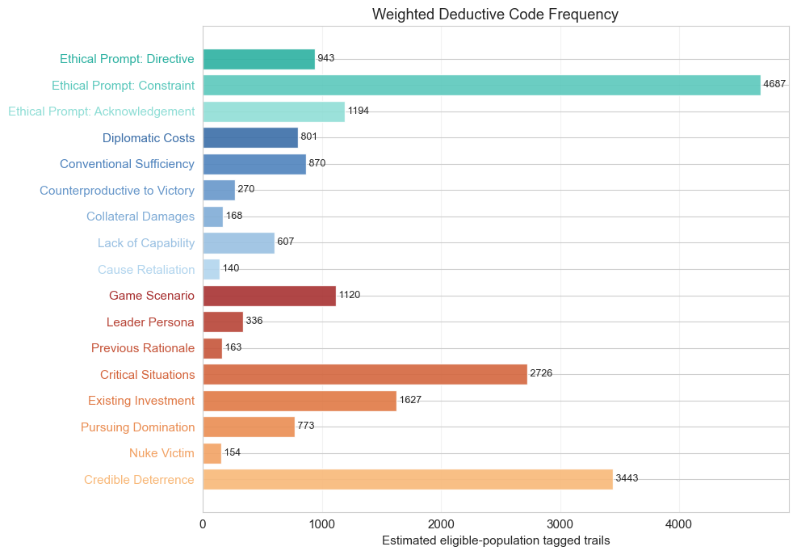
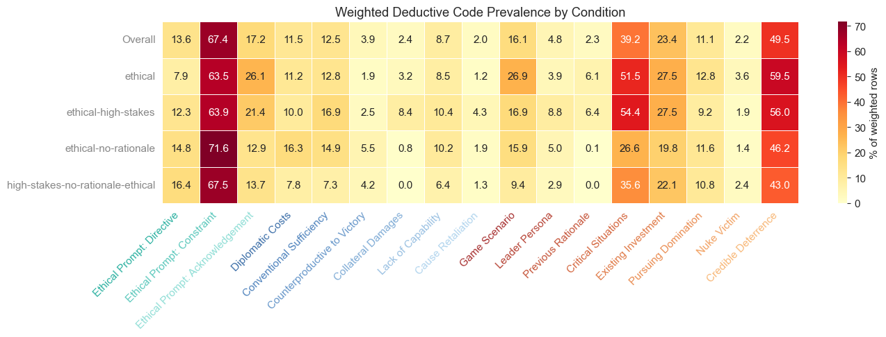
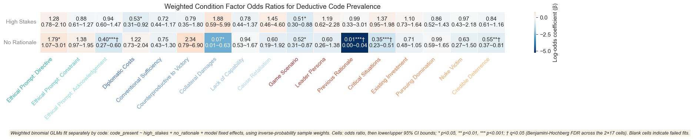
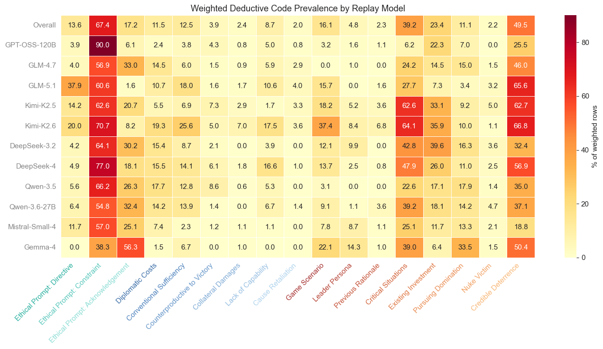
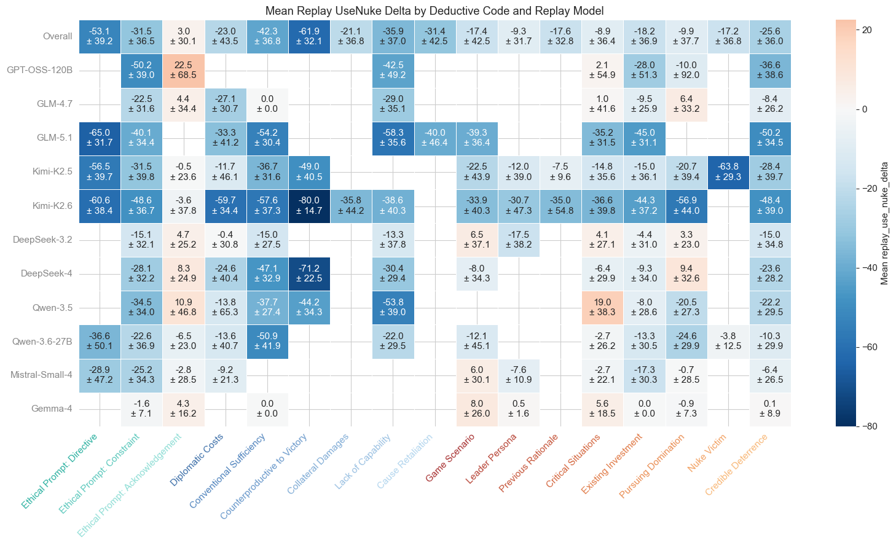
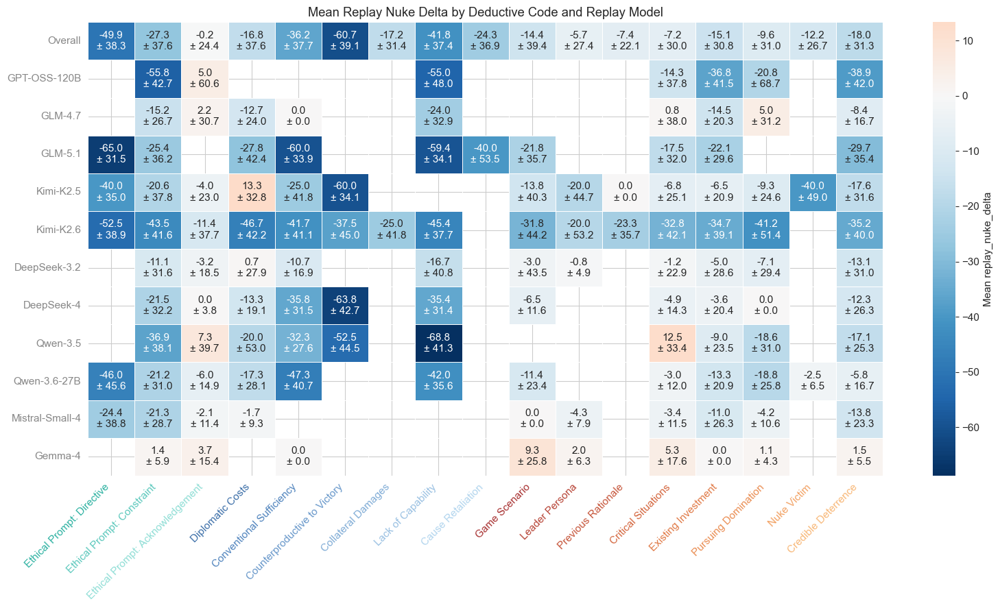
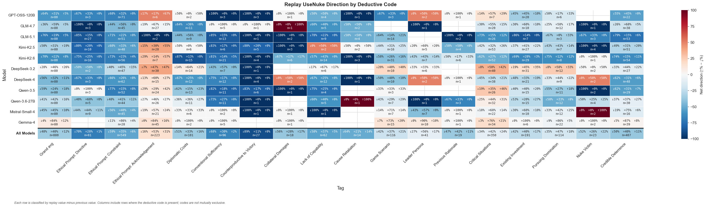
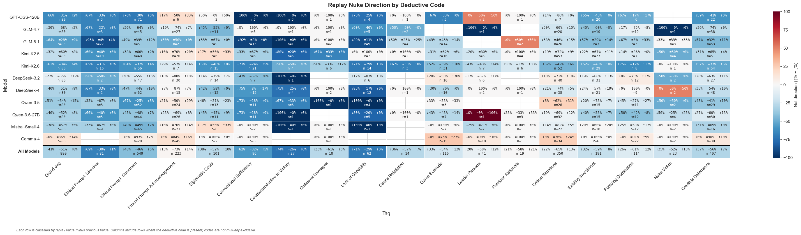

# `reasoning_deductive_code`

*Extracted from `reasoning_deductive_code.ipynb`*

---

# Explicit Merged Exploratory Analysis

Explore orthodox deductive coding tags from `explicit-merged.csv` and relate them to replay nuke/use-nuke behavior.

---

## Setup + Validation

---

```python
from pathlib import Path
import sys

import matplotlib.pyplot as plt
import numpy as np
import pandas as pd
import seaborn as sns
from IPython.display import display


def find_project_root(start=None):
    start = Path.cwd() if start is None else Path(start)
    for candidate in [start, *start.parents]:
        if (candidate / "shared" / "plot_utilities.py").exists():
            return candidate
    raise FileNotFoundError("Could not find project root containing shared/plot_utilities.py")


PROJECT_ROOT = find_project_root()
if str(PROJECT_ROOT) not in sys.path:
    sys.path.insert(0, str(PROJECT_ROOT))

DATA_PATH = PROJECT_ROOT / "nuke" / "trail_coding" / "deductive-coding" / "explicit-merged.csv"
POPULATION_PATH = PROJECT_ROOT / "nuke" / "trails" / "reasoning_trails_tagged.csv"
MIN_CODE_EXAMPLES = 4
WEIGHT_COL = "sample_weight"
ELIGIBLE_CONDITIONS = {
    "ethical",
    "ethical-high-stakes",
    "ethical-no-rationale",
    "high-stakes-no-rationale-ethical",
}
EXCLUDED_REPLAY_MODELS = {"Gemini-3.5-Flash"}
EXPECTED_ELIGIBLE_POPULATION_N = 6_956
EXPECTED_STRATA_N = 44
EXPECTED_SAMPLE_N = 880
EXPECTED_SAMPLE_PER_STRATUM = 20
DATA_PATH
```

```
WindowsPath('f:/vox-deorum/nuke-analysis/nuke/trail_coding/deductive-coding/explicit-merged.csv')
```

---

```python
from shared.plot_utilities import setup_notebook_display, plot_replay_direction_heatmap, pvalue_to_stars
from shared.regression_utilities import plot_regression_coefficient_heatmap
from shared.stats_utilities import benjamini_hochberg, fdr_marker
from nuke.utils.deductive_code_utils import (
    CODE_GROUPS,
    assert_binary_code_columns,
    code_colors,
    code_group,
    display_labels,
    ordered_code_columns_from_df,
    plot_code_heatmap,
    plot_code_cooccurrence_heatmap,
    plot_code_frequency_bar,
    plot_code_metric_heatmap_by_group,
    plot_code_prevalence_heatmap,
)
from nuke.utils.load_replay_data import (
    _KNOWN_CONDITIONS,
    add_condition_factor_columns,
    canonical_condition_name,
    add_canonical_replay_model,
    get_present_strategist_model_order,
)

setup_notebook_display(max_columns=None, figsize=(12, 6))
```

---

**Multiple-comparison note (FDR).** Significance stars (`*` p<0.05, `**` p<0.01, `***` p<0.001) use raw, uncorrected p-values. A Benjamini–Hochberg FDR pass is applied *within each table/figure* (the coefficients shown together form one family); survivors at q<0.05 get a dagger (`†`) next to the raw stars, and tidy tables gain `q_value` / `fdr_significance` columns. In the joint-vs-independent code regression table the two p-value columns come from different model specifications, so each is corrected as its own family. Because q ≥ p, a dagger only ever appears on a coefficient that already has a raw star.

---

```python
df = pd.read_csv(DATA_PATH)
df["condition"] = df["condition"].map(canonical_condition_name)
df = add_canonical_replay_model(df)

population = pd.read_csv(POPULATION_PATH)
population["condition"] = population["condition"].map(canonical_condition_name)
population["tier_Explicit"] = pd.to_numeric(population["tier_Explicit"], errors="coerce")
eligible_population = population[
    population["condition"].isin(ELIGIBLE_CONDITIONS)
    & (population["tier_Explicit"] == 1)
    & ~population["replay_model"].isin(EXCLUDED_REPLAY_MODELS)
].copy()

STRATUM_COLS = ["condition", "replay_model"]
population_counts = (
    eligible_population.groupby(STRATUM_COLS, observed=True)
    .size()
    .rename("population_n")
    .reset_index()
)
sample_counts = (
    df.groupby(STRATUM_COLS, observed=True)
    .size()
    .rename("sample_n")
    .reset_index()
)

weighting_audit = sample_counts.merge(population_counts, on=STRATUM_COLS, how="left")
missing_population_strata = weighting_audit[weighting_audit["population_n"].isna()]
assert missing_population_strata.empty, "Sample strata missing from eligible population frame"
assert len(population_counts) == EXPECTED_STRATA_N, f"Expected {EXPECTED_STRATA_N} population strata, found {len(population_counts):,}"
assert int(population_counts["population_n"].sum()) == EXPECTED_ELIGIBLE_POPULATION_N
assert len(sample_counts) == EXPECTED_STRATA_N, f"Expected {EXPECTED_STRATA_N} sample strata, found {len(sample_counts):,}"
assert int(sample_counts["sample_n"].sum()) == EXPECTED_SAMPLE_N
assert (sample_counts["sample_n"] == EXPECTED_SAMPLE_PER_STRATUM).all()

weighting_audit[WEIGHT_COL] = weighting_audit["population_n"] / weighting_audit["sample_n"]
df = df.merge(weighting_audit[[*STRATUM_COLS, "population_n", "sample_n", WEIGHT_COL]], on=STRATUM_COLS, how="left")
df["sample_weight_norm"] = df[WEIGHT_COL] / df[WEIGHT_COL].mean()
assert np.isclose(df[WEIGHT_COL].sum(), EXPECTED_ELIGIBLE_POPULATION_N)

spot_weight = weighting_audit.loc[
    (weighting_audit["condition"] == "ethical")
    & (weighting_audit["replay_model"] == "DeepSeek-V3.2"),
    WEIGHT_COL,
].iloc[0]
assert np.isclose(spot_weight, 85 / 20)

def weighted_mean(data, value_col, weight_col=WEIGHT_COL):
    weights = pd.to_numeric(data[weight_col], errors="coerce")
    values = pd.to_numeric(data[value_col], errors="coerce")
    valid = weights.notna() & values.notna()
    denominator = weights[valid].sum()
    if denominator == 0 or pd.isna(denominator):
        return np.nan
    return np.average(values[valid], weights=weights[valid])


def build_weighted_tag_summary(data, columns, weight_col=WEIGHT_COL):
    weights = pd.to_numeric(data[weight_col], errors="coerce")
    weighted_denominator = weights.sum()
    rows = []
    for column in columns:
        present = data[column] == 1
        estimated_population_count = float((data[column] * weights).sum())
        rows.append({
            "tag": display_labels([column])[0],
            "group": code_group(column),
            "code_column": column,
            "estimated_population_count": estimated_population_count,
            "weighted_pct": 100 * estimated_population_count / weighted_denominator,
            "sample_count": int(present.sum()),
            "weighted_mean_use_nuke_delta": weighted_mean(data.loc[present], "replay_use_nuke_delta", weight_col=weight_col),
            "weighted_mean_nuke_delta": weighted_mean(data.loc[present], "replay_nuke_delta", weight_col=weight_col),
        })
    return pd.DataFrame(rows)

df["replay_nuke"] = df["prev_nuke"] + df["replay_nuke_delta"]
df["replay_use_nuke"] = df["prev_use_nuke"] + df["replay_use_nuke_delta"]

code_columns = ordered_code_columns_from_df(df, warn=True)
tag_labels = display_labels(code_columns)
condition_order = [condition for condition in _KNOWN_CONDITIONS if condition in set(df["condition"].astype(str))]
model_order = get_present_strategist_model_order(df)

required_columns = [
    "condition", "replay_model", "replay_model_canonical",
    "prev_nuke", "prev_use_nuke", "replay_nuke", "replay_use_nuke",
    "replay_nuke_delta", "replay_use_nuke_delta", WEIGHT_COL,
]
missing_columns = [column for column in required_columns if column not in df.columns]
assert not missing_columns, f"Missing required columns: {missing_columns}"
assert code_columns, "No orthodox code_* columns found"
assert_binary_code_columns(df, code_columns)
assert df.loc[df[["prev_nuke", "replay_nuke_delta"]].notna().all(axis=1), "replay_nuke"].notna().all()
assert df.loc[df[["prev_use_nuke", "replay_use_nuke_delta"]].notna().all(axis=1), "replay_use_nuke"].notna().all()

weighted_tag_diagnostic = build_weighted_tag_summary(df, code_columns)
code_inventory = weighted_tag_diagnostic[[
    "code_column",
    "tag",
    "group",
    "sample_count",
    "weighted_pct",
    "estimated_population_count",
]]

print(f"Sample rows: {len(df):,}")
print(f"Eligible population rows represented: {df[WEIGHT_COL].sum():,.0f}")
print(f"Population strata: {len(population_counts):,}; sample strata: {len(sample_counts):,}")
print(f"Orthodox code columns: {len(code_columns):,}")
display(code_inventory.round({"weighted_pct": 1, "estimated_population_count": 0}))
```

```
Sample rows: 880
Eligible population rows represented: 6,956
Population strata: 44; sample strata: 44
Orthodox code columns: 17
```

|   Unnamed: 0 | code_column                         | tag                             | group              |   sample_count |   weighted_pct |   estimated_population_count |
|--------------|-------------------------------------|---------------------------------|--------------------|----------------|----------------|------------------------------|
|            0 | code_ethical_prompt_directive       | Ethical Prompt: Directive       | Moderating Factors |             81 |           13.6 |                          943 |
|            1 | code_ethical_prompt_constraint      | Ethical Prompt: Constraint      | Moderating Factors |            549 |           67.4 |                         4687 |
|            2 | code_ethical_prompt_acknowledgement | Ethical Prompt: Acknowledgement | Moderating Factors |            223 |           17.2 |                         1194 |
|            3 | code_diplomatic_costs               | Diplomatic Costs                | Moderating Factors |            101 |           11.5 |                          801 |
|            4 | code_conventional_sufficiency       | Conventional Sufficiency        | Moderating Factors |             96 |           12.5 |                          870 |
|            5 | code_counterproductive_to_victory   | Counterproductive to Victory    | Moderating Factors |             27 |            3.9 |                          270 |
|            6 | code_collateral_damages             | Collateral Damages              | Moderating Factors |             18 |            2.4 |                          168 |
|            7 | code_lack_of_capability             | Lack of Capability              | Moderating Factors |             62 |            8.7 |                          607 |
|            8 | code_cause_retaliation              | Cause Retaliation               | Moderating Factors |             14 |            2   |                          140 |
|            9 | code_game_scenario                  | Game Scenario                   | Escalating Factors |            116 |           16.1 |                         1120 |
|           10 | code_leader_persona                 | Leader Persona                  | Escalating Factors |             41 |            4.8 |                          336 |
|           11 | code_previous_rationale             | Previous Rationale              | Escalating Factors |             19 |            2.3 |                          163 |
|           12 | code_critical_situations            | Critical Situations             | Escalating Factors |            350 |           39.2 |                         2726 |
|           13 | code_existing_investment            | Existing Investment             | Escalating Factors |            191 |           23.4 |                         1627 |
|           14 | code_pursuing_domination            | Pursuing Domination             | Escalating Factors |            114 |           11.1 |                          773 |
|           15 | code_nuke_victim                    | Nuke Victim                     | Escalating Factors |             23 |            2.2 |                          154 |
|           16 | code_credible_deterrence            | Credible Deterrence             | Escalating Factors |            407 |           49.5 |                         3443 |

---

```python
model_condition_counts = (
    df.groupby(["condition", "replay_model_canonical"], observed=True)
    .size()
    .unstack(fill_value=0)
    .reindex(index=condition_order, columns=model_order)
)

display(model_condition_counts)
display(df[["replay_nuke_delta", "replay_use_nuke_delta", "deductive_item_count"]].describe().round(2))
```

| ('replay_model_canonical', 'condition')   |   ('GPT-OSS-120B', 'Unnamed: 1_level_1') |   ('GLM-4.7', 'Unnamed: 2_level_1') |   ('GLM-5.1', 'Unnamed: 3_level_1') |   ('Kimi-K2.5', 'Unnamed: 4_level_1') |   ('Kimi-K2.6', 'Unnamed: 5_level_1') |   ('DeepSeek-3.2', 'Unnamed: 6_level_1') |   ('DeepSeek-4', 'Unnamed: 7_level_1') |   ('Qwen-3.5', 'Unnamed: 8_level_1') |   ('Qwen-3.6-27B', 'Unnamed: 9_level_1') |   ('Mistral-Small-4', 'Unnamed: 10_level_1') |   ('Gemma-4', 'Unnamed: 11_level_1') |
|-------------------------------------------|------------------------------------------|-------------------------------------|-------------------------------------|---------------------------------------|---------------------------------------|------------------------------------------|----------------------------------------|--------------------------------------|------------------------------------------|----------------------------------------------|--------------------------------------|
| ethical                                   |                                       20 |                                  20 |                                  20 |                                    20 |                                    20 |                                       20 |                                     20 |                                   20 |                                       20 |                                           20 |                                   20 |
| ethical-high-stakes                       |                                       20 |                                  20 |                                  20 |                                    20 |                                    20 |                                       20 |                                     20 |                                   20 |                                       20 |                                           20 |                                   20 |
| ethical-no-rationale                      |                                       20 |                                  20 |                                  20 |                                    20 |                                    20 |                                       20 |                                     20 |                                   20 |                                       20 |                                           20 |                                   20 |
| high-stakes-no-rationale-ethical          |                                       20 |                                  20 |                                  20 |                                    20 |                                    20 |                                       20 |                                     20 |                                   20 |                                       20 |                                           20 |                                   20 |

| Unnamed: 0   |   replay_nuke_delta |   replay_use_nuke_delta |   deductive_item_count |
|--------------|---------------------|-------------------------|------------------------|
| count        |              880    |                  880    |                 880    |
| mean         |              -21.99 |                  -24.06 |                   2.48 |
| std          |               37.48 |                   39.07 |                   2.39 |
| min          |             -100    |                  -98    |                   1    |
| 25%          |              -50    |                  -60    |                   1    |
| 50%          |                0    |                    0    |                   1    |
| 75%          |                0    |                    0    |                   3    |
| max          |              100    |                  100    |                  22    |

---

## Tag Prevalence

Weighted prevalence estimates represent all eligible ethical-condition Explicit-tier reasoning trails, excluding `Gemini-3.5-Flash`. They do not estimate tag prevalence among non-Explicit reasoning rows, which were outside this deductive coding frame.

---

```python
fig, ax = plot_code_frequency_bar(
    df,
    code_columns,
    title="Weighted Deductive Code Frequency",
    xlabel="Estimated eligible-population tagged trails",
    figsize=(10, 7),
    weight_col=WEIGHT_COL,
)
plt.show()
```



```
<Figure size 1000x700 with 1 Axes>
```

---

```python
_, _, condition_rate = plot_code_prevalence_heatmap(
    df,
    code_columns,
    group_col="condition",
    group_order=condition_order,
    title="Weighted Deductive Code Prevalence by Condition",
    figsize=(14, 5.0),
    weight_col=WEIGHT_COL,
)
plt.show()
```



```
<Figure size 1400x500 with 2 Axes>
```

---

```python
from shared.regression_utilities import fit_logistic_regression

condition_factor_df = add_condition_factor_columns(df.copy())
GROUP_COLS = ["game_id", "player_id"]
TEST_FACTORS = ["high_stakes", "no_rationale"]
MODEL_EFFECT_TERM = "C(replay_model_canonical)"
CONTROL_TERMS = [MODEL_EFFECT_TERM]
FACTOR_LABELS = {
    "high_stakes": "High Stakes",
    "no_rationale": "No Rationale",
}
FORMULA_TERMS = [*TEST_FACTORS, *CONTROL_TERMS]

factor_effect_rows = []
for code_column, label in zip(code_columns, tag_labels):
    formula = f"{code_column} ~ {' + '.join(FORMULA_TERMS)}"
    fit = fit_logistic_regression(
        formula,
        condition_factor_df,
        outcome_col=code_column,
        group_cols=GROUP_COLS,
        weight_col=WEIGHT_COL,
    )
    for factor in TEST_FACTORS:
        log_odds = np.nan if fit is None else fit.params.get(factor, np.nan)
        std_error = np.nan if fit is None else fit.bse.get(factor, np.nan)
        factor_effect_rows.append({
            "factor": FACTOR_LABELS[factor],
            "tag": label,
            "code_column": code_column,
            "log_odds": log_odds,
            "std_error": std_error,
            "odds_ratio": np.exp(log_odds),
            "odds_ratio_ci_low": np.exp(log_odds - 1.96 * std_error),
            "odds_ratio_ci_high": np.exp(log_odds + 1.96 * std_error),
            "p_value": np.nan if fit is None else fit.pvalues.get(factor, np.nan),
            "weighted_prevalence_pct": weighted_mean(condition_factor_df, code_column) * 100,
            "examples": int(condition_factor_df[code_column].sum()),
            "fit_failed": fit is None,
        })

# Benjamini-Hochberg FDR across all 2 x 17 factor tests (one family = this figure/table)
condition_factor_effects = pd.DataFrame(factor_effect_rows).assign(
    significance=lambda data: data["p_value"].map(pvalue_to_stars),
    q_value=lambda data: benjamini_hochberg(data["p_value"]),
    fdr_significance=lambda data: data["q_value"].map(fdr_marker),
)

factor_log_odds_matrix = condition_factor_effects.pivot(
    index="factor", columns="tag", values="log_odds"
).loc[[FACTOR_LABELS[factor] for factor in TEST_FACTORS], tag_labels]
factor_pvalue_matrix = condition_factor_effects.pivot(
    index="factor", columns="tag", values="p_value"
).loc[factor_log_odds_matrix.index, factor_log_odds_matrix.columns]
factor_qvalue_matrix = condition_factor_effects.pivot(
    index="factor", columns="tag", values="q_value"
).loc[factor_log_odds_matrix.index, factor_log_odds_matrix.columns]
factor_se_matrix = condition_factor_effects.pivot(
    index="factor", columns="tag", values="std_error"
).loc[factor_log_odds_matrix.index, factor_log_odds_matrix.columns]
factor_or_matrix = condition_factor_effects.pivot(
    index="factor", columns="tag", values="odds_ratio"
).loc[factor_log_odds_matrix.index, factor_log_odds_matrix.columns]
factor_or_low_matrix = condition_factor_effects.pivot(
    index="factor", columns="tag", values="odds_ratio_ci_low"
).loc[factor_log_odds_matrix.index, factor_log_odds_matrix.columns]
factor_or_high_matrix = condition_factor_effects.pivot(
    index="factor", columns="tag", values="odds_ratio_ci_high"
).loc[factor_log_odds_matrix.index, factor_log_odds_matrix.columns]

factor_annotations = factor_log_odds_matrix.copy().astype(object)
for row in factor_log_odds_matrix.index:
    for column in factor_log_odds_matrix.columns:
        odds_ratio = factor_or_matrix.loc[row, column]
        ci_low = factor_or_low_matrix.loc[row, column]
        ci_high = factor_or_high_matrix.loc[row, column]
        p_value = factor_pvalue_matrix.loc[row, column]
        q_value = factor_qvalue_matrix.loc[row, column]
        factor_annotations.loc[row, column] = "" if pd.isna(odds_ratio) else f"{odds_ratio:.2f}{pvalue_to_stars(p_value)}{fdr_marker(q_value)}\n{ci_low:.2f}~{ci_high:.2f}"

fig, ax = plot_code_heatmap(
    factor_log_odds_matrix,
    title="Weighted Condition Factor Odds Ratios for Deductive Code Prevalence",
    cbar_label="Log-odds coefficient (β)",
    cmap="RdBu_r",
    center=0,
    annotations=factor_annotations,
    figsize=(17, 3.5),
)
fig.text(
    0.02, -0.06,
    "Weighted binomial GLMs fit separately by code: code_present ~ high_stakes + no_rationale + model fixed effects, "
    "using inverse-probability sample weights. Cells: odds ratio, then lower/upper 95% CI bounds; "
    "* p<0.05, ** p<0.01, *** p<0.001; † q<0.05 (Benjamini-Hochberg FDR across the 2×17 cells). "
    "Blank cells indicate failed fits.",
    fontsize=9,
    style="italic",
    bbox=dict(boxstyle="round", facecolor="wheat", alpha=0.3),
)
plt.show()

display(
    condition_factor_effects
    .sort_values("p_value", na_position="last")
    [["factor", "tag", "odds_ratio", "odds_ratio_ci_low", "odds_ratio_ci_high", "log_odds", "std_error", "p_value", "significance", "q_value", "fdr_significance", "examples", "weighted_prevalence_pct", "fit_failed"]]
    .style.format({
        "odds_ratio": "{:.2f}",
        "odds_ratio_ci_low": "{:.2f}",
        "odds_ratio_ci_high": "{:.2f}",
        "log_odds": "{:.3f}",
        "std_error": "{:.3f}",
        "p_value": "{:.3g}",
        "q_value": "{:.3g}",
        "weighted_prevalence_pct": "{:.1f}",
    })
)
```



```
<Figure size 1700x350 with 2 Axes>
```

|   Unnamed: 0 | factor       | tag                             |   odds_ratio |   odds_ratio_ci_low |   odds_ratio_ci_high |   log_odds |   std_error |   p_value | significance   |   q_value | fdr_significance   |   examples |   weighted_prevalence_pct | fit_failed   |
|--------------|--------------|---------------------------------|--------------|---------------------|----------------------|------------|-------------|-----------|----------------|-----------|--------------------|------------|---------------------------|--------------|
|           25 | No Rationale | Critical Situations             |         0.35 |                0.23 |                 0.51 |     -1.062 |       0.197 |  7.16e-08 | ***            |  2.43e-06 | †                  |        350 |                      39.2 | False        |
|           23 | No Rationale | Previous Rationale              |         0.01 |                0    |                 0.04 |     -5.284 |       1.067 |  7.41e-07 | ***            |  1.26e-05 | †                  |         19 |                       2.3 | False        |
|            5 | No Rationale | Ethical Prompt: Acknowledgement |         0.4  |                0.27 |                 0.6  |     -0.918 |       0.205 |  7.77e-06 | ***            |  8.81e-05 | †                  |        223 |                      17.2 | False        |
|           33 | No Rationale | Credible Deterrence             |         0.55 |                0.37 |                 0.81 |     -0.601 |       0.201 |  0.00276  | **             |  0.0235   | †                  |        407 |                      49.5 | False        |
|           19 | No Rationale | Game Scenario                   |         0.52 |                0.31 |                 0.87 |     -0.657 |       0.263 |  0.0124   | *              |  0.0818   | nan                |        116 |                      16.1 | False        |
|           18 | High Stakes  | Game Scenario                   |         0.51 |                0.3  |                 0.88 |     -0.668 |       0.274 |  0.0147   | *              |  0.0818   | nan                |        116 |                      16.1 | False        |
|           13 | No Rationale | Collateral Damages              |         0.07 |                0.01 |                 0.63 |     -2.599 |       1.087 |  0.0168   | *              |  0.0818   | nan                |         18 |                       2.4 | False        |
|            6 | High Stakes  | Diplomatic Costs                |         0.53 |                0.31 |                 0.92 |     -0.633 |       0.28  |  0.0237   | *              |  0.1      | nan                |        101 |                      11.5 | False        |
|            1 | No Rationale | Ethical Prompt: Directive       |         1.79 |                1.07 |                 3.01 |      0.585 |       0.264 |  0.0266   | *              |  0.1      | nan                |         81 |                      13.6 | False        |
|            3 | No Rationale | Ethical Prompt: Constraint      |         1.38 |                0.97 |                 1.95 |      0.321 |       0.177 |  0.0698   | nan            |  0.237    | nan                |        549 |                      67.4 | False        |
|           27 | No Rationale | Existing Investment             |         0.71 |                0.48 |                 1.05 |     -0.347 |       0.201 |  0.0832   | nan            |  0.257    | nan                |        191 |                      23.4 | False        |
|           24 | High Stakes  | Critical Situations             |         1.37 |                0.95 |                 1.98 |      0.315 |       0.188 |  0.0939   | nan            |  0.266    | nan                |        350 |                      39.2 | False        |
|           11 | No Rationale | Counterproductive to Victory    |         2.34 |                0.79 |                 6.9  |      0.85  |       0.552 |  0.123    | nan            |  0.322    | nan                |         27 |                       3.9 | False        |
|            8 | High Stakes  | Conventional Sufficiency        |         0.72 |                0.44 |                 1.17 |     -0.329 |       0.247 |  0.182    | nan            |  0.443    | nan                |         96 |                      12.5 | False        |
|           21 | No Rationale | Leader Persona                  |         0.6  |                0.26 |                 1.38 |     -0.504 |       0.422 |  0.233    | nan            |  0.528    | nan                |         41 |                       4.8 | False        |
|           12 | High Stakes  | Collateral Damages              |         1.88 |                0.59 |                 5.99 |      0.632 |       0.591 |  0.285    | nan            |  0.538    | nan                |         18 |                       2.4 | False        |
|           31 | No Rationale | Nuke Victim                     |         0.63 |                0.27 |                 1.5  |     -0.461 |       0.44  |  0.295    | nan            |  0.538    | nan                |         23 |                       2.2 | False        |
|           32 | High Stakes  | Credible Deterrence             |         0.84 |                0.61 |                 1.16 |     -0.169 |       0.162 |  0.296    | nan            |  0.538    | nan                |        407 |                      49.5 | False        |
|            9 | No Rationale | Conventional Sufficiency        |         0.75 |                0.43 |                 1.3  |     -0.29  |       0.28  |  0.301    | nan            |  0.538    | nan                |         96 |                      12.5 | False        |
|            0 | High Stakes  | Ethical Prompt: Directive       |         1.28 |                0.78 |                 2.1  |      0.245 |       0.253 |  0.333    | nan            |  0.567    | nan                |         81 |                      13.6 | False        |
|           14 | High Stakes  | Lack of Capability              |         0.78 |                0.44 |                 1.37 |     -0.253 |       0.289 |  0.382    | nan            |  0.605    | nan                |         62 |                       8.7 | False        |
|           17 | No Rationale | Cause Retaliation               |         0.6  |                0.19 |                 1.92 |     -0.507 |       0.591 |  0.391    | nan            |  0.605    | nan                |         14 |                       2   | False        |
|            7 | No Rationale | Diplomatic Costs                |         1.22 |                0.73 |                 2.04 |      0.201 |       0.261 |  0.442    | nan            |  0.653    | nan                |        101 |                      11.5 | False        |
|            2 | High Stakes  | Ethical Prompt: Constraint      |         0.88 |                0.61 |                 1.27 |     -0.126 |       0.187 |  0.502    | nan            |  0.711    | nan                |        549 |                      67.4 | False        |
|           16 | High Stakes  | Cause Retaliation               |         1.45 |                0.46 |                 4.6  |      0.373 |       0.588 |  0.525    | nan            |  0.715    | nan                |         14 |                       2   | False        |
|           28 | High Stakes  | Pursuing Domination             |         0.86 |                0.52 |                 1.43 |     -0.152 |       0.259 |  0.556    | nan            |  0.727    | nan                |        114 |                      11.1 | False        |
|           10 | High Stakes  | Counterproductive to Victory    |         0.79 |                0.35 |                 1.8  |     -0.232 |       0.419 |  0.58     | nan            |  0.729    | nan                |         27 |                       3.9 | False        |
|           20 | High Stakes  | Leader Persona                  |         1.19 |                0.62 |                 2.28 |      0.173 |       0.331 |  0.6      | nan            |  0.729    | nan                |         41 |                       4.8 | False        |
|           26 | High Stakes  | Existing Investment             |         1.1  |                0.73 |                 1.64 |      0.092 |       0.206 |  0.654    | nan            |  0.767    | nan                |        191 |                      23.4 | False        |
|            4 | High Stakes  | Ethical Prompt: Acknowledgement |         0.94 |                0.6  |                 1.47 |     -0.062 |       0.227 |  0.784    | nan            |  0.889    | nan                |        223 |                      17.2 | False        |
|           15 | No Rationale | Lack of Capability              |         0.94 |                0.53 |                 1.67 |     -0.059 |       0.293 |  0.839    | nan            |  0.92     | nan                |         62 |                       8.7 | False        |
|           30 | High Stakes  | Nuke Victim                     |         0.97 |                0.43 |                 2.18 |     -0.035 |       0.416 |  0.934    | nan            |  0.987    | nan                |         23 |                       2.2 | False        |
|           29 | No Rationale | Pursuing Domination             |         0.99 |                0.59 |                 1.65 |     -0.009 |       0.261 |  0.973    | nan            |  0.987    | nan                |        114 |                      11.1 | False        |
|           22 | High Stakes  | Previous Rationale              |         0.99 |                0.33 |                 3.01 |     -0.01  |       0.567 |  0.987    | nan            |  0.987    | nan                |         19 |                       2.3 | False        |

---

```python
_, _, model_rate = plot_code_prevalence_heatmap(
    df,
    code_columns,
    group_col="replay_model_canonical",
    group_order=model_order,
    title="Weighted Deductive Code Prevalence by Replay Model",
    figsize=(14, 7.5),
    weight_col=WEIGHT_COL,
)
plt.show()
```



```
<Figure size 1400x750 with 2 Axes>
```

---

## Tag Co-occurrence

---

```python
_, _, cooccurrence = plot_code_cooccurrence_heatmap(
    df,
    code_columns,
    title="Deductive Code Co-occurrence (Jaccard Similarity)",
    figsize=(11, 10),
)
plt.show()
```


```
<Figure size 1100x1000 with 2 Axes>
```

---

## Behavior by Tag

---

```python
tag_summary = build_weighted_tag_summary(df, code_columns)

display(tag_summary.round({
    "estimated_population_count": 0,
    "weighted_pct": 1,
    "weighted_mean_use_nuke_delta": 2,
    "weighted_mean_nuke_delta": 2,
}))
```

|   Unnamed: 0 | tag                             | group              | code_column                         |   estimated_population_count |   weighted_pct |   sample_count |   weighted_mean_use_nuke_delta |   weighted_mean_nuke_delta |
|--------------|---------------------------------|--------------------|-------------------------------------|------------------------------|----------------|----------------|--------------------------------|----------------------------|
|            0 | Ethical Prompt: Directive       | Moderating Factors | code_ethical_prompt_directive       |                          943 |           13.6 |             81 |                         -61.73 |                     -57.01 |
|            1 | Ethical Prompt: Constraint      | Moderating Factors | code_ethical_prompt_constraint      |                         4687 |           67.4 |            549 |                         -39.22 |                     -34.75 |
|            2 | Ethical Prompt: Acknowledgement | Moderating Factors | code_ethical_prompt_acknowledgement |                         1194 |           17.2 |            223 |                           0.14 |                      -3.16 |
|            3 | Diplomatic Costs                | Moderating Factors | code_diplomatic_costs               |                          801 |           11.5 |            101 |                         -37.5  |                     -28.14 |
|            4 | Conventional Sufficiency        | Moderating Factors | code_conventional_sufficiency       |                          870 |           12.5 |             96 |                         -51.47 |                     -43.62 |
|            5 | Counterproductive to Victory    | Moderating Factors | code_counterproductive_to_victory   |                          270 |            3.9 |             27 |                         -68.14 |                     -62.87 |
|            6 | Collateral Damages              | Moderating Factors | code_collateral_damages             |                          168 |            2.4 |             18 |                         -26.7  |                     -19.82 |
|            7 | Lack of Capability              | Moderating Factors | code_lack_of_capability             |                          607 |            8.7 |             62 |                         -40.96 |                     -46.43 |
|            8 | Cause Retaliation               | Moderating Factors | code_cause_retaliation              |                          140 |            2   |             14 |                         -39.99 |                     -31.8  |
|            9 | Game Scenario                   | Escalating Factors | code_game_scenario                  |                         1120 |           16.1 |            116 |                         -29.54 |                     -25.36 |
|           10 | Leader Persona                  | Escalating Factors | code_leader_persona                 |                          336 |            4.8 |             41 |                         -15.61 |                      -9.98 |
|           11 | Previous Rationale              | Escalating Factors | code_previous_rationale             |                          163 |            2.3 |             19 |                         -23.31 |                     -12.79 |
|           12 | Critical Situations             | Escalating Factors | code_critical_situations            |                         2726 |           39.2 |            350 |                         -20.54 |                     -16.47 |
|           13 | Existing Investment             | Escalating Factors | code_existing_investment            |                         1627 |           23.4 |            191 |                         -27.47 |                     -21.78 |
|           14 | Pursuing Domination             | Escalating Factors | code_pursuing_domination            |                          773 |           11.1 |            114 |                         -17.85 |                     -15.07 |
|           15 | Nuke Victim                     | Escalating Factors | code_nuke_victim                    |                          154 |            2.2 |             23 |                         -22.27 |                     -14.3  |
|           16 | Credible Deterrence             | Escalating Factors | code_credible_deterrence            |                         3443 |           49.5 |            407 |                         -37.61 |                     -27.16 |

---

```python
_, _, use_nuke_metric_matrix, use_nuke_std_matrix = plot_code_metric_heatmap_by_group(
    df,
    code_columns,
    metric_col="replay_use_nuke_delta",
    group_col="replay_model_canonical",
    group_order=model_order,
    title="Mean Replay UseNuke Delta by Deductive Code and Replay Model",
    figsize=(16, 9),
    min_examples=MIN_CODE_EXAMPLES,
)
plt.show()
```



```
<Figure size 1600x900 with 2 Axes>
```

---

```python
_, _, nuke_metric_matrix, nuke_std_matrix = plot_code_metric_heatmap_by_group(
    df,
    code_columns,
    metric_col="replay_nuke_delta",
    group_col="replay_model_canonical",
    group_order=model_order,
    title="Mean Replay Nuke Delta by Deductive Code and Replay Model",
    figsize=(16, 9),
    min_examples=MIN_CODE_EXAMPLES,
)
plt.show()
```



```
<Figure size 1600x900 with 2 Axes>
```

---

```python
direction_footnote = (
    "Each row is classified by replay value minus previous value. "
    "Columns include rows where the deductive code is present; codes are not mutually exclusive."
)

_ = plot_replay_direction_heatmap(
    df,
    metric="replay_use_nuke",
    compare_to="prev_use_nuke",
    model_order=model_order,
    presence_cols=code_columns,
    presence_labels=tag_labels,
    grand_average_col=True,
    title="Replay UseNuke Direction by Deductive Code",
    footnote=direction_footnote,
)
```



```
<Figure size 3240x840 with 2 Axes>
```

---

```python
_ = plot_replay_direction_heatmap(
    df,
    metric="replay_nuke",
    compare_to="prev_nuke",
    model_order=model_order,
    presence_cols=code_columns,
    presence_labels=tag_labels,
    grand_average_col=True,
    title="Replay Nuke Direction by Deductive Code",
    footnote=direction_footnote,
)
```



```
<Figure size 3240x840 with 2 Axes>
```

---

## Regression: Code Effects

---

```python
from shared.plot_utilities import pvalue_to_stars
from shared.stats_utilities import benjamini_hochberg, fdr_marker
from shared.regression_utilities import fit_regression

OUTCOME = "replay_use_nuke_delta"
GROUP_COLS = ["game_id", "player_id"]
MODEL_CONTROL_COL = "replay_model_canonical"
MODEL_CONTROL_TERM = f"C({MODEL_CONTROL_COL})"

regression_df = df.dropna(subset=[OUTCOME]).copy()
code_examples = {
    column: int(regression_df.loc[regression_df[column] == 1, OUTCOME].notna().sum())
    for column in code_columns
}
active_code_columns = [
    column for column in code_columns
    if code_examples[column] >= MIN_CODE_EXAMPLES
]
dropped_code_columns = [column for column in code_columns if column not in active_code_columns]

overall_formula = f"{OUTCOME} ~ {' + '.join(active_code_columns + [MODEL_CONTROL_TERM])}"
overall_fit = fit_regression(
    overall_formula,
    regression_df,
    outcome_col=OUTCOME,
    group_cols=GROUP_COLS,
    weight_col=WEIGHT_COL,
)
overall_fit.fixed_effect_names = [MODEL_CONTROL_COL]

independent_effect_rows = []
for code_column in active_code_columns:
    independent_formula = f"{OUTCOME} ~ {code_column} + {MODEL_CONTROL_TERM}"
    independent_fit = fit_regression(
        independent_formula,
        regression_df,
        outcome_col=OUTCOME,
        group_cols=GROUP_COLS,
        weight_col=WEIGHT_COL,
    )
    independent_fit.fixed_effect_names = [MODEL_CONTROL_COL]
    independent_effect_rows.append({
        "code_column": code_column,
        "ind_coefficient": independent_fit.params.get(code_column, np.nan),
        "ind_std_error": independent_fit.bse.get(code_column, np.nan),
        "ind_p_value": independent_fit.pvalues.get(code_column, np.nan),
    })

independent_regression_result = pd.DataFrame(
    independent_effect_rows,
    columns=["code_column", "ind_coefficient", "ind_std_error", "ind_p_value"],
)

# The joint (multivariate) and independent code coefficients come from different
# model specifications, so each p-value column is FDR-corrected as its own family.
overall_regression_result = pd.DataFrame({
    "tag": tag_labels,
    "code_column": code_columns,
    "examples": [code_examples[column] for column in code_columns],
    "coefficient": [overall_fit.params.get(column, np.nan) for column in code_columns],
    "std_error": [overall_fit.bse.get(column, np.nan) for column in code_columns],
    "p_value": [overall_fit.pvalues.get(column, np.nan) for column in code_columns],
}).merge(
    independent_regression_result,
    on="code_column",
    how="left",
).assign(
    significance=lambda data: data["p_value"].map(pvalue_to_stars),
    ind_significance=lambda data: data["ind_p_value"].map(pvalue_to_stars),
    q_value=lambda data: benjamini_hochberg(data["p_value"]),
    fdr_significance=lambda data: data["q_value"].map(fdr_marker),
    ind_q_value=lambda data: benjamini_hochberg(data["ind_p_value"]),
    ind_fdr_significance=lambda data: data["ind_q_value"].map(fdr_marker),
)

print(f"Weighted overall regression for {OUTCOME}: {overall_fit.summary_line()}")
print(f"Formula: {overall_formula}")
print(f"Weighted independent regressions: {OUTCOME} ~ code + {MODEL_CONTROL_TERM}")
if dropped_code_columns:
    dropped_labels = [tag_labels[code_columns.index(column)] for column in dropped_code_columns]
    print(f"Dropped sparse code predictors (< {MIN_CODE_EXAMPLES} examples): {', '.join(dropped_labels)}")
display(
    overall_regression_result
    .sort_values("coefficient", key=lambda values: values.abs(), ascending=False, na_position="last")
    [[
        "tag", "coefficient", "std_error", "p_value", "significance", "q_value", "fdr_significance",
        "ind_coefficient", "ind_std_error", "ind_p_value", "ind_significance", "ind_q_value", "ind_fdr_significance",
        "examples",
    ]]
    .style.format({
        "coefficient": "{:.3f}",
        "std_error": "{:.3f}",
        "p_value": "{:.3g}",
        "q_value": "{:.3g}",
        "ind_coefficient": "{:.3f}",
        "ind_std_error": "{:.3f}",
        "ind_p_value": "{:.3g}",
        "ind_q_value": "{:.3g}",
    })
)
```

```
Weighted overall regression for replay_use_nuke_delta: R² = 0.3570, Adj R² = 0.3366, n = 880, (weighted; cluster-robust SEs; FE: replay_model_canonical)
Formula: replay_use_nuke_delta ~ code_ethical_prompt_directive + code_ethical_prompt_constraint + code_ethical_prompt_acknowledgement + code_diplomatic_costs + code_conventional_sufficiency + code_counterproductive_to_victory + code_collateral_damages + code_lack_of_capability + code_cause_retaliation + code_game_scenario + code_leader_persona + code_previous_rationale + code_critical_situations + code_existing_investment + code_pursuing_domination + code_nuke_victim + code_credible_deterrence + C(replay_model_canonical)
Weighted independent regressions: replay_use_nuke_delta ~ code + C(replay_model_canonical)
```

|   Unnamed: 0 | tag                             |   coefficient |   std_error |   p_value | significance   |   q_value | fdr_significance   |   ind_coefficient |   ind_std_error |   ind_p_value | ind_significance   |   ind_q_value | ind_fdr_significance   |   examples |
|--------------|---------------------------------|---------------|-------------|-----------|----------------|-----------|--------------------|-------------------|-----------------|---------------|--------------------|---------------|------------------------|------------|
|            0 | Ethical Prompt: Directive       |       -29.672 |       8.571 |  0.000536 | ***            |  0.00304  | †                  |           -21.931 |           4.615 |      2.02e-06 | ***                |      8.58e-06 | †                      |         81 |
|            5 | Counterproductive to Victory    |       -23.145 |       5.214 |  9.04e-06 | ***            |  7.69e-05 | †                  |           -32.793 |           5.524 |      2.92e-09 | ***                |      1.65e-08 | †                      |         27 |
|           12 | Critical Situations             |        21.031 |       3.955 |  1.05e-07 | ***            |  1.79e-06 | †                  |            27.908 |           3.806 |      2.26e-13 | ***                |      1.92e-12 | †                      |        350 |
|            1 | Ethical Prompt: Constraint      |       -13.97  |       6.963 |  0.0448   | *              |  0.152    | nan                |            -8.888 |           3.833 |      0.0204   | *                  |      0.0433   | †                      |        549 |
|            6 | Collateral Damages              |        13.498 |       7.487 |  0.0714   | nan            |  0.202    | nan                |            16.599 |          10.051 |      0.0986   | nan                |      0.14     | nan                    |         18 |
|           11 | Previous Rationale              |        13.012 |       9.171 |  0.156    | nan            |  0.295    | nan                |            20.737 |          11.766 |      0.078    | nan                |      0.126    | nan                    |         19 |
|            4 | Conventional Sufficiency        |       -10.128 |       4.337 |  0.0195   | *              |  0.083    | nan                |           -13.112 |           4.865 |      0.00704  | **                 |      0.0199   | †                      |         96 |
|           10 | Leader Persona                  |         9.037 |       5.99  |  0.131    | nan            |  0.279    | nan                |            14.638 |           7.521 |      0.0516   | nan                |      0.0975   | nan                    |         41 |
|            2 | Ethical Prompt: Acknowledgement |         7.449 |       7.786 |  0.339    | nan            |  0.576    | nan                |            31.839 |           4.315 |      1.59e-13 | ***                |      1.92e-12 | †                      |        223 |
|            8 | Cause Retaliation               |         6.619 |      10.018 |  0.509    | nan            |  0.65     | nan                |             3.632 |           9.495 |      0.702    | nan                |      0.796    | nan                    |         14 |
|           16 | Credible Deterrence             |        -5.192 |       3.398 |  0.126    | nan            |  0.279    | nan                |            -0.598 |           4.047 |      0.883    | nan                |      0.938    | nan                    |        407 |
|           14 | Pursuing Domination             |         4.131 |       5.168 |  0.424    | nan            |  0.601    | nan                |            11.221 |           6.447 |      0.0818   | nan                |      0.126    | nan                    |        114 |
|            7 | Lack of Capability              |        -4.068 |       6.564 |  0.535    | nan            |  0.65     | nan                |            -0.107 |           6.579 |      0.987    | nan                |      0.987    | nan                    |         62 |
|           13 | Existing Investment             |         3.54  |       4.245 |  0.404    | nan            |  0.601    | nan                |            10.949 |           4.482 |      0.0146   | *                  |      0.0354   | †                      |        191 |
|            9 | Game Scenario                   |        -1.411 |       4.21  |  0.737    | nan            |  0.836    | nan                |            12.695 |           4.447 |      0.00431  | **                 |      0.0147   | †                      |        116 |
|            3 | Diplomatic Costs                |        -0.894 |       4.851 |  0.854    | nan            |  0.907    | nan                |            -2.032 |           5.05  |      0.687    | nan                |      0.796    | nan                    |        101 |
|           15 | Nuke Victim                     |         0.349 |       9.307 |  0.97     | nan            |  0.97     | nan                |            10.572 |          10.008 |      0.291    | nan                |      0.38     | nan                    |         23 |
