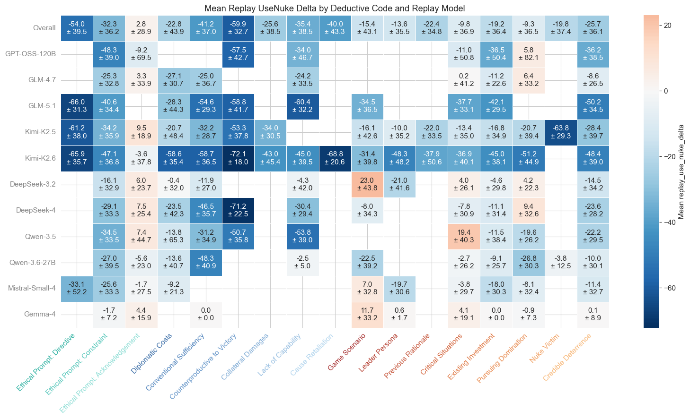

# `reasoning_deductive_code`

*Extracted from `reasoning_deductive_code.ipynb`*

---

# Explicit Merged Exploratory Analysis

Explore orthodox deductive coding tags from `explicit-merged.csv` and relate them to replay nuke/use-nuke behavior.

---

## Setup + Validation

---

```python
from pathlib import Path
import sys

import matplotlib.pyplot as plt
import numpy as np
import pandas as pd
import seaborn as sns
from IPython.display import display


def find_project_root(start=None):
    start = Path.cwd() if start is None else Path(start)
    for candidate in [start, *start.parents]:
        if (candidate / "shared" / "plot_utilities.py").exists():
            return candidate
    raise FileNotFoundError("Could not find project root containing shared/plot_utilities.py")


PROJECT_ROOT = find_project_root()
if str(PROJECT_ROOT) not in sys.path:
    sys.path.insert(0, str(PROJECT_ROOT))

DATA_PATH = PROJECT_ROOT / "nuke" / "trail_coding" / "deductive-coding" / "explicit-merged.csv"
MIN_CODE_EXAMPLES = 4
DATA_PATH
```

```
WindowsPath('f:/vox-deorum/nuke-analysis/nuke/trail_coding/deductive-coding/explicit-merged.csv')
```

---

```python
from shared.plot_utilities import setup_notebook_display, plot_replay_direction_heatmap
from shared.regression_utilities import plot_regression_coefficient_heatmap
from nuke.utils.deductive_code_utils import (
    CODE_GROUPS,
    assert_binary_code_columns,
    code_colors,
    code_group,
    display_labels,
    ordered_code_columns_from_df,
    plot_code_cooccurrence_heatmap,
    plot_code_frequency_bar,
    plot_code_metric_heatmap_by_group,
    plot_code_prevalence_heatmap,
)
from nuke.utils.load_replay_data import (
    _KNOWN_CONDITIONS,
    canonical_condition_name,
    add_canonical_replay_model,
    get_present_strategist_model_order,
)

setup_notebook_display(max_columns=None, figsize=(12, 6))
```

---

```python
df = pd.read_csv(DATA_PATH)
df["condition"] = df["condition"].map(canonical_condition_name)
df = add_canonical_replay_model(df)

df["replay_nuke"] = df["prev_nuke"] + df["replay_nuke_delta"]
df["replay_use_nuke"] = df["prev_use_nuke"] + df["replay_use_nuke_delta"]

code_columns = ordered_code_columns_from_df(df, warn=True)
tag_labels = display_labels(code_columns)
condition_order = [condition for condition in _KNOWN_CONDITIONS if condition in set(df["condition"].astype(str))]
model_order = get_present_strategist_model_order(df)

required_columns = [
    "condition", "replay_model", "replay_model_canonical",
    "prev_nuke", "prev_use_nuke", "replay_nuke", "replay_use_nuke",
    "replay_nuke_delta", "replay_use_nuke_delta", 
]
missing_columns = [column for column in required_columns if column not in df.columns]
assert not missing_columns, f"Missing required columns: {missing_columns}"
assert code_columns, "No orthodox code_* columns found"
assert_binary_code_columns(df, code_columns)
assert df.loc[df[["prev_nuke", "replay_nuke_delta"]].notna().all(axis=1), "replay_nuke"].notna().all()
assert df.loc[df[["prev_use_nuke", "replay_use_nuke_delta"]].notna().all(axis=1), "replay_use_nuke"].notna().all()

code_inventory = pd.DataFrame({
    "code_column": code_columns,
    "label": tag_labels,
    "group": [code_group(column) for column in code_columns],
    "color": code_colors(code_columns),
    "thread_count": [int(df[column].sum()) for column in code_columns],
})

print(f"Rows: {len(df):,}")
print(f"Columns: {df.shape[1]:,}")
print(f"Orthodox code columns: {len(code_columns):,}")
display(code_inventory)
```

```
Rows: 880
Columns: 44
Orthodox code columns: 17
```

|   Unnamed: 0 | code_column                         | label                           | group              | color   |   thread_count |
|--------------|-------------------------------------|---------------------------------|--------------------|---------|----------------|
|            0 | code_ethical_prompt_directive       | Ethical Prompt: Directive       | Moderating Factors | #2CB1A1 |             75 |
|            1 | code_ethical_prompt_constraint      | Ethical Prompt: Constraint      | Moderating Factors | #5BC8BC |            543 |
|            2 | code_ethical_prompt_acknowledgement | Ethical Prompt: Acknowledgement | Moderating Factors | #90DED6 |            225 |
|            3 | code_diplomatic_costs               | Diplomatic Costs                | Moderating Factors | #3B6EA8 |             96 |
|            4 | code_conventional_sufficiency       | Conventional Sufficiency        | Moderating Factors | #4F83BD |            105 |
|            5 | code_counterproductive_to_victory   | Counterproductive to Victory    | Moderating Factors | #6797CA |             35 |
|            6 | code_collateral_damages             | Collateral Damages              | Moderating Factors | #80ACD6 |             17 |
|            7 | code_lack_of_capability             | Lack of Capability              | Moderating Factors | #99C0E2 |             71 |
|            8 | code_cause_retaliation              | Cause Retaliation               | Moderating Factors | #B2D5EE |             10 |
|            9 | code_game_scenario                  | Game Scenario                   | Escalating Factors | #A83232 |             91 |
|           10 | code_leader_persona                 | Leader Persona                  | Escalating Factors | #B74436 |             40 |
|           11 | code_previous_rationale             | Previous Rationale              | Escalating Factors | #C6553A |             21 |
|           12 | code_critical_situations            | Critical Situations             | Escalating Factors | #D4663E |            368 |
|           13 | code_existing_investment            | Existing Investment             | Escalating Factors | #E07945 |            260 |
|           14 | code_pursuing_domination            | Pursuing Domination             | Escalating Factors | #EA8D52 |            117 |
|           15 | code_nuke_victim                    | Nuke Victim                     | Escalating Factors | #F2A264 |             21 |
|           16 | code_credible_deterrence            | Credible Deterrence             | Escalating Factors | #F8B878 |            406 |

---

```python
model_condition_counts = (
    df.groupby(["condition", "replay_model_canonical"], observed=True)
    .size()
    .unstack(fill_value=0)
    .reindex(index=condition_order, columns=model_order)
)

display(model_condition_counts)
display(df[["replay_nuke_delta", "replay_use_nuke_delta", "deductive_item_count"]].describe().round(2))
```

| ('replay_model_canonical', 'condition')   |   ('GPT-OSS-120B', 'Unnamed: 1_level_1') |   ('GLM-4.7', 'Unnamed: 2_level_1') |   ('GLM-5.1', 'Unnamed: 3_level_1') |   ('Kimi-K2.5', 'Unnamed: 4_level_1') |   ('Kimi-K2.6', 'Unnamed: 5_level_1') |   ('DeepSeek-3.2', 'Unnamed: 6_level_1') |   ('DeepSeek-4', 'Unnamed: 7_level_1') |   ('Qwen-3.5', 'Unnamed: 8_level_1') |   ('Qwen-3.6-27B', 'Unnamed: 9_level_1') |   ('Mistral-Small-4', 'Unnamed: 10_level_1') |   ('Gemma-4', 'Unnamed: 11_level_1') |
|-------------------------------------------|------------------------------------------|-------------------------------------|-------------------------------------|---------------------------------------|---------------------------------------|------------------------------------------|----------------------------------------|--------------------------------------|------------------------------------------|----------------------------------------------|--------------------------------------|
| ethical                                   |                                       20 |                                  20 |                                  20 |                                    20 |                                    20 |                                       20 |                                     20 |                                   20 |                                       20 |                                           20 |                                   20 |
| ethical-high-stakes                       |                                       20 |                                  20 |                                  20 |                                    20 |                                    20 |                                       20 |                                     20 |                                   20 |                                       20 |                                           20 |                                   20 |
| ethical-no-rationale                      |                                       20 |                                  20 |                                  20 |                                    20 |                                    20 |                                       20 |                                     20 |                                   20 |                                       20 |                                           20 |                                   20 |
| high-stakes-no-rationale-ethical          |                                       20 |                                  20 |                                  20 |                                    20 |                                    20 |                                       20 |                                     20 |                                   20 |                                       20 |                                           20 |                                   20 |

| Unnamed: 0   |   replay_nuke_delta |   replay_use_nuke_delta |   deductive_item_count |
|--------------|---------------------|-------------------------|------------------------|
| count        |              880    |                  880    |                 880    |
| mean         |              -21.99 |                  -24.06 |                   2.48 |
| std          |               37.48 |                   39.07 |                   2.39 |
| min          |             -100    |                  -98    |                   1    |
| 25%          |              -50    |                  -60    |                   1    |
| 50%          |                0    |                    0    |                   1    |
| 75%          |                0    |                    0    |                   3    |
| max          |              100    |                  100    |                  22    |

---

## Tag Prevalence

---

```python
fig, ax = plot_code_frequency_bar(
    df,
    code_columns,
    title="Deductive Code Frequency",
    xlabel="Tagged threads",
    figsize=(10, 7),
)
plt.show()
```


```
<Figure size 1000x700 with 1 Axes>
```

---

```python
_, _, condition_rate = plot_code_prevalence_heatmap(
    df,
    code_columns,
    group_col="condition",
    group_order=condition_order,
    title="Deductive Code Prevalence by Condition",
    figsize=(14, 5.0),
)
plt.show()
```


```
<Figure size 1400x500 with 2 Axes>
```

---

```python
_, _, model_rate = plot_code_prevalence_heatmap(
    df,
    code_columns,
    group_col="replay_model_canonical",
    group_order=model_order,
    title="Deductive Code Prevalence by Replay Model",
    figsize=(14, 7.5),
)
plt.show()
```


```
<Figure size 1400x750 with 2 Axes>
```

---

## Tag Co-occurrence

---

```python
_, _, cooccurrence = plot_code_cooccurrence_heatmap(
    df,
    code_columns,
    title="Deductive Code Co-occurrence (Jaccard Similarity)",
    figsize=(11, 10),
)
plt.show()
```


```
<Figure size 1100x1000 with 2 Axes>
```

---

## Behavior by Tag

---

```python
tag_summary = pd.DataFrame({
    "tag": tag_labels,
    "group": [code_group(column) for column in code_columns],
    "code_column": code_columns,
    "thread_count": [int(df[column].sum()) for column in code_columns],
    "thread_pct": [df[column].mean() * 100 for column in code_columns],
    "mean_use_nuke_delta": [df.loc[df[column] == 1, "replay_use_nuke_delta"].mean() for column in code_columns],
    "mean_nuke_delta": [df.loc[df[column] == 1, "replay_nuke_delta"].mean() for column in code_columns],
})

display(tag_summary.round({"thread_pct": 1, "mean_use_nuke_delta": 2, "mean_nuke_delta": 2}))
```

|   Unnamed: 0 | tag                             | group              | code_column                         |   thread_count |   thread_pct |   mean_use_nuke_delta |   mean_nuke_delta |
|--------------|---------------------------------|--------------------|-------------------------------------|----------------|--------------|-----------------------|-------------------|
|            0 | Ethical Prompt: Directive       | Moderating Factors | code_ethical_prompt_directive       |             75 |          8.5 |                -54    |            -45.6  |
|            1 | Ethical Prompt: Constraint      | Moderating Factors | code_ethical_prompt_constraint      |            543 |         61.7 |                -32.27 |            -28.79 |
|            2 | Ethical Prompt: Acknowledgement | Moderating Factors | code_ethical_prompt_acknowledgement |            225 |         25.6 |                  2.83 |              0.07 |
|            3 | Diplomatic Costs                | Moderating Factors | code_diplomatic_costs               |             96 |         10.9 |                -22.79 |            -18.44 |
|            4 | Conventional Sufficiency        | Moderating Factors | code_conventional_sufficiency       |            105 |         11.9 |                -41.24 |            -33.52 |
|            5 | Counterproductive to Victory    | Moderating Factors | code_counterproductive_to_victory   |             35 |          4   |                -59.86 |            -53.71 |
|            6 | Collateral Damages              | Moderating Factors | code_collateral_damages             |             17 |          1.9 |                -25.59 |            -22.94 |
|            7 | Lack of Capability              | Moderating Factors | code_lack_of_capability             |             71 |          8.1 |                -35.35 |            -38.31 |
|            8 | Cause Retaliation               | Moderating Factors | code_cause_retaliation              |             10 |          1.1 |                -40    |            -35    |
|            9 | Game Scenario                   | Escalating Factors | code_game_scenario                  |             91 |         10.3 |                -15.36 |            -12.58 |
|           10 | Leader Persona                  | Escalating Factors | code_leader_persona                 |             40 |          4.5 |                -13.58 |             -7.12 |
|           11 | Previous Rationale              | Escalating Factors | code_previous_rationale             |             21 |          2.4 |                -22.38 |            -16.19 |
|           12 | Critical Situations             | Escalating Factors | code_critical_situations            |            368 |         41.8 |                 -9.78 |             -7.07 |
|           13 | Existing Investment             | Escalating Factors | code_existing_investment            |            260 |         29.5 |                -19.23 |            -15.62 |
|           14 | Pursuing Domination             | Escalating Factors | code_pursuing_domination            |            117 |         13.3 |                 -9.32 |             -8.85 |
|           15 | Nuke Victim                     | Escalating Factors | code_nuke_victim                    |             21 |          2.4 |                -19.76 |            -13.33 |
|           16 | Credible Deterrence             | Escalating Factors | code_credible_deterrence            |            406 |         46.1 |                -25.71 |            -18.05 |

---

```python
_, _, use_nuke_metric_matrix, use_nuke_std_matrix = plot_code_metric_heatmap_by_group(
    df,
    code_columns,
    metric_col="replay_use_nuke_delta",
    group_col="replay_model_canonical",
    group_order=model_order,
    title="Mean Replay UseNuke Delta by Deductive Code and Replay Model",
    figsize=(16, 9),
    min_examples=MIN_CODE_EXAMPLES,
)
plt.show()
```



```
<Figure size 1600x900 with 2 Axes>
```

---

```python
_, _, nuke_metric_matrix, nuke_std_matrix = plot_code_metric_heatmap_by_group(
    df,
    code_columns,
    metric_col="replay_nuke_delta",
    group_col="replay_model_canonical",
    group_order=model_order,
    title="Mean Replay Nuke Delta by Deductive Code and Replay Model",
    figsize=(16, 9),
    min_examples=MIN_CODE_EXAMPLES,
)
plt.show()
```


```
<Figure size 1600x900 with 2 Axes>
```

---

```python
direction_footnote = (
    "Each row is classified by replay value minus previous value. "
    "Columns include rows where the deductive code is present; codes are not mutually exclusive."
)

_ = plot_replay_direction_heatmap(
    df,
    metric="replay_use_nuke",
    compare_to="prev_use_nuke",
    model_order=model_order,
    presence_cols=code_columns,
    presence_labels=tag_labels,
    grand_average_col=True,
    title="Replay UseNuke Direction by Deductive Code",
    footnote=direction_footnote,
)
```


```
<Figure size 3240x840 with 2 Axes>
```

---

```python
_ = plot_replay_direction_heatmap(
    df,
    metric="replay_nuke",
    compare_to="prev_nuke",
    model_order=model_order,
    presence_cols=code_columns,
    presence_labels=tag_labels,
    grand_average_col=True,
    title="Replay Nuke Direction by Deductive Code",
    footnote=direction_footnote,
)
```


```
<Figure size 3240x840 with 2 Axes>
```

---

## Regression: Code Effects

---

```python
from shared.plot_utilities import pvalue_to_stars
from shared.regression_utilities import build_regression_heatmap_data

OVERALL_LABEL = "[Overall]"
OUTCOME = "replay_use_nuke_delta"
GROUP_COLS = ["game_id", "player_id"]

overall_regression = build_regression_heatmap_data(
    data=df,
    outcome=OUTCOME,
    predictors=code_columns,
    group_cols=GROUP_COLS,
    model_order=[],
    include_overall=True,
    min_predictor_count=MIN_CODE_EXAMPLES,
)
overall_fit = overall_regression.results[OVERALL_LABEL]

overall_regression_result = pd.DataFrame({
    "tag": tag_labels,
    "code_column": code_columns,
    "examples": [
        int(df.loc[df[column] == 1, OUTCOME].notna().sum())
        for column in code_columns
    ],
    "coefficient": overall_regression.coefficients.loc[OVERALL_LABEL].to_numpy(),
    "std_error": overall_regression.standard_errors.loc[OVERALL_LABEL].to_numpy(),
    "p_value": overall_regression.pvalues.loc[OVERALL_LABEL].to_numpy(),
}).assign(
    significance=lambda data: data["p_value"].map(pvalue_to_stars),
)

print(f"Overall regression for {OUTCOME}: {overall_fit.summary_line()}")
display(
    overall_regression_result
    .sort_values("coefficient", key=lambda values: values.abs(), ascending=False)
    [["tag", "coefficient", "std_error", "p_value", "significance", "examples"]]
    .style.format({
        "coefficient": "{:.3f}",
        "std_error": "{:.3f}",
        "p_value": "{:.3g}",
    })
)
```

```
Overall regression for replay_use_nuke_delta: R² = 0.3065, Adj R² = 0.2929, n = 880, (cluster-robust SEs)
```

|   Unnamed: 0 | tag                             |   coefficient |   std_error |   p_value | significance   |   examples |
|--------------|---------------------------------|---------------|-------------|-----------|----------------|------------|
|            0 | Ethical Prompt: Directive       |       -43.847 |       7.12  |  7.37e-10 | ***            |         75 |
|            5 | Counterproductive to Victory    |       -23.813 |       5.302 |  7.08e-06 | ***            |         35 |
|            1 | Ethical Prompt: Constraint      |       -22.76  |       5.981 |  0.000142 | ***            |        543 |
|           12 | Critical Situations             |        20.645 |       3.199 |  1.08e-10 | ***            |        368 |
|            4 | Conventional Sufficiency        |       -14.185 |       3.461 |  4.15e-05 | ***            |        105 |
|           14 | Pursuing Domination             |        10.897 |       3.539 |  0.00208  | **             |        117 |
|            8 | Cause Retaliation               |       -10.595 |      13.413 |  0.43     | nan            |         10 |
|            7 | Lack of Capability              |       -10.4   |       5.068 |  0.0401   | *              |         71 |
|            3 | Diplomatic Costs                |         4.363 |       5.432 |  0.422    | nan            |         96 |
|           16 | Credible Deterrence             |        -4.353 |       3.278 |  0.184    | nan            |        406 |
|            6 | Collateral Damages              |         2.956 |       6.632 |  0.656    | nan            |         17 |
|            2 | Ethical Prompt: Acknowledgement |         2.578 |       5.755 |  0.654    | nan            |        225 |
|           11 | Previous Rationale              |         1.964 |       6.693 |  0.769    | nan            |         21 |
|           15 | Nuke Victim                     |        -1.263 |       6.75  |  0.852    | nan            |         21 |
|            9 | Game Scenario                   |        -1.164 |       3.839 |  0.762    | nan            |         91 |
|           13 | Existing Investment             |         0.466 |       3.139 |  0.882    | nan            |        260 |
|           10 | Leader Persona                  |         0.121 |       5.484 |  0.982    | nan            |         40 |
