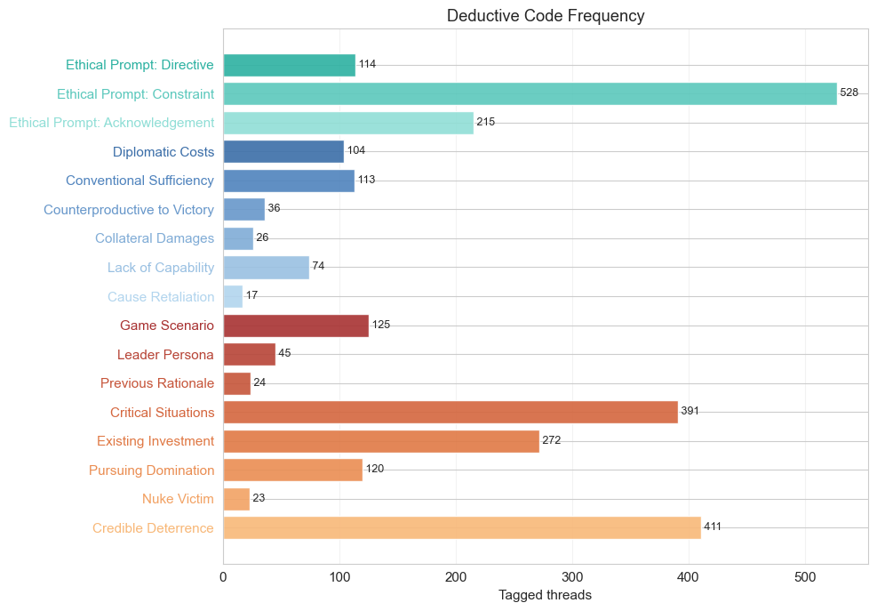
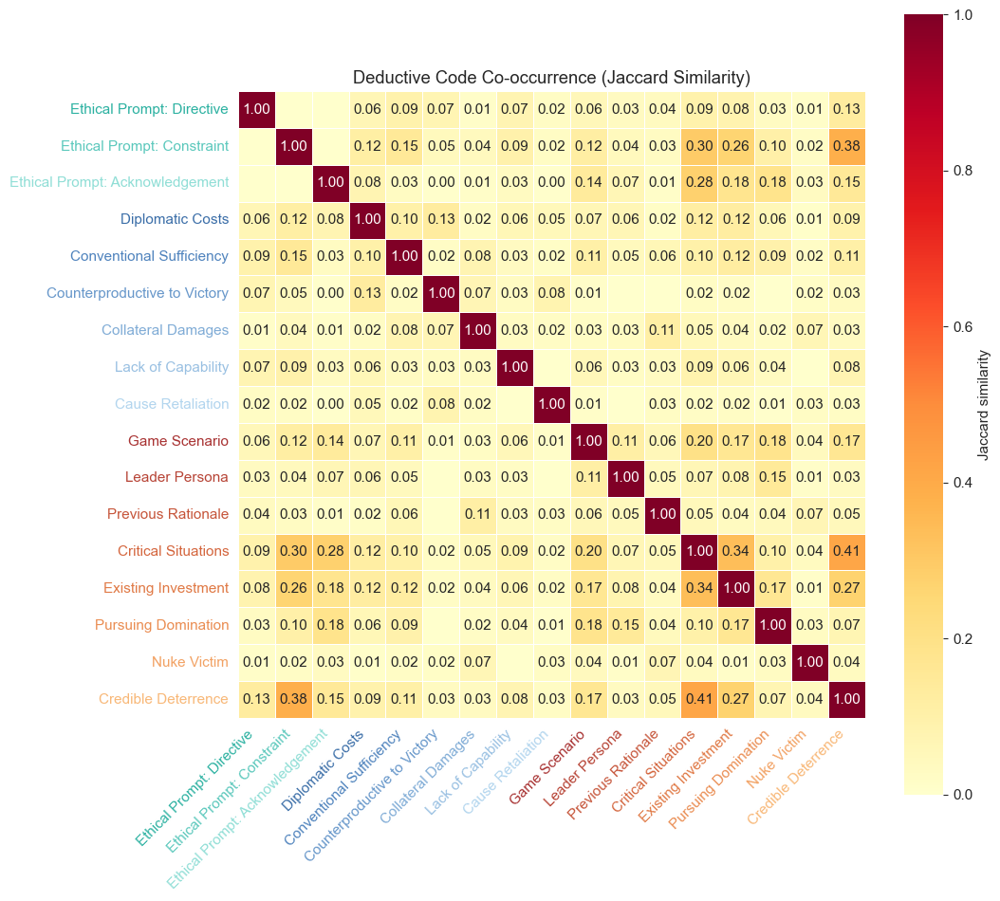
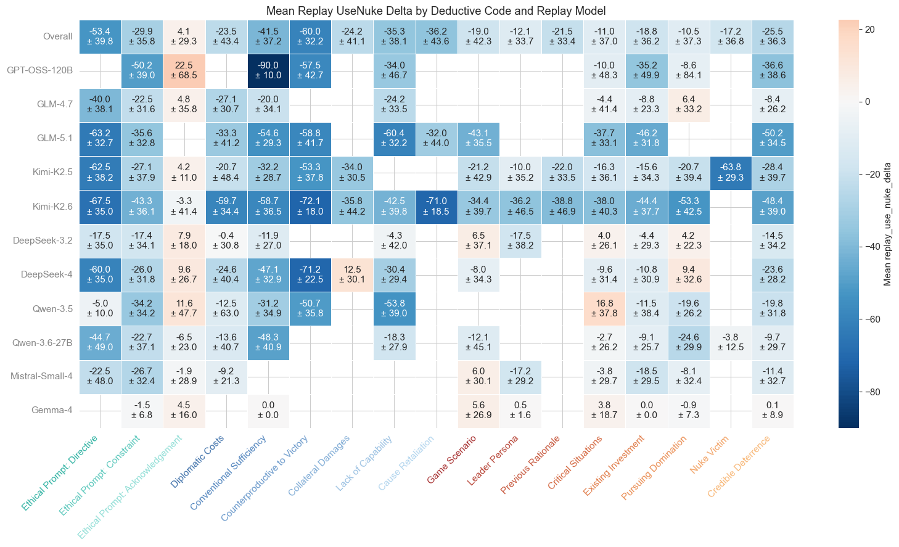

# `reasoning_deductive_code`

*Extracted from `reasoning_deductive_code.ipynb`*

---

# Explicit Merged Exploratory Analysis

Explore orthodox deductive coding tags from `explicit-merged.csv` and relate them to replay nuke/use-nuke behavior.

---

## Setup + Validation

---

```python
from pathlib import Path
import sys

import matplotlib.pyplot as plt
import numpy as np
import pandas as pd
import seaborn as sns
from IPython.display import display


def find_project_root(start=None):
    start = Path.cwd() if start is None else Path(start)
    for candidate in [start, *start.parents]:
        if (candidate / "shared" / "plot_utilities.py").exists():
            return candidate
    raise FileNotFoundError("Could not find project root containing shared/plot_utilities.py")


PROJECT_ROOT = find_project_root()
if str(PROJECT_ROOT) not in sys.path:
    sys.path.insert(0, str(PROJECT_ROOT))

DATA_PATH = PROJECT_ROOT / "nuke" / "trail_coding" / "deductive-coding" / "explicit-merged.csv"
MIN_CODE_EXAMPLES = 4
DATA_PATH
```

```
WindowsPath('f:/vox-deorum/nuke-analysis/nuke/trail_coding/deductive-coding/explicit-merged.csv')
```

---

```python
from shared.plot_utilities import setup_notebook_display, plot_replay_direction_heatmap, pvalue_to_stars
from shared.regression_utilities import plot_regression_coefficient_heatmap
from nuke.utils.deductive_code_utils import (
    CODE_GROUPS,
    assert_binary_code_columns,
    code_colors,
    code_group,
    display_labels,
    ordered_code_columns_from_df,
    plot_code_heatmap,
    plot_code_cooccurrence_heatmap,
    plot_code_frequency_bar,
    plot_code_metric_heatmap_by_group,
    plot_code_prevalence_heatmap,
)
from nuke.utils.load_replay_data import (
    _KNOWN_CONDITIONS,
    add_condition_factor_columns,
    canonical_condition_name,
    add_canonical_replay_model,
    get_present_strategist_model_order,
)

setup_notebook_display(max_columns=None, figsize=(12, 6))
```

---

```python
df = pd.read_csv(DATA_PATH)
df["condition"] = df["condition"].map(canonical_condition_name)
df = add_canonical_replay_model(df)

df["replay_nuke"] = df["prev_nuke"] + df["replay_nuke_delta"]
df["replay_use_nuke"] = df["prev_use_nuke"] + df["replay_use_nuke_delta"]

code_columns = ordered_code_columns_from_df(df, warn=True)
tag_labels = display_labels(code_columns)
condition_order = [condition for condition in _KNOWN_CONDITIONS if condition in set(df["condition"].astype(str))]
model_order = get_present_strategist_model_order(df)

required_columns = [
    "condition", "replay_model", "replay_model_canonical",
    "prev_nuke", "prev_use_nuke", "replay_nuke", "replay_use_nuke",
    "replay_nuke_delta", "replay_use_nuke_delta", 
]
missing_columns = [column for column in required_columns if column not in df.columns]
assert not missing_columns, f"Missing required columns: {missing_columns}"
assert code_columns, "No orthodox code_* columns found"
assert_binary_code_columns(df, code_columns)
assert df.loc[df[["prev_nuke", "replay_nuke_delta"]].notna().all(axis=1), "replay_nuke"].notna().all()
assert df.loc[df[["prev_use_nuke", "replay_use_nuke_delta"]].notna().all(axis=1), "replay_use_nuke"].notna().all()

code_inventory = pd.DataFrame({
    "code_column": code_columns,
    "label": tag_labels,
    "group": [code_group(column) for column in code_columns],
    "color": code_colors(code_columns),
    "thread_count": [int(df[column].sum()) for column in code_columns],
})

print(f"Rows: {len(df):,}")
print(f"Columns: {df.shape[1]:,}")
print(f"Orthodox code columns: {len(code_columns):,}")
display(code_inventory)
```

```
Rows: 880
Columns: 44
Orthodox code columns: 17
```

|   Unnamed: 0 | code_column                         | label                           | group              | color   |   thread_count |
|--------------|-------------------------------------|---------------------------------|--------------------|---------|----------------|
|            0 | code_ethical_prompt_directive       | Ethical Prompt: Directive       | Moderating Factors | #2CB1A1 |            114 |
|            1 | code_ethical_prompt_constraint      | Ethical Prompt: Constraint      | Moderating Factors | #5BC8BC |            528 |
|            2 | code_ethical_prompt_acknowledgement | Ethical Prompt: Acknowledgement | Moderating Factors | #90DED6 |            215 |
|            3 | code_diplomatic_costs               | Diplomatic Costs                | Moderating Factors | #3B6EA8 |            104 |
|            4 | code_conventional_sufficiency       | Conventional Sufficiency        | Moderating Factors | #4F83BD |            113 |
|            5 | code_counterproductive_to_victory   | Counterproductive to Victory    | Moderating Factors | #6797CA |             36 |
|            6 | code_collateral_damages             | Collateral Damages              | Moderating Factors | #80ACD6 |             26 |
|            7 | code_lack_of_capability             | Lack of Capability              | Moderating Factors | #99C0E2 |             74 |
|            8 | code_cause_retaliation              | Cause Retaliation               | Moderating Factors | #B2D5EE |             17 |
|            9 | code_game_scenario                  | Game Scenario                   | Escalating Factors | #A83232 |            125 |
|           10 | code_leader_persona                 | Leader Persona                  | Escalating Factors | #B74436 |             45 |
|           11 | code_previous_rationale             | Previous Rationale              | Escalating Factors | #C6553A |             24 |
|           12 | code_critical_situations            | Critical Situations             | Escalating Factors | #D4663E |            391 |
|           13 | code_existing_investment            | Existing Investment             | Escalating Factors | #E07945 |            272 |
|           14 | code_pursuing_domination            | Pursuing Domination             | Escalating Factors | #EA8D52 |            120 |
|           15 | code_nuke_victim                    | Nuke Victim                     | Escalating Factors | #F2A264 |             23 |
|           16 | code_credible_deterrence            | Credible Deterrence             | Escalating Factors | #F8B878 |            411 |

---

```python
model_condition_counts = (
    df.groupby(["condition", "replay_model_canonical"], observed=True)
    .size()
    .unstack(fill_value=0)
    .reindex(index=condition_order, columns=model_order)
)

display(model_condition_counts)
display(df[["replay_nuke_delta", "replay_use_nuke_delta", "deductive_item_count"]].describe().round(2))
```

| ('replay_model_canonical', 'condition')   |   ('GPT-OSS-120B', 'Unnamed: 1_level_1') |   ('GLM-4.7', 'Unnamed: 2_level_1') |   ('GLM-5.1', 'Unnamed: 3_level_1') |   ('Kimi-K2.5', 'Unnamed: 4_level_1') |   ('Kimi-K2.6', 'Unnamed: 5_level_1') |   ('DeepSeek-3.2', 'Unnamed: 6_level_1') |   ('DeepSeek-4', 'Unnamed: 7_level_1') |   ('Qwen-3.5', 'Unnamed: 8_level_1') |   ('Qwen-3.6-27B', 'Unnamed: 9_level_1') |   ('Mistral-Small-4', 'Unnamed: 10_level_1') |   ('Gemma-4', 'Unnamed: 11_level_1') |
|-------------------------------------------|------------------------------------------|-------------------------------------|-------------------------------------|---------------------------------------|---------------------------------------|------------------------------------------|----------------------------------------|--------------------------------------|------------------------------------------|----------------------------------------------|--------------------------------------|
| ethical                                   |                                       20 |                                  20 |                                  20 |                                    20 |                                    20 |                                       20 |                                     20 |                                   20 |                                       20 |                                           20 |                                   20 |
| ethical-high-stakes                       |                                       20 |                                  20 |                                  20 |                                    20 |                                    20 |                                       20 |                                     20 |                                   20 |                                       20 |                                           20 |                                   20 |
| ethical-no-rationale                      |                                       20 |                                  20 |                                  20 |                                    20 |                                    20 |                                       20 |                                     20 |                                   20 |                                       20 |                                           20 |                                   20 |
| high-stakes-no-rationale-ethical          |                                       20 |                                  20 |                                  20 |                                    20 |                                    20 |                                       20 |                                     20 |                                   20 |                                       20 |                                           20 |                                   20 |

| Unnamed: 0   |   replay_nuke_delta |   replay_use_nuke_delta |   deductive_item_count |
|--------------|---------------------|-------------------------|------------------------|
| count        |              880    |                  880    |                 880    |
| mean         |              -21.99 |                  -24.06 |                   2.48 |
| std          |               37.48 |                   39.07 |                   2.39 |
| min          |             -100    |                  -98    |                   1    |
| 25%          |              -50    |                  -60    |                   1    |
| 50%          |                0    |                    0    |                   1    |
| 75%          |                0    |                    0    |                   3    |
| max          |              100    |                  100    |                  22    |

---

## Tag Prevalence

---

```python
fig, ax = plot_code_frequency_bar(
    df,
    code_columns,
    title="Deductive Code Frequency",
    xlabel="Tagged threads",
    figsize=(10, 7),
)
plt.show()
```



```
<Figure size 1000x700 with 1 Axes>
```

---

```python
_, _, condition_rate = plot_code_prevalence_heatmap(
    df,
    code_columns,
    group_col="condition",
    group_order=condition_order,
    title="Deductive Code Prevalence by Condition",
    figsize=(14, 5.0),
)
plt.show()
```


```
<Figure size 1400x500 with 2 Axes>
```

---

```python
from shared.regression_utilities import fit_logistic_regression

condition_factor_df = add_condition_factor_columns(df.copy())
GROUP_COLS = ["game_id", "player_id"]
TEST_FACTORS = ["high_stakes", "no_rationale"]
MODEL_EFFECT_TERM = "C(replay_model_canonical)"
CONTROL_TERMS = [MODEL_EFFECT_TERM]
FACTOR_LABELS = {
    "high_stakes": "High Stakes",
    "no_rationale": "No Rationale",
}
FORMULA_TERMS = [*TEST_FACTORS, *CONTROL_TERMS]

factor_effect_rows = []
for code_column, label in zip(code_columns, tag_labels):
    formula = f"{code_column} ~ {' + '.join(FORMULA_TERMS)}"
    fit = fit_logistic_regression(
        formula,
        condition_factor_df,
        outcome_col=code_column,
        group_cols=GROUP_COLS,
    )
    for factor in TEST_FACTORS:
        log_odds = np.nan if fit is None else fit.params.get(factor, np.nan)
        std_error = np.nan if fit is None else fit.bse.get(factor, np.nan)
        factor_effect_rows.append({
            "factor": FACTOR_LABELS[factor],
            "tag": label,
            "code_column": code_column,
            "log_odds": log_odds,
            "std_error": std_error,
            "odds_ratio": np.exp(log_odds),
            "odds_ratio_ci_low": np.exp(log_odds - 1.96 * std_error),
            "odds_ratio_ci_high": np.exp(log_odds + 1.96 * std_error),
            "p_value": np.nan if fit is None else fit.pvalues.get(factor, np.nan),
            "prevalence_pct": condition_factor_df[code_column].mean() * 100,
            "examples": int(condition_factor_df[code_column].sum()),
            "fit_failed": fit is None,
        })

condition_factor_effects = pd.DataFrame(factor_effect_rows).assign(
    significance=lambda data: data["p_value"].map(pvalue_to_stars),
)

factor_log_odds_matrix = condition_factor_effects.pivot(
    index="factor", columns="tag", values="log_odds"
).loc[[FACTOR_LABELS[factor] for factor in TEST_FACTORS], tag_labels]
factor_pvalue_matrix = condition_factor_effects.pivot(
    index="factor", columns="tag", values="p_value"
).loc[factor_log_odds_matrix.index, factor_log_odds_matrix.columns]
factor_se_matrix = condition_factor_effects.pivot(
    index="factor", columns="tag", values="std_error"
).loc[factor_log_odds_matrix.index, factor_log_odds_matrix.columns]
factor_or_matrix = condition_factor_effects.pivot(
    index="factor", columns="tag", values="odds_ratio"
).loc[factor_log_odds_matrix.index, factor_log_odds_matrix.columns]
factor_or_low_matrix = condition_factor_effects.pivot(
    index="factor", columns="tag", values="odds_ratio_ci_low"
).loc[factor_log_odds_matrix.index, factor_log_odds_matrix.columns]
factor_or_high_matrix = condition_factor_effects.pivot(
    index="factor", columns="tag", values="odds_ratio_ci_high"
).loc[factor_log_odds_matrix.index, factor_log_odds_matrix.columns]

factor_annotations = factor_log_odds_matrix.copy().astype(object)
for row in factor_log_odds_matrix.index:
    for column in factor_log_odds_matrix.columns:
        odds_ratio = factor_or_matrix.loc[row, column]
        ci_low = factor_or_low_matrix.loc[row, column]
        ci_high = factor_or_high_matrix.loc[row, column]
        p_value = factor_pvalue_matrix.loc[row, column]
        factor_annotations.loc[row, column] = "" if pd.isna(odds_ratio) else f"{odds_ratio:.2f}{pvalue_to_stars(p_value)}\n{ci_low:.2f}~{ci_high:.2f}"

fig, ax = plot_code_heatmap(
    factor_log_odds_matrix,
    title="Condition Factor Odds Ratios for Deductive Code Prevalence",
    cbar_label="Log-odds coefficient (β)",
    cmap="RdBu_r",
    center=0,
    annotations=factor_annotations,
    figsize=(17, 3.5),
)
fig.text(
    0.02, -0.06,
    "Logit models fit separately by code: code_present ~ high_stakes + no_rationale + model fixed effects. "
    "Cells: odds ratio, then lower/upper 95% CI bounds; * p<0.05, ** p<0.01, *** p<0.001. Blank cells indicate failed fits.",
    fontsize=9,
    style="italic",
    bbox=dict(boxstyle="round", facecolor="wheat", alpha=0.3),
)
plt.show()

display(
    condition_factor_effects
    .sort_values("p_value", na_position="last")
    [["factor", "tag", "odds_ratio", "odds_ratio_ci_low", "odds_ratio_ci_high", "log_odds", "std_error", "p_value", "significance", "examples", "prevalence_pct", "fit_failed"]]
    .style.format({
        "odds_ratio": "{:.2f}",
        "odds_ratio_ci_low": "{:.2f}",
        "odds_ratio_ci_high": "{:.2f}",
        "log_odds": "{:.3f}",
        "std_error": "{:.3f}",
        "p_value": "{:.3g}",
        "prevalence_pct": "{:.1f}",
    })
)
```


```
<Figure size 1700x350 with 2 Axes>
```

|   Unnamed: 0 | factor       | tag                             |   odds_ratio |   odds_ratio_ci_low |   odds_ratio_ci_high |   log_odds |   std_error |   p_value | significance   |   examples |   prevalence_pct | fit_failed   |
|--------------|--------------|---------------------------------|--------------|---------------------|----------------------|------------|-------------|-----------|----------------|------------|------------------|--------------|
|           25 | No Rationale | Critical Situations             |         0.28 |                0.2  |                 0.39 |     -1.288 |       0.175 |  1.59e-13 | ***            |        391 |             44.4 | False        |
|            5 | No Rationale | Ethical Prompt: Acknowledgement |         0.44 |                0.32 |                 0.6  |     -0.818 |       0.158 |  2.44e-07 | ***            |        215 |             24.4 | False        |
|            1 | No Rationale | Ethical Prompt: Directive       |         2.31 |                1.51 |                 3.53 |      0.837 |       0.216 |  0.000109 | ***            |        114 |             13   | False        |
|           18 | High Stakes  | Game Scenario                   |         0.51 |                0.33 |                 0.78 |     -0.672 |       0.218 |  0.00208  | **             |        125 |             14.2 | False        |
|           23 | No Rationale | Previous Rationale              |         0.04 |                0    |                 0.31 |     -3.257 |       1.059 |  0.0021   | **             |         24 |              2.7 | False        |
|           13 | No Rationale | Collateral Damages              |         0.17 |                0.05 |                 0.55 |     -1.78  |       0.603 |  0.00317  | **             |         26 |              3   | False        |
|           33 | No Rationale | Credible Deterrence             |         0.59 |                0.41 |                 0.86 |     -0.52  |       0.188 |  0.00563  | **             |        411 |             46.7 | False        |
|            6 | High Stakes  | Diplomatic Costs                |         0.64 |                0.44 |                 0.93 |     -0.453 |       0.193 |  0.0189   | *              |        104 |             11.8 | False        |
|           11 | No Rationale | Counterproductive to Victory    |         2.1  |                1.04 |                 4.24 |      0.741 |       0.359 |  0.0391   | *              |         36 |              4.1 | False        |
|            0 | High Stakes  | Ethical Prompt: Directive       |         1.48 |                0.97 |                 2.26 |      0.392 |       0.216 |  0.0698   | nan            |        114 |             13   | False        |
|           19 | No Rationale | Game Scenario                   |         0.63 |                0.38 |                 1.05 |     -0.454 |       0.256 |  0.0762   | nan            |        125 |             14.2 | False        |
|           32 | High Stakes  | Credible Deterrence             |         0.77 |                0.58 |                 1.03 |     -0.256 |       0.148 |  0.0825   | nan            |        411 |             46.7 | False        |
|            3 | No Rationale | Ethical Prompt: Constraint      |         1.28 |                0.97 |                 1.69 |      0.245 |       0.141 |  0.0827   | nan            |        528 |             60   | False        |
|           12 | High Stakes  | Collateral Damages              |         1.98 |                0.89 |                 4.38 |      0.682 |       0.405 |  0.0923   | nan            |         26 |              3   | False        |
|           10 | High Stakes  | Counterproductive to Victory    |         0.7  |                0.37 |                 1.3  |     -0.362 |       0.318 |  0.255    | nan            |         36 |              4.1 | False        |
|            2 | High Stakes  | Ethical Prompt: Constraint      |         0.85 |                0.63 |                 1.15 |     -0.164 |       0.154 |  0.288    | nan            |        528 |             60   | False        |
|           27 | No Rationale | Existing Investment             |         0.85 |                0.62 |                 1.18 |     -0.157 |       0.165 |  0.342    | nan            |        272 |             30.9 | False        |
|           29 | No Rationale | Pursuing Domination             |         1.22 |                0.79 |                 1.88 |      0.199 |       0.221 |  0.367    | nan            |        120 |             13.6 | False        |
|           28 | High Stakes  | Pursuing Domination             |         0.85 |                0.58 |                 1.25 |     -0.159 |       0.196 |  0.415    | nan            |        120 |             13.6 | False        |
|           20 | High Stakes  | Leader Persona                  |         1.28 |                0.69 |                 2.38 |      0.244 |       0.317 |  0.44     | nan            |         45 |              5.1 | False        |
|           16 | High Stakes  | Cause Retaliation               |         1.45 |                0.56 |                 3.77 |      0.373 |       0.486 |  0.443    | nan            |         17 |              1.9 | False        |
|           30 | High Stakes  | Nuke Victim                     |         0.76 |                0.36 |                 1.62 |     -0.272 |       0.385 |  0.48     | nan            |         23 |              2.6 | False        |
|           31 | No Rationale | Nuke Victim                     |         0.76 |                0.34 |                 1.68 |     -0.272 |       0.405 |  0.502    | nan            |         23 |              2.6 | False        |
|           26 | High Stakes  | Existing Investment             |         1.09 |                0.83 |                 1.44 |      0.09  |       0.141 |  0.524    | nan            |        272 |             30.9 | False        |
|           15 | No Rationale | Lack of Capability              |         0.88 |                0.54 |                 1.43 |     -0.125 |       0.246 |  0.612    | nan            |         74 |              8.4 | False        |
|            9 | No Rationale | Conventional Sufficiency        |         0.9  |                0.58 |                 1.39 |     -0.106 |       0.223 |  0.635    | nan            |        113 |             12.8 | False        |
|            7 | No Rationale | Diplomatic Costs                |         1.09 |                0.73 |                 1.64 |      0.09  |       0.207 |  0.663    | nan            |        104 |             11.8 | False        |
|           21 | No Rationale | Leader Persona                  |         0.86 |                0.43 |                 1.74 |     -0.147 |       0.357 |  0.68     | nan            |         45 |              5.1 | False        |
|           17 | No Rationale | Cause Retaliation               |         0.88 |                0.35 |                 2.22 |     -0.125 |       0.471 |  0.791    | nan            |         17 |              1.9 | False        |
|           24 | High Stakes  | Critical Situations             |         1.03 |                0.77 |                 1.39 |      0.034 |       0.15  |  0.821    | nan            |        391 |             44.4 | False        |
|            8 | High Stakes  | Conventional Sufficiency        |         1.02 |                0.69 |                 1.51 |      0.021 |       0.2   |  0.916    | nan            |        113 |             12.8 | False        |
|            4 | High Stakes  | Ethical Prompt: Acknowledgement |         1.01 |                0.72 |                 1.42 |      0.014 |       0.172 |  0.933    | nan            |        215 |             24.4 | False        |
|           22 | High Stakes  | Previous Rationale              |         1    |                0.42 |                 2.38 |     -0     |       0.442 |  1        | nan            |         24 |              2.7 | False        |
|           14 | High Stakes  | Lack of Capability              |         1    |                0.6  |                 1.66 |     -0     |       0.258 |  1        | nan            |         74 |              8.4 | False        |

---

```python
_, _, model_rate = plot_code_prevalence_heatmap(
    df,
    code_columns,
    group_col="replay_model_canonical",
    group_order=model_order,
    title="Deductive Code Prevalence by Replay Model",
    figsize=(14, 7.5),
)
plt.show()
```


```
<Figure size 1400x750 with 2 Axes>
```

---

## Tag Co-occurrence

---

```python
_, _, cooccurrence = plot_code_cooccurrence_heatmap(
    df,
    code_columns,
    title="Deductive Code Co-occurrence (Jaccard Similarity)",
    figsize=(11, 10),
)
plt.show()
```



```
<Figure size 1100x1000 with 2 Axes>
```

---

## Behavior by Tag

---

```python
tag_summary = pd.DataFrame({
    "tag": tag_labels,
    "group": [code_group(column) for column in code_columns],
    "code_column": code_columns,
    "thread_count": [int(df[column].sum()) for column in code_columns],
    "thread_pct": [df[column].mean() * 100 for column in code_columns],
    "mean_use_nuke_delta": [df.loc[df[column] == 1, "replay_use_nuke_delta"].mean() for column in code_columns],
    "mean_nuke_delta": [df.loc[df[column] == 1, "replay_nuke_delta"].mean() for column in code_columns],
})

display(tag_summary.round({"thread_pct": 1, "mean_use_nuke_delta": 2, "mean_nuke_delta": 2}))
```

|   Unnamed: 0 | tag                             | group              | code_column                         |   thread_count |   thread_pct |   mean_use_nuke_delta |   mean_nuke_delta |
|--------------|---------------------------------|--------------------|-------------------------------------|----------------|--------------|-----------------------|-------------------|
|            0 | Ethical Prompt: Directive       | Moderating Factors | code_ethical_prompt_directive       |            114 |         13   |                -53.36 |            -46.36 |
|            1 | Ethical Prompt: Constraint      | Moderating Factors | code_ethical_prompt_constraint      |            528 |         60   |                -29.91 |            -26.64 |
|            2 | Ethical Prompt: Acknowledgement | Moderating Factors | code_ethical_prompt_acknowledgement |            215 |         24.4 |                  4.11 |              0.74 |
|            3 | Diplomatic Costs                | Moderating Factors | code_diplomatic_costs               |            104 |         11.8 |                -23.54 |            -18.03 |
|            4 | Conventional Sufficiency        | Moderating Factors | code_conventional_sufficiency       |            113 |         12.8 |                -41.55 |            -34.07 |
|            5 | Counterproductive to Victory    | Moderating Factors | code_counterproductive_to_victory   |             36 |          4.1 |                -60    |            -54.03 |
|            6 | Collateral Damages              | Moderating Factors | code_collateral_damages             |             26 |          3   |                -24.23 |            -22.5  |
|            7 | Lack of Capability              | Moderating Factors | code_lack_of_capability             |             74 |          8.4 |                -35.27 |            -38.51 |
|            8 | Cause Retaliation               | Moderating Factors | code_cause_retaliation              |             17 |          1.9 |                -36.18 |            -27.06 |
|            9 | Game Scenario                   | Escalating Factors | code_game_scenario                  |            125 |         14.2 |                -19.02 |            -15.32 |
|           10 | Leader Persona                  | Escalating Factors | code_leader_persona                 |             45 |          5.1 |                -12.07 |             -6.33 |
|           11 | Previous Rationale              | Escalating Factors | code_previous_rationale             |             24 |          2.7 |                -21.46 |            -14.17 |
|           12 | Critical Situations             | Escalating Factors | code_critical_situations            |            391 |         44.4 |                -10.95 |             -8.27 |
|           13 | Existing Investment             | Escalating Factors | code_existing_investment            |            272 |         30.9 |                -18.84 |            -15.37 |
|           14 | Pursuing Domination             | Escalating Factors | code_pursuing_domination            |            120 |         13.6 |                -10.47 |             -9.88 |
|           15 | Nuke Victim                     | Escalating Factors | code_nuke_victim                    |             23 |          2.6 |                -17.17 |            -12.17 |
|           16 | Credible Deterrence             | Escalating Factors | code_credible_deterrence            |            411 |         46.7 |                -25.47 |            -17.96 |

---

```python
_, _, use_nuke_metric_matrix, use_nuke_std_matrix = plot_code_metric_heatmap_by_group(
    df,
    code_columns,
    metric_col="replay_use_nuke_delta",
    group_col="replay_model_canonical",
    group_order=model_order,
    title="Mean Replay UseNuke Delta by Deductive Code and Replay Model",
    figsize=(16, 9),
    min_examples=MIN_CODE_EXAMPLES,
)
plt.show()
```



```
<Figure size 1600x900 with 2 Axes>
```

---

```python
_, _, nuke_metric_matrix, nuke_std_matrix = plot_code_metric_heatmap_by_group(
    df,
    code_columns,
    metric_col="replay_nuke_delta",
    group_col="replay_model_canonical",
    group_order=model_order,
    title="Mean Replay Nuke Delta by Deductive Code and Replay Model",
    figsize=(16, 9),
    min_examples=MIN_CODE_EXAMPLES,
)
plt.show()
```


```
<Figure size 1600x900 with 2 Axes>
```

---

```python
direction_footnote = (
    "Each row is classified by replay value minus previous value. "
    "Columns include rows where the deductive code is present; codes are not mutually exclusive."
)

_ = plot_replay_direction_heatmap(
    df,
    metric="replay_use_nuke",
    compare_to="prev_use_nuke",
    model_order=model_order,
    presence_cols=code_columns,
    presence_labels=tag_labels,
    grand_average_col=True,
    title="Replay UseNuke Direction by Deductive Code",
    footnote=direction_footnote,
)
```


```
<Figure size 3240x840 with 2 Axes>
```

---

```python
_ = plot_replay_direction_heatmap(
    df,
    metric="replay_nuke",
    compare_to="prev_nuke",
    model_order=model_order,
    presence_cols=code_columns,
    presence_labels=tag_labels,
    grand_average_col=True,
    title="Replay Nuke Direction by Deductive Code",
    footnote=direction_footnote,
)
```


```
<Figure size 3240x840 with 2 Axes>
```

---

## Regression: Code Effects

---

```python
from shared.plot_utilities import pvalue_to_stars
from shared.regression_utilities import fit_regression

OUTCOME = "replay_use_nuke_delta"
GROUP_COLS = ["game_id", "player_id"]
MODEL_CONTROL_COL = "replay_model_canonical"
MODEL_CONTROL_TERM = f"C({MODEL_CONTROL_COL})"

regression_df = df.dropna(subset=[OUTCOME]).copy()
code_examples = {
    column: int(regression_df.loc[regression_df[column] == 1, OUTCOME].notna().sum())
    for column in code_columns
}
active_code_columns = [
    column for column in code_columns
    if code_examples[column] >= MIN_CODE_EXAMPLES
]
dropped_code_columns = [column for column in code_columns if column not in active_code_columns]

overall_formula = f"{OUTCOME} ~ {' + '.join(active_code_columns + [MODEL_CONTROL_TERM])}"
overall_fit = fit_regression(
    overall_formula,
    regression_df,
    outcome_col=OUTCOME,
    group_cols=GROUP_COLS,
)
overall_fit.fixed_effect_names = [MODEL_CONTROL_COL]

overall_regression_result = pd.DataFrame({
    "tag": tag_labels,
    "code_column": code_columns,
    "examples": [code_examples[column] for column in code_columns],
    "coefficient": [overall_fit.params.get(column, np.nan) for column in code_columns],
    "std_error": [overall_fit.bse.get(column, np.nan) for column in code_columns],
    "p_value": [overall_fit.pvalues.get(column, np.nan) for column in code_columns],
}).assign(
    significance=lambda data: data["p_value"].map(pvalue_to_stars),
)

print(f"Overall regression for {OUTCOME}: {overall_fit.summary_line()}")
print(f"Formula: {overall_formula}")
if dropped_code_columns:
    dropped_labels = [tag_labels[code_columns.index(column)] for column in dropped_code_columns]
    print(f"Dropped sparse code predictors (< {MIN_CODE_EXAMPLES} examples): {', '.join(dropped_labels)}")
display(
    overall_regression_result
    .sort_values("coefficient", key=lambda values: values.abs(), ascending=False, na_position="last")
    [["tag", "coefficient", "std_error", "p_value", "significance", "examples"]]
    .style.format({
        "coefficient": "{:.3f}",
        "std_error": "{:.3f}",
        "p_value": "{:.3g}",
    })
)
```

```
Overall regression for replay_use_nuke_delta: R² = 0.3661, Adj R² = 0.3460, n = 880, (cluster-robust SEs; FE: replay_model_canonical)
Formula: replay_use_nuke_delta ~ code_ethical_prompt_directive + code_ethical_prompt_constraint + code_ethical_prompt_acknowledgement + code_diplomatic_costs + code_conventional_sufficiency + code_counterproductive_to_victory + code_collateral_damages + code_lack_of_capability + code_cause_retaliation + code_game_scenario + code_leader_persona + code_previous_rationale + code_critical_situations + code_existing_investment + code_pursuing_domination + code_nuke_victim + code_credible_deterrence + C(replay_model_canonical)
```

|   Unnamed: 0 | tag                             |   coefficient |   std_error |   p_value | significance   |   examples |
|--------------|---------------------------------|---------------|-------------|-----------|----------------|------------|
|            0 | Ethical Prompt: Directive       |       -31.353 |       5.927 |  1.22e-07 | ***            |        114 |
|            5 | Counterproductive to Victory    |       -22.205 |       5.208 |  2.01e-05 | ***            |         36 |
|           12 | Critical Situations             |        19.775 |       3.405 |  6.33e-09 | ***            |        391 |
|            1 | Ethical Prompt: Constraint      |       -15.83  |       4.381 |  0.000302 | ***            |        528 |
|            4 | Conventional Sufficiency        |       -13.134 |       3.08  |  2.01e-05 | ***            |        113 |
|           11 | Previous Rationale              |         9.581 |       6.005 |  0.111    | nan            |         24 |
|           14 | Pursuing Domination             |         5.237 |       3.69  |  0.156    | nan            |        120 |
|            6 | Collateral Damages              |         4.867 |       6.771 |  0.472    | nan            |         26 |
|            7 | Lack of Capability              |        -4.506 |       4.565 |  0.324    | nan            |         74 |
|            8 | Cause Retaliation               |         3.85  |       9.287 |  0.678    | nan            |         17 |
|            2 | Ethical Prompt: Acknowledgement |         3.846 |       4.685 |  0.412    | nan            |        215 |
|            3 | Diplomatic Costs                |         3.572 |       5.095 |  0.483    | nan            |        104 |
|           15 | Nuke Victim                     |        -2.985 |       7.153 |  0.676    | nan            |         23 |
|           16 | Credible Deterrence             |        -2.795 |       3.115 |  0.37     | nan            |        411 |
|            9 | Game Scenario                   |         2.707 |       3.466 |  0.435    | nan            |        125 |
|           13 | Existing Investment             |         2.608 |       3.125 |  0.404    | nan            |        272 |
|           10 | Leader Persona                  |         1.462 |       4.987 |  0.769    | nan            |         45 |
