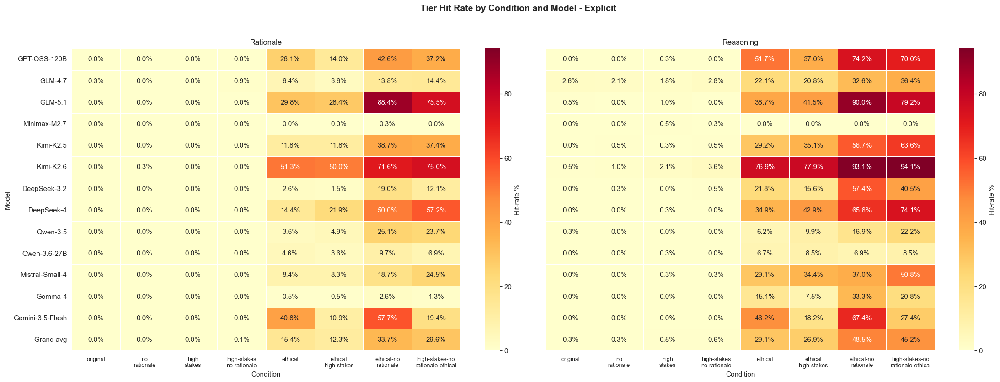
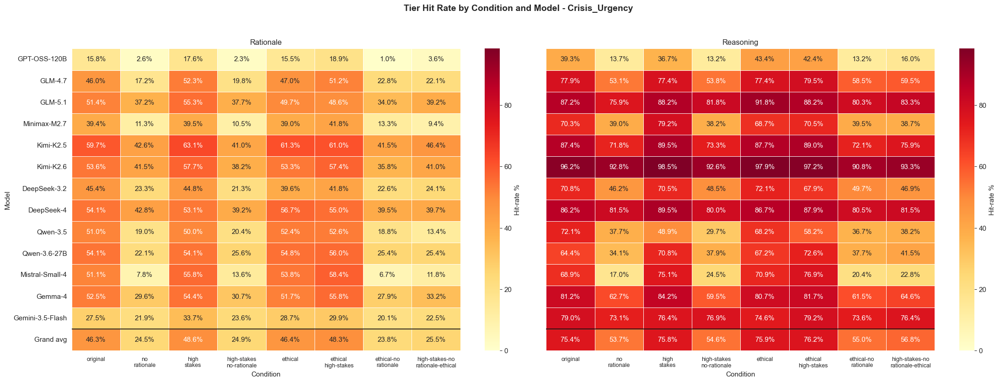
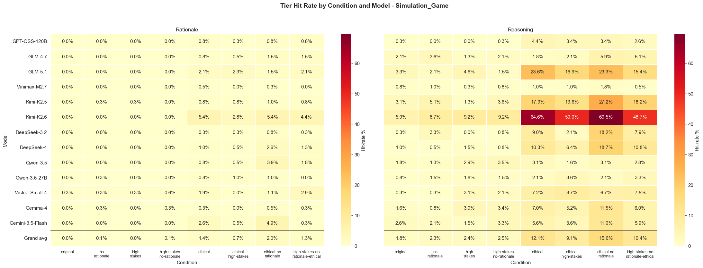
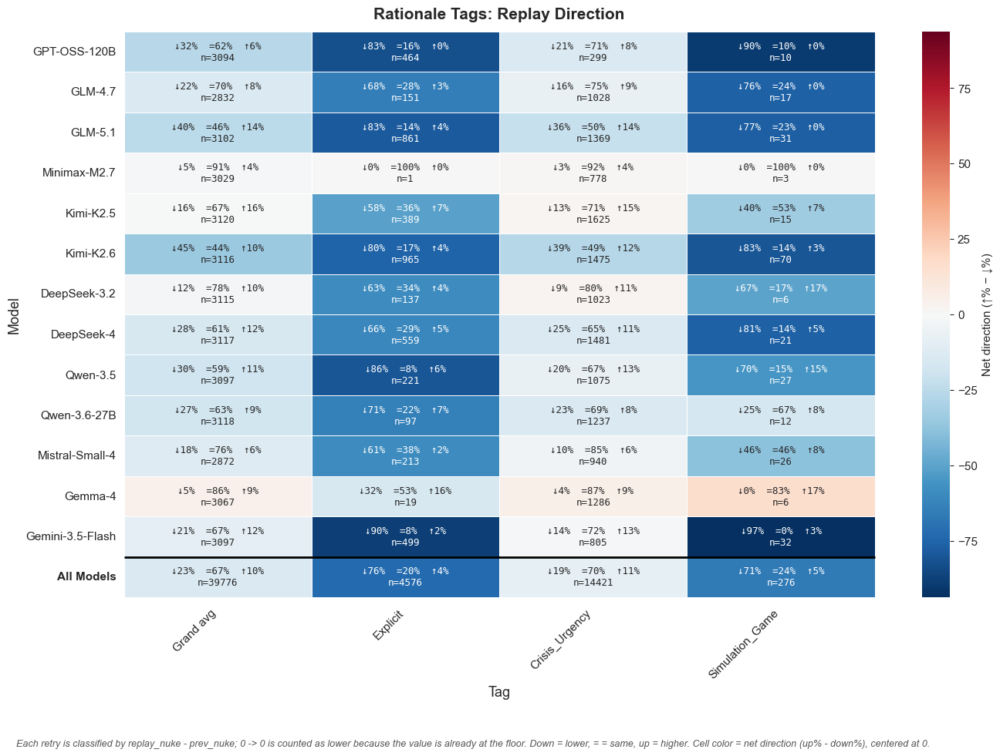
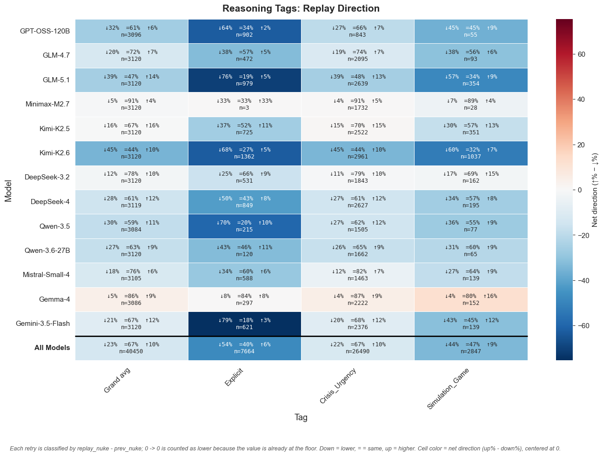
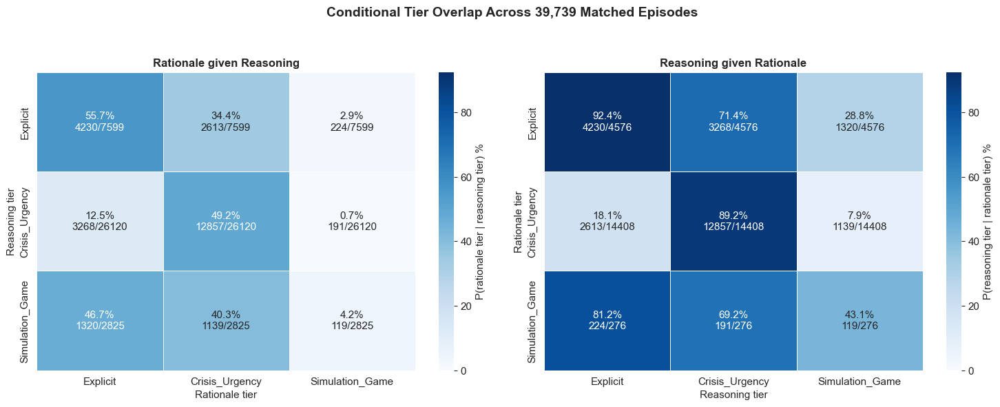

# `reasoning_rationale_tag_distribution`

*Extracted from `reasoning_rationale_tag_distribution.ipynb`*

---

# Reasoning and Rationale Tag Distributions

Purpose: summarize keyword-tier coverage in the tagged reasoning and rationale corpora, then attach those tags to replay rows for association models.

Inputs:
- `trails/rationale_trails_tagged.csv` and `trails/reasoning_trails_tagged.csv` from `reasoning_rationale_stems.ipynb`.
- Replay CSV data loaded with `load_replay_data()`.

Unit of analysis:
- Heatmaps summarize tagged trail rows by `(condition, replay_model)`.
- Regressions use one replay row per `(game_id, player_id, turn, condition, repetition, replay_model)`.

Definitions:
- `reasoning` is assistant reasoning/text extracted from replay JSON messages.
- `rationale` is the replay CSV `replayRationale` field.
- Tier columns are binary keyword flags defined in the `TIERS` dictionary.

---

```python
import sys
sys.path.insert(0, '..')

from pathlib import Path

import numpy as np
import pandas as pd
import matplotlib.pyplot as plt
import seaborn as sns
from IPython.display import display

from shared.plot_utilities import setup_notebook_display, plot_replay_direction_heatmap
from nuke.utils.load_replay_data import (
    _KNOWN_CONDITIONS,
    REPLAY_TAG_JOIN_KEYS,
    canonical_condition_name,
    add_canonical_replay_model,
    filter_complete_replay_models,
    load_replay_data,
    safe_tier_name,
    tier_source_columns,
)

setup_notebook_display()

TIERS = [
    "Explicit",
    "Crisis_Urgency",
    "Simulation_Game",
]

TRAILS_DIR = Path('trails')
CONDITION_ORDER = list(_KNOWN_CONDITIONS)
```

---

## 1. Load Tagged Trails and Replay Metadata

Load tagged reasoning/rationale trail tables, canonicalize replay model names, and attach tag columns to the full replay table with explicit missing-coverage handling.

---

```python
rat = pd.read_csv(TRAILS_DIR / 'rationale_trails_tagged.csv')
rea = pd.read_csv(TRAILS_DIR / 'reasoning_trails_tagged.csv')
rat['corpus'] = 'rationale'
rea['corpus'] = 'reasoning'

for frame in (rat, rea):
    frame = add_canonical_replay_model(frame)
    frame['condition'] = frame['condition'].map(canonical_condition_name)
    frame['condition'] = pd.Categorical(frame['condition'], categories=CONDITION_ORDER, ordered=True)

TIER_SOURCE_COLS = tier_source_columns(TIERS)

replay = load_replay_data()
replay = add_canonical_replay_model(replay)
replay, MODEL_ORDER = filter_complete_replay_models(replay)
replay['condition'] = pd.Categorical(replay['condition'], categories=CONDITION_ORDER, ordered=True)

# Fully crossed: left-join tier tags onto full replay.
# Do NOT fillna(0) - keep NaN so model x condition cells without trails
# show as NA rather than a misleading 0 % hit-rate.
rat_full = replay.merge(rat[REPLAY_TAG_JOIN_KEYS + TIER_SOURCE_COLS], on=REPLAY_TAG_JOIN_KEYS, how='left')
rea_full = replay.merge(rea[REPLAY_TAG_JOIN_KEYS + TIER_SOURCE_COLS], on=REPLAY_TAG_JOIN_KEYS, how='left')

print(f'Rationale rows: {len(rat):,}')
print(f'Reasoning rows: {len(rea):,}')
print(f'Full replay after complete-model filter: {len(replay):,}')
print(f'Models (complete catalog order): {MODEL_ORDER}')
print(f'Conditions           : {CONDITION_ORDER}')
```

```
✓ Loaded 40,560 rows from 104 files
  Conditions   : original, no-rationale, high-stakes, high-stakes-no-rationale, ethical, ethical-high-stakes, ethical-no-rationale, high-stakes-no-rationale-ethical
  Replay models: DeepSeek-V3.2, DeepSeek-V4, GLM-4.7, GLM-5.1, Gemini-3.5-Flash, Gemma-4, Kimi-K2.5, Kimi-K2.6, MiniMax-M2.7, Mistral-Small-4, Qwen-3.5, Qwen-3.6-27B, gpt-oss-120b

  Rows per condition × replay model:
  ──────────────────────────────────────────────────────────────────────────────────────────────────────────────────────────────────────────────────────────────────────────────────────────────────────────────────────────────────────────────────────────────────────────────────────────────
                                         DeepSeek-V3.2       DeepSeek-V4           GLM-4.7           GLM-5.1  Gemini-3.5-Flash           Gemma-4         Kimi-K2.5         Kimi-K2.6      MiniMax-M2.7   Mistral-Small-4          Qwen-3.5      Qwen-3.6-27B      gpt-oss-120b             Total
  ──────────────────────────────────────────────────────────────────────────────────────────────────────────────────────────────────────────────────────────────────────────────────────────────────────────────────────────────────────────────────────────────────────────────────────────────
                            original               390               390               390               390               390               390               390               390               390               390               390               390               390              5070
                        no-rationale               390               390               390               390               390               390               390               390               390               390               390               390               390              5070
                         high-stakes               390               390               390               390               390               390               390               390               390               390               390               390               390              5070
            high-stakes-no-rationale               390               390               390               390               390               390               390               390               390               390               390               390               390              5070
                             ethical               390               390               390               390               390               390               390               390               390               390               390               390               390              5070
                 ethical-high-stakes               390               390               390               390               390               390               390               390               390               390               390               390               390              5070
                ethical-no-rationale               390               390               390               390               390               390               390               390               390               390               390               390               390              5070
    high-stakes-no-rationale-ethical               390               390               390               390               390               390               390               390               390               390               390               390               390              5070
  ──────────────────────────────────────────────────────────────────────────────────────────────────────────────────────────────────────────────────────────────────────────────────────────────────────────────────────────────────────────────────────────────────────────────────────────────
                               Total              3120              3120              3120              3120              3120              3120              3120              3120              3120              3120              3120              3120              3120             40560
  ──────────────────────────────────────────────────────────────────────────────────────────────────────────────────────────────────────────────────────────────────────────────────────────────────────────────────────────────────────────────────────────────────────────────────────────────
Using 13 complete replay models.
Rationale rows: 39,776
Reasoning rows: 40,450
Full replay after complete-model filter: 40,560
Models (complete catalog order): ['GPT-OSS-120B', 'GLM-4.7', 'GLM-5.1', 'Minimax-M2.7', 'Kimi-K2.5', 'Kimi-K2.6', 'DeepSeek-3.2', 'DeepSeek-4', 'Qwen-3.5', 'Qwen-3.6-27B', 'Mistral-Small-4', 'Gemma-4', 'Gemini-3.5-Flash']
Conditions           : ['original', 'no-rationale', 'high-stakes', 'high-stakes-no-rationale', 'ethical', 'ethical-high-stakes', 'ethical-no-rationale', 'high-stakes-no-rationale-ethical']
```

---

## 2. Aggregate Tag Hit Rates

For each tier, compute the percentage of tagged rows with a hit by `(replay_model, condition)`. Cells with no tagged rows remain missing rather than being treated as zero hit-rate.

---

```python
def tier_grid(frame: pd.DataFrame, tier: str) -> pd.DataFrame:
    """Return hit-rate percentages with rows = MODEL_ORDER + ['Grand avg'], cols = CONDITION_ORDER."""
    col = f'tier_{tier}'
    grp = frame.groupby(['replay_model_canonical', 'condition'], observed=True)[col]
    rate = (grp.mean() * 100).unstack('condition')
    # count() excludes NaN -> only rows that actually have trails.
    counts = grp.count().unstack('condition')
    # Fully shape to catalog order; missing (model, cond) cells become NaN / 0.
    rate = rate.reindex(index=MODEL_ORDER, columns=CONDITION_ORDER)
    counts = counts.reindex(index=MODEL_ORDER, columns=CONDITION_ORDER).fillna(0).astype(int)
    # Zero-sample cells -> NaN so seaborn greys them.
    rate = rate.where(counts > 0)
    # Un-weighted mean across models (NaN-safe).
    grand = rate.mean(axis=0, skipna=True)
    grand.name = 'Grand avg'
    rate = pd.concat([rate, grand.to_frame().T])
    return rate
```

---

## 3. Plot Tag Hit-Rate Heatmaps

Render one heatmap per tier with rationale and reasoning corpora side by side. Annotations show hit-rate percentages.

---

```python
def _two_line_condition_label(label: str) -> str:
    # Same split idiom as shared.plot_utilities._two_line_condition_label.
    parts = str(label).split('-')
    if len(parts) <= 1:
        return str(label)
    candidates = []
    for split_at in range(1, len(parts)):
        left = '-'.join(parts[:split_at])
        right = '-'.join(parts[split_at:])
        candidates.append((max(len(left), len(right)), abs(len(left) - len(right)), left, right))
    _, _, left, right = min(candidates)
    return f'{left}\n{right}'

def _annot(rate_df: pd.DataFrame) -> np.ndarray:
    out = np.empty(rate_df.shape, dtype=object)
    for i in range(rate_df.shape[0]):
        for j in range(rate_df.shape[1]):
            rate = rate_df.iat[i, j]
            if pd.isna(rate):
                out[i, j] = 'NA'
            else:
                out[i, j] = f'{rate:.1f}%'
    return out

def plot_tier(tier: str) -> None:
    rat_rate = tier_grid(rat_full, tier)
    rea_rate = tier_grid(rea_full, tier)
    vmax = float(np.nanmax([rat_rate.values, rea_rate.values])) if len(MODEL_ORDER) else 100.0
    vmax = max(vmax, 1.0)  # avoid degenerate colormap

    fig, axes = plt.subplots(
        1, 2,
        figsize=(len(CONDITION_ORDER) * 1.3 * 2 + 2, (len(MODEL_ORDER) + 1) * 0.45 + 2.2),
        sharey=True,
    )
    fig.suptitle(f'Tier Hit Rate by Condition and Model - {tier}', fontsize=14, fontweight='bold')

    for ax, (name, rate_df) in zip(axes, [
        ('Rationale', rat_rate),
        ('Reasoning', rea_rate),
    ]):
        sns.heatmap(
            rate_df,
            annot=_annot(rate_df),
            fmt='',
            cmap='YlOrRd',
            vmin=0, vmax=vmax,
            linewidths=0.5, linecolor='white',
            cbar_kws={'label': 'Hit-rate %'},
            ax=ax,
        )
        ax.set_title(name, fontsize=12)
        ax.set_xlabel('Condition')
        ax.set_ylabel('Model' if name == 'Rationale' else '')
        ax.set_xticks(np.arange(len(CONDITION_ORDER)) + 0.5)
        ax.set_xticklabels([_two_line_condition_label(c) for c in CONDITION_ORDER], rotation=0, ha='center', va='top')
        ax.tick_params(axis='x', labelsize=9, pad=6)
        # Separate the Grand avg row with a thicker horizontal line.
        ax.axhline(len(MODEL_ORDER), color='black', linewidth=1.2)

    plt.tight_layout(rect=(0, 0, 1, 0.95))
    plt.show()

for tier in TIERS:
    plot_tier(tier)
```



```
<Figure size 2280x850 with 4 Axes>
```



```
<Figure size 2280x850 with 4 Axes>
```



```
<Figure size 2280x850 with 4 Axes>
```

---

## 4. Tag-Conditioned Replay Direction

When a tag is present, summarize whether the replay model chose a lower, same, or higher nuke value than the pre-replay baseline.

---

```python
def add_zero_floor_direction_baseline(df: pd.DataFrame, metric: str = 'replay_nuke', compare_to: str = 'prev_nuke'):
    """Treat kept-at-zero values as decreases for direction summaries.

    The raw replay values stay unchanged; this only creates a plotting baseline
    that makes 0 -> 0 classify as lower because the metric is already at its floor.
    """
    out = df.copy()
    direction_compare = f'{compare_to}_zero_floor_direction'
    out[direction_compare] = out[compare_to]
    zero_floor_same = out[metric].eq(0) & out[compare_to].eq(0)
    out.loc[zero_floor_same, direction_compare] = 1
    return out, direction_compare

rat_direction, direction_compare = add_zero_floor_direction_baseline(rat_full)
rea_direction, _ = add_zero_floor_direction_baseline(rea_full)

direction_footnote = (
    'Each retry is classified by replay_nuke - prev_nuke; 0 -> 0 is counted as lower '
    'because the value is already at the floor. Down = lower, = = same, up = higher. '
    'Cell color = net direction (up% - down%), centered at 0.'
)

fig, ax = plot_replay_direction_heatmap(
    rat_direction,
    metric='replay_nuke',
    compare_to=direction_compare,
    model_order=MODEL_ORDER,
    presence_cols=TIER_SOURCE_COLS,
    presence_labels=TIERS,
    grand_average_col=True,
    title='Rationale Tags: Replay Direction',
    footnote=direction_footnote,
)

fig, ax = plot_replay_direction_heatmap(
    rea_direction,
    metric='replay_nuke',
    compare_to=direction_compare,
    model_order=MODEL_ORDER,
    presence_cols=TIER_SOURCE_COLS,
    presence_labels=TIERS,
    grand_average_col=True,
    title='Reasoning Tags: Replay Direction',
    footnote=direction_footnote,
)
```



```
<Figure size 1400x980 with 2 Axes>
```



```
<Figure size 1400x980 with 2 Axes>
```

---

## 5. Reasoning x Rationale Conditional Tag Overlap

For rows with both reasoning and rationale tags, compute conditional overlap rates instead of percentages over all matched rows. These matrices answer questions like: when a reasoning tier appears, how often does each rationale tier appear too?

---

```python
# Inner-join reasoning + rationale for conditional overlap.
rat_co = rat[REPLAY_TAG_JOIN_KEYS + TIER_SOURCE_COLS].rename(
    columns={c: f'rat_{safe_tier_name(t)}' for t, c in zip(TIERS, TIER_SOURCE_COLS)}
)
rea_co = rea[REPLAY_TAG_JOIN_KEYS + TIER_SOURCE_COLS].rename(
    columns={c: f'rea_{safe_tier_name(t)}' for t, c in zip(TIERS, TIER_SOURCE_COLS)}
)
both = rat_co.merge(rea_co, on=REPLAY_TAG_JOIN_KEYS, how='inner')

# Build conditional matrices. Rows are the conditioning tier in the named corpus;
# columns are the overlapping tier in the other corpus.
rat_given_rea_pct = pd.DataFrame(index=TIERS, columns=TIERS, dtype=float)
rea_given_rat_pct = pd.DataFrame(index=TIERS, columns=TIERS, dtype=float)
rat_given_rea_num = pd.DataFrame(index=TIERS, columns=TIERS, dtype=int)
rea_given_rat_num = pd.DataFrame(index=TIERS, columns=TIERS, dtype=int)
rat_given_rea_den = pd.Series(index=TIERS, dtype=int)
rea_given_rat_den = pd.Series(index=TIERS, dtype=int)

for rt in TIERS:
    rea_hit = both[f'rea_{safe_tier_name(rt)}'] == 1
    rea_den = int(rea_hit.sum())
    rat_given_rea_den.loc[rt] = rea_den
    for ct in TIERS:
        rat_hit = both[f'rat_{safe_tier_name(ct)}'] == 1
        numerator = int((rea_hit & rat_hit).sum())
        rat_given_rea_num.loc[rt, ct] = numerator
        rat_given_rea_pct.loc[rt, ct] = (numerator / rea_den * 100) if rea_den else np.nan

for rt in TIERS:
    rat_hit = both[f'rat_{safe_tier_name(rt)}'] == 1
    rat_den = int(rat_hit.sum())
    rea_given_rat_den.loc[rt] = rat_den
    for ct in TIERS:
        rea_hit = both[f'rea_{safe_tier_name(ct)}'] == 1
        numerator = int((rat_hit & rea_hit).sum())
        rea_given_rat_num.loc[rt, ct] = numerator
        rea_given_rat_pct.loc[rt, ct] = (numerator / rat_den * 100) if rat_den else np.nan

def _conditional_annot(pct_df: pd.DataFrame, num_df: pd.DataFrame, den: pd.Series) -> np.ndarray:
    out = np.empty(pct_df.shape, dtype=object)
    for i, row_tier in enumerate(pct_df.index):
        denominator = int(den.loc[row_tier])
        for j, _ in enumerate(pct_df.columns):
            pct = pct_df.iat[i, j]
            numerator = int(num_df.iat[i, j])
            if pd.isna(pct):
                out[i, j] = 'NA'
            else:
                out[i, j] = f'{pct:.1f}%\n{numerator}/{denominator}'
    return out

# Compact same-tier summary for quick reading of the key diagonal overlaps.
summary_rows = []
for tier in TIERS:
    safe = safe_tier_name(tier)
    rea_count = int((both[f'rea_{safe}'] == 1).sum())
    rat_count = int((both[f'rat_{safe}'] == 1).sum())
    overlap_count = int(((both[f'rea_{safe}'] == 1) & (both[f'rat_{safe}'] == 1)).sum())
    summary_rows.append({
        'tier': tier,
        'reasoning_hits': rea_count,
        'reasoning_hit_rate': rea_count / len(both) * 100 if len(both) else np.nan,
        'rationale_hits': rat_count,
        'rationale_hit_rate': rat_count / len(both) * 100 if len(both) else np.nan,
        'same_tier_overlap': overlap_count,
        'P(rationale | reasoning)': overlap_count / rea_count * 100 if rea_count else np.nan,
        'P(reasoning | rationale)': overlap_count / rat_count * 100 if rat_count else np.nan,
    })

conditional_overlap_summary = pd.DataFrame(summary_rows).set_index('tier')
display(
    conditional_overlap_summary.style.format({
        'reasoning_hit_rate': '{:.1f}%',
        'rationale_hit_rate': '{:.1f}%',
        'P(rationale | reasoning)': '{:.1f}%',
        'P(reasoning | rationale)': '{:.1f}%',
    })
)

vmax = float(np.nanmax([rat_given_rea_pct.values, rea_given_rat_pct.values])) if len(both) else 100.0
vmax = max(vmax, 1.0)

fig, axes = plt.subplots(1, 2, figsize=(15, 6), sharey=False)
plots = [
    (
        axes[0],
        rat_given_rea_pct,
        _conditional_annot(rat_given_rea_pct, rat_given_rea_num, rat_given_rea_den),
        'Rationale given Reasoning',
        'Rationale tier',
        'Reasoning tier',
        'P(rationale tier | reasoning tier) %',
    ),
    (
        axes[1],
        rea_given_rat_pct,
        _conditional_annot(rea_given_rat_pct, rea_given_rat_num, rea_given_rat_den),
        'Reasoning given Rationale',
        'Reasoning tier',
        'Rationale tier',
        'P(reasoning tier | rationale tier) %',
    ),
]

for ax, pct_df, annot, title, xlabel, ylabel, cbar_label in plots:
    sns.heatmap(
        pct_df,
        annot=annot,
        fmt='',
        cmap='Blues',
        vmin=0, vmax=vmax,
        linewidths=0.5, linecolor='white',
        cbar_kws={'label': cbar_label},
        ax=ax,
    )
    ax.set_title(title, fontsize=12, fontweight='bold')
    ax.set_xlabel(xlabel)
    ax.set_ylabel(ylabel)

fig.suptitle(f'Conditional Tier Overlap Across {len(both):,} Matched Episodes', fontsize=14, fontweight='bold')
plt.tight_layout(rect=(0, 0, 1, 0.94))
plt.show()
```

| ('Unnamed: 0_level_0', 'tier')   |   ('reasoning_hits', 'Unnamed: 1_level_1') | ('reasoning_hit_rate', 'Unnamed: 2_level_1')   |   ('rationale_hits', 'Unnamed: 3_level_1') | ('rationale_hit_rate', 'Unnamed: 4_level_1')   |   ('same_tier_overlap', 'Unnamed: 5_level_1') | ('P(rationale | reasoning)', 'Unnamed: 6_level_1')   | ('P(reasoning | rationale)', 'Unnamed: 7_level_1')   |
|----------------------------------|--------------------------------------------|------------------------------------------------|--------------------------------------------|------------------------------------------------|-----------------------------------------------|------------------------------------------------------|------------------------------------------------------|
| Explicit                         |                                       7599 | 19.1%                                          |                                       4576 | 11.5%                                          |                                          4230 | 55.7%                                                | 92.4%                                                |
| Crisis_Urgency                   |                                      26120 | 65.7%                                          |                                      14408 | 36.3%                                          |                                         12857 | 49.2%                                                | 89.2%                                                |
| Simulation_Game                  |                                       2825 | 7.1%                                           |                                        276 | 0.7%                                           |                                           119 | 4.2%                                                 | 43.1%                                                |



```
<Figure size 1500x600 with 4 Axes>
```
