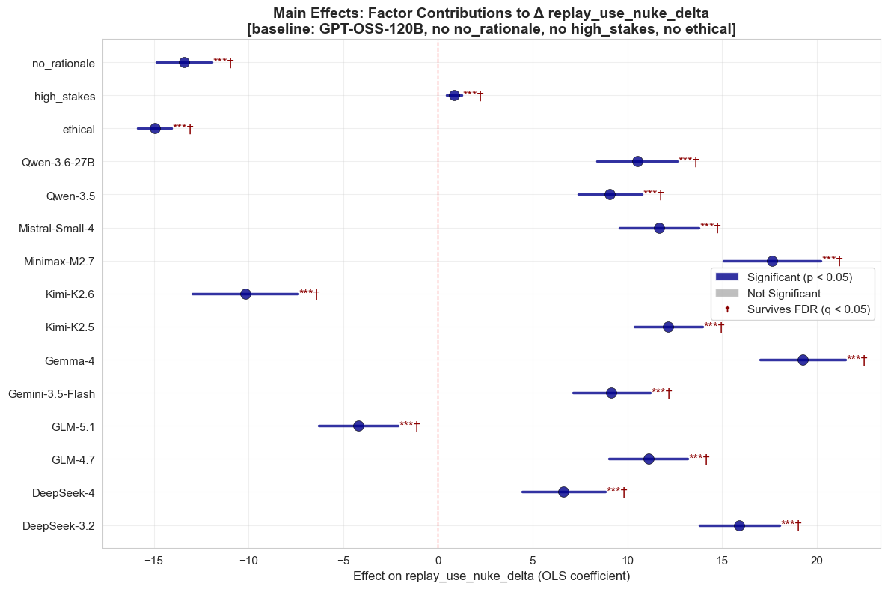
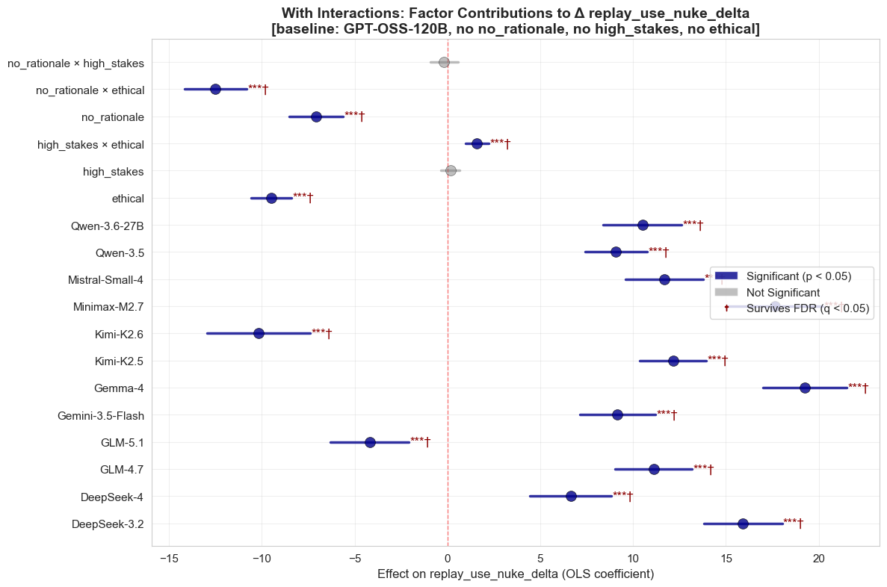
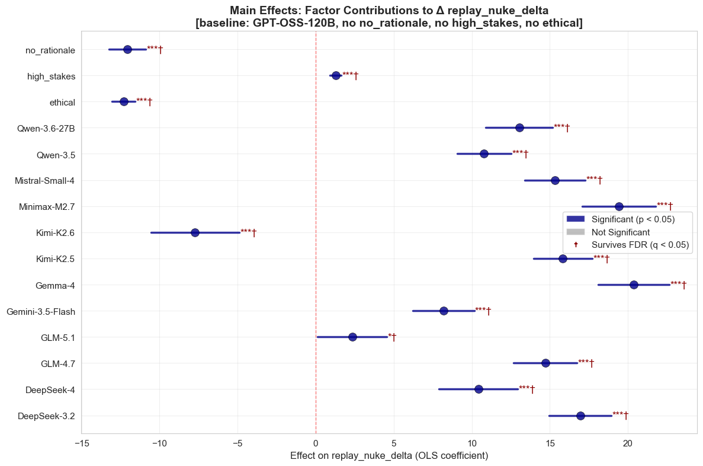
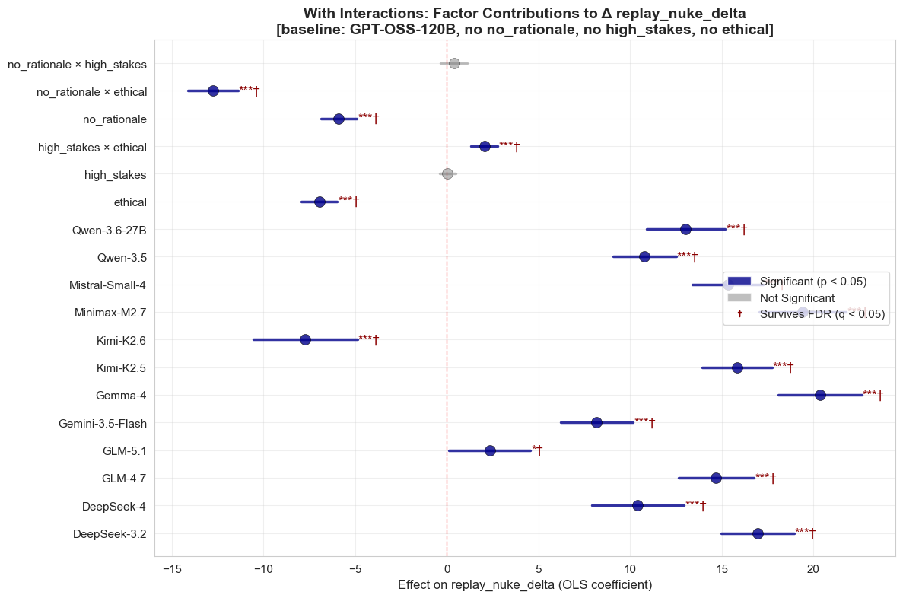
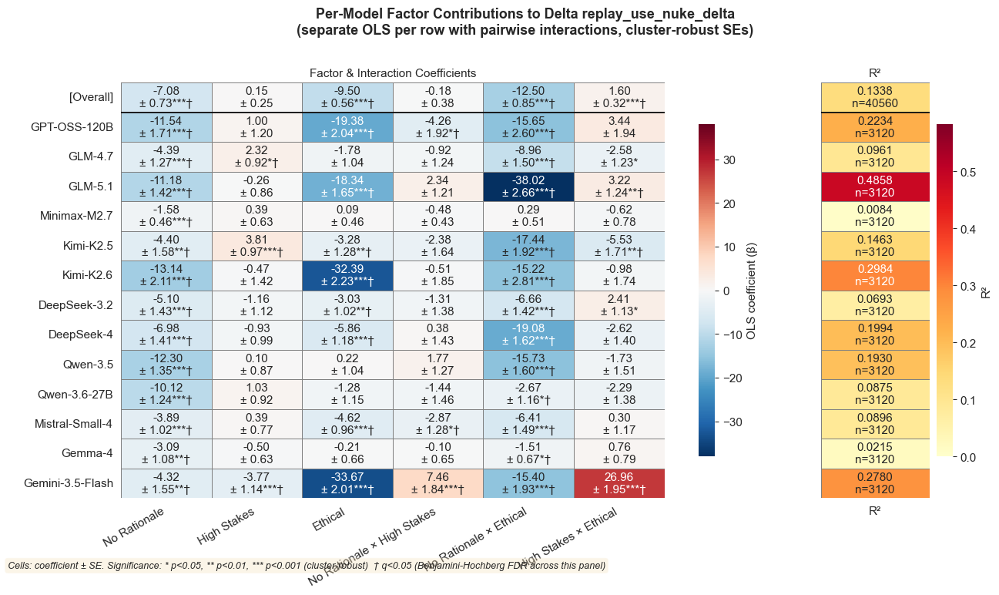
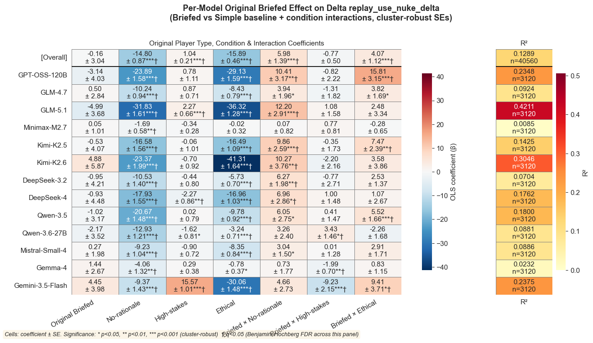
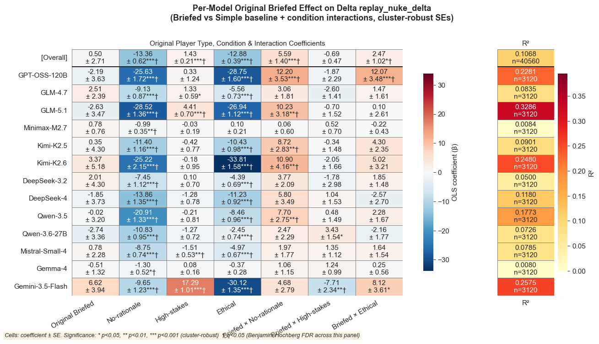
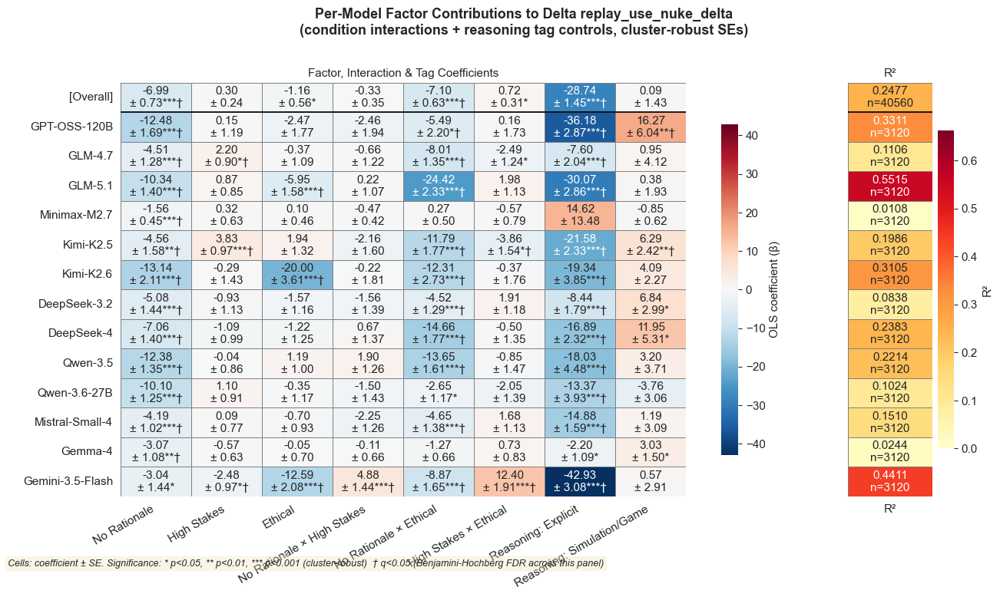
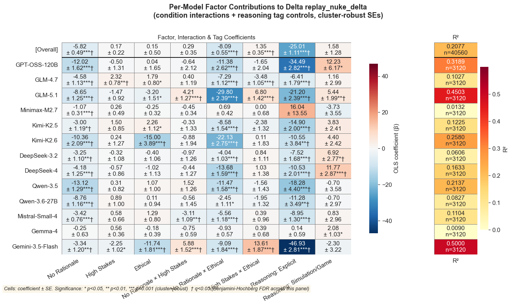

# `replay_regression`

*Extracted from `replay_regression.ipynb`*

---

```python
import sys
sys.path.insert(0, '..')

import pandas as pd
from IPython.display import display, Markdown

from shared.plot_utilities import setup_notebook_display
from shared.regression_utilities import run_regression_suite, plot_regression_coefficient_heatmap
from shared.stats_utilities import benjamini_hochberg, fdr_marker
from nuke.utils.load_replay_data import (
    CONDITION_FACTORS,
    REPLAY_TAG_JOIN_KEYS,
    canonical_condition_name,
    add_canonical_replay_model,
    add_condition_factor_columns,
    get_complete_replay_models,
    get_present_strategist_model_order,
    load_replay_data,
    prefixed_tier_columns,
    tier_source_columns,
)

setup_notebook_display()
df = load_replay_data()
df = add_canonical_replay_model(df)
df = add_condition_factor_columns(df)
```

```
✓ Loaded 40,560 rows from 104 files
  Conditions   : original, no-rationale, high-stakes, high-stakes-no-rationale, ethical, ethical-high-stakes, ethical-no-rationale, high-stakes-no-rationale-ethical
  Replay models: DeepSeek-V3.2, DeepSeek-V4, GLM-4.7, GLM-5.1, Gemini-3.5-Flash, Gemma-4, Kimi-K2.5, Kimi-K2.6, MiniMax-M2.7, Mistral-Small-4, Qwen-3.5, Qwen-3.6-27B, gpt-oss-120b

  Rows per condition × replay model:
  ──────────────────────────────────────────────────────────────────────────────────────────────────────────────────────────────────────────────────────────────────────────────────────────────────────────────────────────────────────────────────────────────────────────────────────────────
                                         DeepSeek-V3.2       DeepSeek-V4           GLM-4.7           GLM-5.1  Gemini-3.5-Flash           Gemma-4         Kimi-K2.5         Kimi-K2.6      MiniMax-M2.7   Mistral-Small-4          Qwen-3.5      Qwen-3.6-27B      gpt-oss-120b             Total
  ──────────────────────────────────────────────────────────────────────────────────────────────────────────────────────────────────────────────────────────────────────────────────────────────────────────────────────────────────────────────────────────────────────────────────────────────
                            original               390               390               390               390               390               390               390               390               390               390               390               390               390              5070
                        no-rationale               390               390               390               390               390               390               390               390               390               390               390               390               390              5070
                         high-stakes               390               390               390               390               390               390               390               390               390               390               390               390               390              5070
            high-stakes-no-rationale               390               390               390               390               390               390               390               390               390               390               390               390               390              5070
                             ethical               390               390               390               390               390               390               390               390               390               390               390               390               390              5070
                 ethical-high-stakes               390               390               390               390               390               390               390               390               390               390               390               390               390              5070
                ethical-no-rationale               390               390               390               390               390               390               390               390               390               390               390               390               390              5070
    high-stakes-no-rationale-ethical               390               390               390               390               390               390               390               390               390               390               390               390               390              5070
  ──────────────────────────────────────────────────────────────────────────────────────────────────────────────────────────────────────────────────────────────────────────────────────────────────────────────────────────────────────────────────────────────────────────────────────────────
                               Total              3120              3120              3120              3120              3120              3120              3120              3120              3120              3120              3120              3120              3120             40560
  ──────────────────────────────────────────────────────────────────────────────────────────────────────────────────────────────────────────────────────────────────────────────────────────────────────────────────────────────────────────────────────────────────────────────────────────────
```

---

**Multiple-comparison note (FDR).** The significance stars (`*` p<0.05, `**` p<0.01, `***` p<0.001) below use raw, uncorrected p-values. A Benjamini–Hochberg FDR pass is applied *within each table/figure* (the coefficients shown together form one family); coefficients that survive at q<0.05 are additionally marked with a dagger (`†`) next to the raw stars, and tidy tables gain `q_value` / `fdr_significance` columns. Because q ≥ p, a dagger only ever appears on a coefficient that already has a raw star.

---

## Regressions: `replay_use_nuke_delta`

Three nested models (main effects → condition interactions → model × condition) with game/player fixed effects and cluster-robust SEs.

Baseline: GPT-OSS-120B, has rationale, not high-stakes, not ethical

---

```python
GROUP_COLS = ['game_id', 'player_id']

_ = run_regression_suite(
    data=df,
    outcome='replay_use_nuke_delta',
    condition_factors=CONDITION_FACTORS,
    group_cols=GROUP_COLS,
    fdr=True,
)
```

```
[main] replay_use_nuke_delta ~ no_rationale + high_stakes + ethical + C(replay_model_canonical, Treatment(reference="GPT-OSS-120B")) + C(_fe_group)
[interactions] replay_use_nuke_delta ~ no_rationale * high_stakes + no_rationale * ethical + high_stakes * ethical + C(replay_model_canonical, Treatment(reference="GPT-OSS-120B")) + C(_fe_group)
[model_x_condition] replay_use_nuke_delta ~ (no_rationale + high_stakes + ethical) * C(replay_model_canonical, Treatment(reference="GPT-OSS-120B")) + C(_fe_group)

============================================================
Main Effects: Factor Contributions to Δ replay_use_nuke_delta
[baseline: GPT-OSS-120B, no no_rationale, no high_stakes, no ethical] SUMMARY
============================================================

Statistically Significant Effects (p < 0.05):
----------------------------------------
  DeepSeek-3.2                   +15.914 [+13.800, +18.028] ***
  DeepSeek-4                     +6.639 [+4.435, +8.843] ***
  GLM-4.7                        +11.110 [+9.039, +13.181] ***
  GLM-5.1                        -4.198 [-6.302, -2.094] ***
  Gemini-3.5-Flash               +9.166 [+7.125, +11.207] ***
  Gemma-4                        +19.249 [+17.000, +21.498] ***
  Kimi-K2.5                      +12.155 [+10.355, +13.956] ***
  Kimi-K2.6                      -10.170 [-12.951, -7.389] ***
  Minimax-M2.7                   +17.656 [+15.090, +20.222] ***
  Mistral-Small-4                +11.676 [+9.581, +13.771] ***
  Qwen-3.5                       +9.085 [+7.402, +10.768] ***
  Qwen-3.6-27B                   +10.515 [+8.401, +12.629] ***
  ethical                        -14.954 [-15.840, -14.068] ***
  high_stakes                    +0.859 [+0.473, +1.245] ***
  no_rationale                   -13.416 [-14.881, -11.951] ***

Overall Statistics:
----------------------------------------
  Total effects analyzed: 15
  Significant effects: 15 (100.0%)
```



```
<Figure size 1200x800 with 1 Axes>
```

```
=== Main Effects (replay_use_nuke_delta) ===
                              OLS Regression Results                             
=================================================================================
Dep. Variable:     replay_use_nuke_delta   R-squared:                       0.335
Model:                               OLS   Adj. R-squared:                  0.333
Method:                    Least Squares   F-statistic:                     112.0
Date:                   Wed, 08 Jul 2026   Prob (F-statistic):           2.95e-66
Time:                           11:21:23   Log-Likelihood:            -1.8558e+05
No. Observations:                  40560   AIC:                         3.715e+05
Df Residuals:                      40415   BIC:                         3.727e+05
Df Model:                            144                                         
Covariance Type:                 cluster                                         
=================================================================================
R² = 0.3352, Adj R² = 0.3328, n = 40560, (cluster-robust SEs; FE: game_id, player_id)

============================================================
With Interactions: Factor Contributions to Δ replay_use_nuke_delta
[baseline: GPT-OSS-120B, no no_rationale, no high_stakes, no ethical] SUMMARY
============================================================

Statistically Significant Effects (p < 0.05):
----------------------------------------
  DeepSeek-3.2                   +15.914 [+13.799, +18.028] ***
  DeepSeek-4                     +6.639 [+4.435, +8.843] ***
  GLM-4.7                        +11.110 [+9.039, +13.181] ***
  GLM-5.1                        -4.198 [-6.302, -2.094] ***
  Gemini-3.5-Flash               +9.166 [+7.125, +11.207] ***
  Gemma-4                        +19.249 [+17.000, +21.498] ***
  Kimi-K2.5                      +12.155 [+10.355, +13.956] ***
  Kimi-K2.6                      -10.170 [-12.951, -7.389] ***
  Minimax-M2.7                   +17.656 [+15.090, +20.222] ***
  Mistral-Small-4                +11.676 [+9.581, +13.771] ***
  Qwen-3.5                       +9.085 [+7.402, +10.768] ***
  Qwen-3.6-27B                   +10.515 [+8.401, +12.629] ***
  ethical                        -9.503 [-10.602, -8.403] ***
  high_stakes × ethical          +1.596 [+0.966, +2.225] ***
  no_rationale                   -7.078 [-8.518, -5.638] ***
  no_rationale × ethical         -12.498 [-14.162, -10.834] ***

Non-Significant Effects:
----------------------------------------
  high_stakes                    +0.150 [-0.347, +0.647]
  no_rationale × high_stakes     -0.178 [-0.931, +0.576]

Overall Statistics:
----------------------------------------
  Total effects analyzed: 18
  Significant effects: 16 (88.9%)
```

```
c:\Users\John Chen\AppData\Local\Programs\Python\Python312\Lib\site-packages\statsmodels\base\model.py:1894: ValueWarning: covariance of constraints does not have full rank. The number of constraints is 144, but rank is 15
  warnings.warn('covariance of constraints does not have full '
```



```
<Figure size 1200x800 with 1 Axes>
```

```
c:\Users\John Chen\AppData\Local\Programs\Python\Python312\Lib\site-packages\statsmodels\base\model.py:1894: ValueWarning: covariance of constraints does not have full rank. The number of constraints is 147, but rank is 18
  warnings.warn('covariance of constraints does not have full '
```

```

=== Condition Interactions (replay_use_nuke_delta) ===
                              OLS Regression Results                             
=================================================================================
Dep. Variable:     replay_use_nuke_delta   R-squared:                       0.347
Model:                               OLS   Adj. R-squared:                  0.345
Method:                    Least Squares   F-statistic:                     95.03
Date:                   Wed, 08 Jul 2026   Prob (F-statistic):           2.60e-65
Time:                           11:21:23   Log-Likelihood:            -1.8521e+05
No. Observations:                  40560   AIC:                         3.707e+05
Df Residuals:                      40412   BIC:                         3.720e+05
Df Model:                            147                                         
Covariance Type:                 cluster                                         
=================================================================================
R² = 0.3471, Adj R² = 0.3448, n = 40560, (cluster-robust SEs; FE: game_id, player_id)

=== Model x Condition (replay_use_nuke_delta) ===
                              OLS Regression Results                             
=================================================================================
Dep. Variable:     replay_use_nuke_delta   R-squared:                       0.406
Model:                               OLS   Adj. R-squared:                  0.404
Method:                    Least Squares   F-statistic:                     51.52
Date:                   Wed, 08 Jul 2026   Prob (F-statistic):           2.80e-65
Time:                           11:21:23   Log-Likelihood:            -1.8328e+05
No. Observations:                  40560   AIC:                         3.669e+05
Df Residuals:                      40379   BIC:                         3.685e+05
Df Model:                            180                                         
Covariance Type:                 cluster                                         
=================================================================================
R² = 0.4064, Adj R² = 0.4038, n = 40560, (cluster-robust SEs; FE: game_id, player_id)

=== F-tests (replay_use_nuke_delta) ===
Main vs Condition Interactions:
   df_resid           ssr  df_diff        ss_diff           F         Pr(>F)
0   40415.0  2.237793e+07      0.0            NaN         NaN            NaN
1   40412.0  2.197543e+07      3.0  402503.266864  246.729541  1.141787e-158
Main vs Model x Condition:
   df_resid           ssr  df_diff       ss_diff           F  Pr(>F)
0   40415.0  2.237793e+07      0.0           NaN         NaN     NaN
1   40379.0  1.997971e+07     36.0  2.398220e+06  134.633406     0.0
Condition Interactions vs Model x Condition:
   df_resid           ssr  df_diff       ss_diff           F  Pr(>F)
0   40412.0  2.197543e+07      0.0           NaN         NaN     NaN
1   40379.0  1.997971e+07     33.0  1.995717e+06  122.222529     0.0
```

```
c:\Users\John Chen\AppData\Local\Programs\Python\Python312\Lib\site-packages\statsmodels\base\model.py:1894: ValueWarning: covariance of constraints does not have full rank. The number of constraints is 180, but rank is 51
  warnings.warn('covariance of constraints does not have full '
```

---

## Regressions: `replay_nuke_delta`

Same regression suite for the nuke (launch) outcome.

---

```python
_ = run_regression_suite(
    data=df,
    outcome='replay_nuke_delta',
    condition_factors=CONDITION_FACTORS,
    group_cols=GROUP_COLS,
    fdr=True,
)
```

```
[main] replay_nuke_delta ~ no_rationale + high_stakes + ethical + C(replay_model_canonical, Treatment(reference="GPT-OSS-120B")) + C(_fe_group)
[interactions] replay_nuke_delta ~ no_rationale * high_stakes + no_rationale * ethical + high_stakes * ethical + C(replay_model_canonical, Treatment(reference="GPT-OSS-120B")) + C(_fe_group)
[model_x_condition] replay_nuke_delta ~ (no_rationale + high_stakes + ethical) * C(replay_model_canonical, Treatment(reference="GPT-OSS-120B")) + C(_fe_group)

============================================================
Main Effects: Factor Contributions to Δ replay_nuke_delta
[baseline: GPT-OSS-120B, no no_rationale, no high_stakes, no ethical] SUMMARY
============================================================

Statistically Significant Effects (p < 0.05):
----------------------------------------
  DeepSeek-3.2                   +16.949 [+14.954, +18.943] ***
  DeepSeek-4                     +10.419 [+7.895, +12.942] ***
  GLM-4.7                        +14.700 [+12.655, +16.744] ***
  GLM-5.1                        +2.336 [+0.115, +4.556] *
  Gemini-3.5-Flash               +8.179 [+6.209, +10.150] ***
  Gemma-4                        +20.367 [+18.098, +22.636] ***
  Kimi-K2.5                      +15.836 [+13.939, +17.733] ***
  Kimi-K2.6                      -7.726 [-10.565, -4.887] ***
  Minimax-M2.7                   +19.417 [+17.065, +21.769] ***
  Mistral-Small-4                +15.325 [+13.379, +17.272] ***
  Qwen-3.5                       +10.785 [+9.065, +12.506] ***
  Qwen-3.6-27B                   +13.035 [+10.900, +15.170] ***
  ethical                        -12.306 [-13.051, -11.561] ***
  high_stakes                    +1.274 [+0.903, +1.644] ***
  no_rationale                   -12.068 [-13.233, -10.902] ***

Overall Statistics:
----------------------------------------
  Total effects analyzed: 15
  Significant effects: 15 (100.0%)
```



```
<Figure size 1200x800 with 1 Axes>
```

```
=== Main Effects (replay_nuke_delta) ===
                            OLS Regression Results                            
==============================================================================
Dep. Variable:      replay_nuke_delta   R-squared:                       0.287
Model:                            OLS   Adj. R-squared:                  0.284
Method:                 Least Squares   F-statistic:                     107.0
Date:                Wed, 08 Jul 2026   Prob (F-statistic):           4.35e-65
Time:                        11:21:25   Log-Likelihood:            -1.8479e+05
No. Observations:               40560   AIC:                         3.699e+05
Df Residuals:                   40415   BIC:                         3.711e+05
Df Model:                         144                                         
Covariance Type:              cluster                                         
==============================================================================
R² = 0.2867, Adj R² = 0.2842, n = 40560, (cluster-robust SEs; FE: game_id, player_id)
```

```
c:\Users\John Chen\AppData\Local\Programs\Python\Python312\Lib\site-packages\statsmodels\base\model.py:1894: ValueWarning: covariance of constraints does not have full rank. The number of constraints is 144, but rank is 15
  warnings.warn('covariance of constraints does not have full '
```

```

============================================================
With Interactions: Factor Contributions to Δ replay_nuke_delta
[baseline: GPT-OSS-120B, no no_rationale, no high_stakes, no ethical] SUMMARY
============================================================

Statistically Significant Effects (p < 0.05):
----------------------------------------
  DeepSeek-3.2                   +16.949 [+14.954, +18.943] ***
  DeepSeek-4                     +10.419 [+7.895, +12.942] ***
  GLM-4.7                        +14.700 [+12.655, +16.744] ***
  GLM-5.1                        +2.336 [+0.115, +4.556] *
  Gemini-3.5-Flash               +8.179 [+6.209, +10.150] ***
  Gemma-4                        +20.367 [+18.098, +22.636] ***
  Kimi-K2.5                      +15.836 [+13.939, +17.733] ***
  Kimi-K2.6                      -7.726 [-10.565, -4.887] ***
  Minimax-M2.7                   +19.417 [+17.065, +21.769] ***
  Mistral-Small-4                +15.325 [+13.379, +17.272] ***
  Qwen-3.5                       +10.785 [+9.065, +12.506] ***
  Qwen-3.6-27B                   +13.035 [+10.900, +15.170] ***
  ethical                        -6.952 [-7.917, -5.988] ***
  high_stakes × ethical          +2.049 [+1.335, +2.764] ***
  no_rationale                   -5.889 [-6.867, -4.911] ***
  no_rationale × ethical         -12.757 [-14.115, -11.398] ***

Non-Significant Effects:
----------------------------------------
  high_stakes                    +0.050 [-0.385, +0.484]
  no_rationale × high_stakes     +0.399 [-0.333, +1.130]

Overall Statistics:
----------------------------------------
  Total effects analyzed: 18
  Significant effects: 16 (88.9%)
```



```
<Figure size 1200x800 with 1 Axes>
```

```

=== Condition Interactions (replay_nuke_delta) ===
                            OLS Regression Results                            
==============================================================================
Dep. Variable:      replay_nuke_delta   R-squared:                       0.301
Model:                            OLS   Adj. R-squared:                  0.298
Method:                 Least Squares   F-statistic:                     104.0
Date:                Wed, 08 Jul 2026   Prob (F-statistic):           1.18e-67
Time:                        11:21:26   Log-Likelihood:            -1.8439e+05
No. Observations:               40560   AIC:                         3.691e+05
Df Residuals:                   40412   BIC:                         3.703e+05
Df Model:                         147                                         
Covariance Type:              cluster                                         
==============================================================================
R² = 0.3008, Adj R² = 0.2982, n = 40560, (cluster-robust SEs; FE: game_id, player_id)

=== Model x Condition (replay_nuke_delta) ===
                            OLS Regression Results                            
==============================================================================
Dep. Variable:      replay_nuke_delta   R-squared:                       0.357
Model:                            OLS   Adj. R-squared:                  0.354
Method:                 Least Squares   F-statistic:                     66.70
Date:                Wed, 08 Jul 2026   Prob (F-statistic):           4.23e-72
Time:                        11:21:26   Log-Likelihood:            -1.8270e+05
No. Observations:               40560   AIC:                         3.658e+05
Df Residuals:                   40379   BIC:                         3.673e+05
Df Model:                         180                                         
Covariance Type:              cluster                                         
==============================================================================
R² = 0.3566, Adj R² = 0.3537, n = 40560, (cluster-robust SEs; FE: game_id, player_id)

=== F-tests (replay_nuke_delta) ===
Main vs Condition Interactions:
   df_resid           ssr  df_diff        ss_diff           F         Pr(>F)
0   40415.0  2.152266e+07      0.0            NaN         NaN            NaN
1   40412.0  2.109907e+07      3.0  423584.898422  270.437044  8.392702e-174
Main vs Model x Condition:
   df_resid           ssr  df_diff       ss_diff           F  Pr(>F)
0   40415.0  2.152266e+07      0.0           NaN         NaN     NaN
1   40379.0  1.941448e+07     36.0  2.108175e+06  121.796236     0.0
Condition Interactions vs Model x Condition:
   df_resid           ssr  df_diff       ss_diff           F  Pr(>F)
0   40412.0  2.109907e+07      0.0           NaN         NaN     NaN
1   40379.0  1.941448e+07     33.0  1.684590e+06  106.172003     0.0
```

```
c:\Users\John Chen\AppData\Local\Programs\Python\Python312\Lib\site-packages\statsmodels\base\model.py:1894: ValueWarning: covariance of constraints does not have full rank. The number of constraints is 147, but rank is 18
  warnings.warn('covariance of constraints does not have full '
c:\Users\John Chen\AppData\Local\Programs\Python\Python312\Lib\site-packages\statsmodels\base\model.py:1894: ValueWarning: covariance of constraints does not have full rank. The number of constraints is 180, but rank is 51
  warnings.warn('covariance of constraints does not have full '
```

---

## Per-Model Factor Contributions

Separate OLS regressions per model with pairwise interactions:
`outcome ~ no_rationale * high_stakes + no_rationale * ethical + high_stakes * ethical`
with cluster-robust SEs.

Left panel shows main-effect and interaction coefficients with significance stars.
Right panel shows per-model R².

---

```python
from itertools import combinations

model_order = get_present_strategist_model_order(df)
heatmap_model_order = get_complete_replay_models(df, model_order=model_order)
skipped = [model for model in model_order if model not in heatmap_model_order]
if skipped:
    print(f'Skipping models with incomplete condition sets: {", ".join(skipped)}')

interaction_names = [f'{a}:{b}' for a, b in combinations(CONDITION_FACTORS, 2)]
all_vars = CONDITION_FACTORS + interaction_names
pairs = ' + '.join(f'{a} * {b}' for a, b in combinations(CONDITION_FACTORS, 2))
formula_template = '{outcome} ~ ' + pairs

for outcome in ['replay_use_nuke_delta', 'replay_nuke_delta']:
    display(Markdown(f'### {outcome}'))
    plot_regression_coefficient_heatmap(
        data=df,
        outcome=outcome,
        predictors=all_vars,
        group_cols=GROUP_COLS,
        model_order=heatmap_model_order,
        formula=formula_template.format(outcome=outcome),
        title=(
            f'Per-Model Factor Contributions to Delta {outcome}\n'
            f'(separate OLS per row with pairwise interactions, cluster-robust SEs)'
        ),
        coefficient_title='Factor & Interaction Coefficients',
        figsize=(14, 7),
        fdr=True,
    )
```

```
<IPython.core.display.Markdown object>
```

```
f:\vox-deorum\nuke-analysis\nuke\..\shared\regression_utilities.py:447: UserWarning: This figure includes Axes that are not compatible with tight_layout, so results might be incorrect.
  plt.tight_layout()
```



```
<Figure size 1400x700 with 4 Axes>
```

```
<IPython.core.display.Markdown object>
```

```
f:\vox-deorum\nuke-analysis\nuke\..\shared\regression_utilities.py:447: UserWarning: This figure includes Axes that are not compatible with tight_layout, so results might be incorrect.
  plt.tight_layout()
```


```
<Figure size 1400x700 with 4 Axes>
```

---

```python
df_player_type = df.copy()
df_player_type['original_briefed'] = (
    df_player_type['player_type']
    .astype(str)
    .str.contains('Briefed', case=False, regex=False)
    .astype(int)
)

briefed_interaction_names = [
    f'original_briefed:{factor}' for factor in CONDITION_FACTORS
]
briefed_vars = ['original_briefed'] + CONDITION_FACTORS + briefed_interaction_names
briefed_formula_template = (
    '{outcome} ~ original_briefed * ('
    + ' + '.join(CONDITION_FACTORS)
    + ')'
)

BRIEFED_LABELS = {
    'original_briefed': 'Original Briefed',
    'no_rationale': 'No-rationale',
    'high_stakes': 'High-stakes',
    'ethical': 'Ethical',
    'original_briefed:no_rationale': 'Briefed × No-rationale',
    'original_briefed:high_stakes': 'Briefed × High-stakes',
    'original_briefed:ethical': 'Briefed × Ethical',
}

display(Markdown('## Original Player Type: Briefed vs Simple'))
display(
    df_player_type['player_type']
    .str.extract(r'-(Briefed|Simple)$')[0]
    .value_counts()
    .rename_axis('original_player_type')
    .to_frame('rows')
)

for outcome in ['replay_use_nuke_delta', 'replay_nuke_delta']:
    display(Markdown(f'### {outcome}'))
    plot_regression_coefficient_heatmap(
        data=df_player_type,
        outcome=outcome,
        predictors=briefed_vars,
        group_cols=GROUP_COLS,
        model_order=heatmap_model_order,
        formula=briefed_formula_template.format(outcome=outcome),
        predictor_labels=BRIEFED_LABELS,
        title=(
            f'Per-Model Original Briefed Effect on Delta {outcome}\n'
            f'(Briefed vs Simple baseline + condition interactions, cluster-robust SEs)'
        ),
        coefficient_title='Original Player Type, Condition & Interaction Coefficients',
        figsize=(14, 7),
        fdr=True,
    )
```

```
<IPython.core.display.Markdown object>
```

| ('Unnamed: 0_level_0', 'original_player_type')   |   ('rows', 'Unnamed: 1_level_1') |
|--------------------------------------------------|----------------------------------|
| Simple                                           |                            31200 |
| Briefed                                          |                             9360 |

```
<IPython.core.display.Markdown object>
```

```
f:\vox-deorum\nuke-analysis\nuke\..\shared\regression_utilities.py:447: UserWarning: This figure includes Axes that are not compatible with tight_layout, so results might be incorrect.
  plt.tight_layout()
```



```
<Figure size 1400x700 with 4 Axes>
```

```
<IPython.core.display.Markdown object>
```

```
f:\vox-deorum\nuke-analysis\nuke\..\shared\regression_utilities.py:447: UserWarning: This figure includes Axes that are not compatible with tight_layout, so results might be incorrect.
  plt.tight_layout()
```



```
<Figure size 1400x700 with 4 Axes>
```

---

## Per-Model Factor Contributions with Reasoning Tag Controls

Same per-model OLS as above, but with two additional binary predictors from the reasoning trail:
- **rea_tier_Explicit**: whether the model's reasoning contains explicit ethical/moral language
- **rea_tier_SimulationGame**: whether the reasoning references simulation/game framing

`outcome ~ no_rationale * high_stakes + no_rationale * ethical + high_stakes * ethical + rea_tier_Explicit + rea_tier_SimulationGame`

---

```python
from pathlib import Path

# Load reasoning trail tags and join to df
rea = pd.read_csv(Path('trails') / 'reasoning_trails_tagged.csv')
rea['condition'] = rea['condition'].map(canonical_condition_name)
TAG_TIERS = ['Explicit', 'Simulation_Game']
TAG_COLS_ORIG = tier_source_columns(TAG_TIERS)
TAG_COLS = prefixed_tier_columns(TAG_TIERS, 'rea')

rea_tags = rea[REPLAY_TAG_JOIN_KEYS + TAG_COLS_ORIG].rename(columns=dict(zip(TAG_COLS_ORIG, TAG_COLS)))
df_tags = df.merge(rea_tags, on=REPLAY_TAG_JOIN_KEYS, how='left')
df_tags[TAG_COLS] = df_tags[TAG_COLS].fillna(0).astype(int)

print(f'Rows after join: {len(df_tags):,}')
print(f'rea_tier_Explicit prevalence:       {df_tags["rea_tier_Explicit"].mean():.1%}')
print(f'rea_tier_SimulationGame prevalence:  {df_tags["rea_tier_SimulationGame"].mean():.1%}')

# Extended predictors: condition factors + interactions + tag factors
tag_vars = TAG_COLS
extended_vars = all_vars + tag_vars
tag_terms = ' + '.join(tag_vars)
extended_formula_template = formula_template + ' + ' + tag_terms

TAG_LABELS = {
    'rea_tier_Explicit': 'Reasoning: Explicit',
    'rea_tier_SimulationGame': 'Reasoning: Simulation/Game',
}

for outcome in ['replay_use_nuke_delta', 'replay_nuke_delta']:
    display(Markdown(f'### {outcome}'))
    plot_regression_coefficient_heatmap(
        data=df_tags,
        outcome=outcome,
        predictors=extended_vars,
        group_cols=GROUP_COLS,
        model_order=heatmap_model_order,
        formula=extended_formula_template.format(outcome=outcome),
        predictor_labels=TAG_LABELS,
        title=(
            f'Per-Model Factor Contributions to Delta {outcome}\n'
            f'(condition interactions + reasoning tag controls, cluster-robust SEs)'
        ),
        coefficient_title='Factor, Interaction & Tag Coefficients',
        figsize=(14, 7),
        fdr=True,
    )
```

```
Rows after join: 40,560
rea_tier_Explicit prevalence:       18.9%
rea_tier_SimulationGame prevalence:  7.0%
```

```
<IPython.core.display.Markdown object>
```

```
f:\vox-deorum\nuke-analysis\nuke\..\shared\regression_utilities.py:447: UserWarning: This figure includes Axes that are not compatible with tight_layout, so results might be incorrect.
  plt.tight_layout()
```



```
<Figure size 1400x700 with 4 Axes>
```

```
<IPython.core.display.Markdown object>
```

```
f:\vox-deorum\nuke-analysis\nuke\..\shared\regression_utilities.py:447: UserWarning: This figure includes Axes that are not compatible with tight_layout, so results might be incorrect.
  plt.tight_layout()
```



```
<Figure size 1400x700 with 4 Axes>
```

---

## Regression: Episode Civilization as Sum-Coded Predictor

OLS for `replay_use_nuke_delta` on the full replay sample after joining each episode's `civilization` from `panel_data.csv`. Civilization is sum-coded, so each civilization coefficient is interpreted as a deviation from the grand mean. Standard errors are clustered by game/player, but game/player fixed-effect dummies are omitted because civilization is constant within each game/player episode series.

---

```python
from pathlib import Path
from shared.regression_utilities import fit_regression

panel_path = Path('..') / 'panel_data.csv'
if not panel_path.exists():
    panel_path = Path('panel_data.csv')

episode_civilization = (
    pd.read_csv(panel_path, usecols=['game_id', 'player_id', 'civilization'])
    .drop_duplicates(['game_id', 'player_id'])
)

df_civ = df.merge(
    episode_civilization,
    on=['game_id', 'player_id'],
    how='left',
    validate='many_to_one',
)
assert df_civ['civilization'].notna().all(), 'Missing civilization for at least one replay episode'

individual_game_counts = (
    df_civ[['game_id', 'player_id', 'civilization']]
    .drop_duplicates(['game_id', 'player_id'])
    ['civilization']
    .value_counts()
)

OUTCOME = 'replay_use_nuke_delta'
CIV_TERM = 'C(civilization, Sum)'
CIV_PREFIX = f'{CIV_TERM}[S.'
MODEL_TERM = 'C(replay_model_canonical, Treatment(reference="GPT-OSS-120B"))'
civilization_formula = (
    f'{OUTCOME} ~ prev_use_nuke + after_use_nuke + '
    + ' + '.join(CONDITION_FACTORS)
    + f' + {CIV_TERM}'
    + f' + {MODEL_TERM}'
)

display(Markdown('### Episode Civilization Sum-Coded Effect'))
display(
    individual_game_counts
    .rename_axis('civilization')
    .to_frame('n')
)

civilization_fit = fit_regression(
    civilization_formula,
    df_civ,
    outcome_col=OUTCOME,
    group_cols=GROUP_COLS,
)
print(f'[{OUTCOME}] {civilization_formula}')
print(
    f'R^2 = {civilization_fit.rsquared:.4f}, '
    f'Adj R^2 = {civilization_fit.rsquared_adj:.4f}, '
    f'n = {int(individual_game_counts.sum())} individual games, '
    f'replay rows = {civilization_fit.nobs}, '
    '(cluster-robust SEs)'
)

civilization_rows = []
for term in civilization_fit.params.index:
    if not term.startswith(CIV_PREFIX):
        continue
    civilization = term.split('[S.', 1)[1].rstrip(']')
    civilization_rows.append({
        'civilization': civilization,
        'coef': civilization_fit.params.get(term),
        'std_error': civilization_fit.bse.get(term),
        'p_value': civilization_fit.pvalues.get(term),
        'r_squared': civilization_fit.rsquared,
        'n': int(individual_game_counts.get(civilization, 0)),
    })

civilization_regression_results = pd.DataFrame(civilization_rows)
# Benjamini-Hochberg FDR across the civilization coefficients (one family = this table)
civilization_regression_results['q_value'] = benjamini_hochberg(
    civilization_regression_results['p_value']
)
civilization_regression_results['fdr_significance'] = (
    civilization_regression_results['q_value'].map(fdr_marker)
)
display(
    civilization_regression_results
    .sort_values('coef', key=lambda values: values.abs(), ascending=False)
    .style.format({
        'coef': '{:.3f}',
        'std_error': '{:.3f}',
        'p_value': '{:.3g}',
        'q_value': '{:.3g}',
        'r_squared': '{:.4f}',
    })
)
```

```
<IPython.core.display.Markdown object>
```

| ('Unnamed: 0_level_0', 'civilization')   |   ('n', 'Unnamed: 1_level_1') |
|------------------------------------------|-------------------------------|
| Spain                                    |                             7 |
| The Netherlands                          |                             6 |
| America                                  |                             6 |
| Assyria                                  |                             6 |
| The Iroquois                             |                             6 |
| Songhai                                  |                             6 |
| Germany                                  |                             5 |
| Sweden                                   |                             5 |
| The Aztecs                               |                             5 |
| The Zulus                                |                             5 |
| France                                   |                             5 |
| Poland                                   |                             4 |
| The Shoshone                             |                             4 |
| The Inca                                 |                             4 |
| Russia                                   |                             4 |
| Babylon                                  |                             4 |
| Mongolia                                 |                             3 |
| Japan                                    |                             3 |
| The Ottomans                             |                             3 |
| Venice                                   |                             3 |
| Indonesia                                |                             3 |
| India                                    |                             3 |
| Persia                                   |                             2 |
| Siam                                     |                             2 |
| Polynesia                                |                             2 |
| The Maya                                 |                             2 |
| Portugal                                 |                             2 |
| China                                    |                             2 |
| England                                  |                             2 |
| The Huns                                 |                             2 |
| Carthage                                 |                             2 |
| Austria                                  |                             2 |
| The Celts                                |                             2 |
| Arabia                                   |                             1 |
| Ethiopia                                 |                             1 |
| Denmark                                  |                             1 |
| Rome                                     |                             1 |
| Greece                                   |                             1 |
| Byzantium                                |                             1 |
| Korea                                    |                             1 |
| Brazil                                   |                             1 |

```
[replay_use_nuke_delta] replay_use_nuke_delta ~ prev_use_nuke + after_use_nuke + no_rationale + high_stakes + ethical + C(civilization, Sum) + C(replay_model_canonical, Treatment(reference="GPT-OSS-120B"))
R^2 = 0.3020, Adj R^2 = 0.3010, n = 130 individual games, replay rows = 40560, (cluster-robust SEs)
```

|   Unnamed: 0 | civilization    |    coef |   std_error |   p_value |   r_squared |   n |   q_value | fdr_significance   |
|--------------|-----------------|---------|-------------|-----------|-------------|-----|-----------|--------------------|
|           11 | Ethiopia        | -13.518 |       3.08  |  1.14e-05 |       0.302 |   1 |  9.1e-05  | †                  |
|           39 | The Zulus       |  10.74  |       5.828 |  0.0654   |       0.302 |   5 |  0.139    | nan                |
|            1 | Arabia          |  -8.518 |       3.08  |  0.00568  |       0.302 |   1 |  0.0252   | †                  |
|            6 | Byzantium       |  -7.973 |       3.08  |  0.00963  |       0.302 |   1 |  0.0329   | †                  |
|           20 | Persia          |   6.563 |       1.256 |  1.76e-07 |       0.302 |   2 |  3.51e-06 | †                  |
|           15 | India           |  -6.297 |       2.34  |  0.00712  |       0.302 |   3 |  0.0285   | †                  |
|           19 | Mongolia        |   6.282 |       1.694 |  0.000209 |       0.302 |   3 |  0.0012   | †                  |
|           25 | Russia          |   6.056 |       3.108 |  0.0514   |       0.302 |   4 |  0.121    | nan                |
|           24 | Rome            |  -5.649 |       0.758 |  9.54e-14 |       0.302 |   1 |  3.81e-12 | †                  |
|           17 | Japan           |   4.972 |       1.063 |  2.91e-06 |       0.302 |   3 |  2.91e-05 | †                  |
|           33 | The Inca        |   4.511 |       3.443 |  0.19     |       0.302 |   4 |  0.299    | nan                |
|            7 | Carthage        |  -4.373 |       0.873 |  5.47e-07 |       0.302 |   2 |  7.29e-06 | †                  |
|            8 | China           |  -4.223 |       4.136 |  0.307    |       0.302 |   2 |  0.455    | nan                |
|           32 | The Huns        |   3.982 |       2.168 |  0.0662   |       0.302 |   2 |  0.139    | nan                |
|           34 | The Iroquois    |  -3.841 |       2.44  |  0.116    |       0.302 |   6 |  0.21     | nan                |
|           12 | France          |   3.835 |       2.681 |  0.153    |       0.302 |   5 |  0.265    | nan                |
|           36 | The Netherlands |  -3.781 |       2.914 |  0.194    |       0.302 |   6 |  0.299    | nan                |
|           30 | The Aztecs      |   3.532 |       1.526 |  0.0207   |       0.302 |   5 |  0.0591   | nan                |
|           13 | Germany         |   3.526 |       1.367 |  0.00988  |       0.302 |   5 |  0.0329   | †                  |
|           14 | Greece          |   3.379 |       1.904 |  0.076    |       0.302 |   1 |  0.145    | nan                |
|           27 | Songhai         |   3.354 |       1.351 |  0.0131   |       0.302 |   6 |  0.0402   | †                  |
|            9 | Denmark         |  -3.02  |       0.758 |  6.83e-05 |       0.302 |   1 |  0.000455 | †                  |
|           16 | Indonesia       |   2.968 |       1.655 |  0.0729   |       0.302 |   3 |  0.145    | nan                |
|            4 | Babylon         |   2.479 |       1.155 |  0.0318   |       0.302 |   4 |  0.0849   | nan                |
|           21 | Poland          |  -2.201 |       0.758 |  0.00369  |       0.302 |   4 |  0.0184   | †                  |
|           26 | Siam            |  -1.961 |       2.36  |  0.406    |       0.302 |   2 |  0.58     | nan                |
|           22 | Polynesia       |   1.576 |       2.068 |  0.446    |       0.302 |   2 |  0.595    | nan                |
|           31 | The Celts       |   1.425 |       0.689 |  0.0387   |       0.302 |   2 |  0.0967   | nan                |
|           29 | Sweden          |  -1.392 |       2.694 |  0.605    |       0.302 |   5 |  0.727    | nan                |
|            2 | Assyria         |  -1.318 |       1.683 |  0.434    |       0.302 |   6 |  0.595    | nan                |
|           10 | England         |   1.315 |       1.928 |  0.495    |       0.302 |   2 |  0.639    | nan                |
|           28 | Spain           |  -1.302 |       2.264 |  0.565    |       0.302 |   7 |  0.706    | nan                |
|           23 | Portugal        |  -1.271 |       0.924 |  0.169    |       0.302 |   2 |  0.282    | nan                |
|           35 | The Maya        |   1.224 |       7.741 |  0.874    |       0.302 |   2 |  0.945    | nan                |
|            0 | America         |   1.155 |       2.317 |  0.618    |       0.302 |   6 |  0.727    | nan                |
|           38 | The Shoshone    |  -0.846 |       3.455 |  0.807    |       0.302 |   4 |  0.917    | nan                |
|            3 | Austria         |   0.204 |       2.458 |  0.934    |       0.302 |   2 |  0.977    | nan                |
|            5 | Brazil          |  -0.203 |       0.918 |  0.825    |       0.302 |   1 |  0.917    | nan                |
|           18 | Korea           |  -0.05  |       0.847 |  0.953    |       0.302 |   1 |  0.977    | nan                |
|           37 | The Ottomans    |  -0.043 |       2.777 |  0.988    |       0.302 |   3 |  0.988    | nan                |
