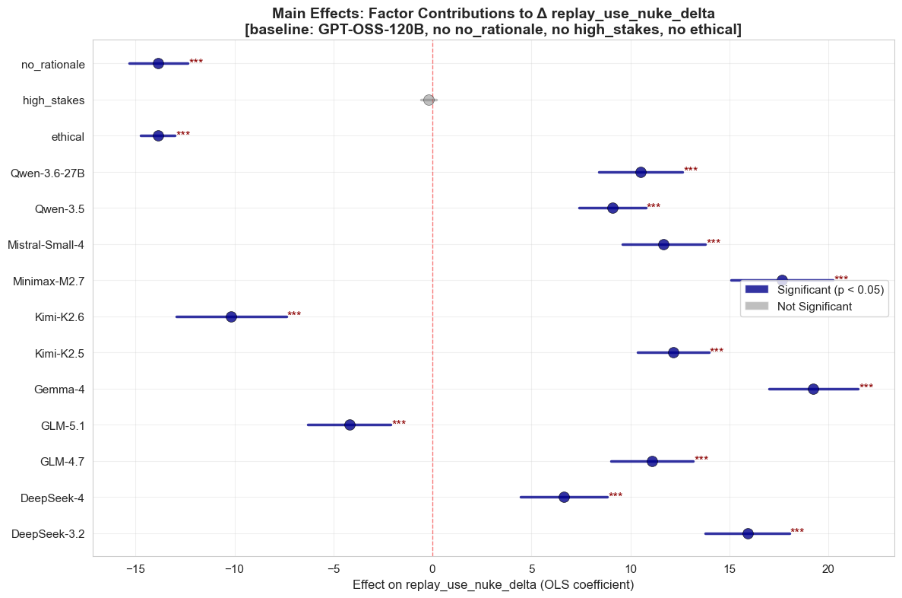
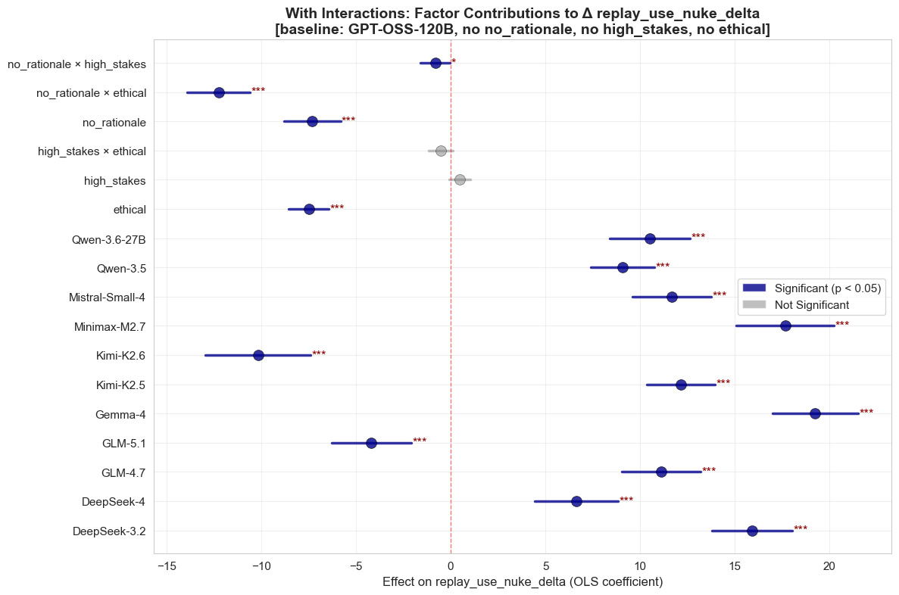
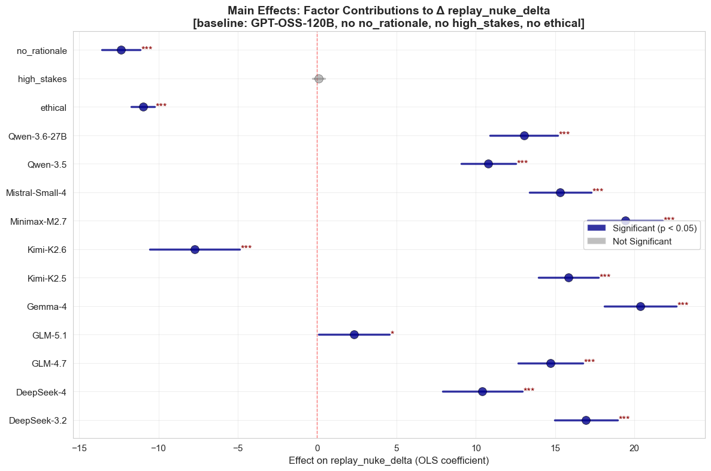
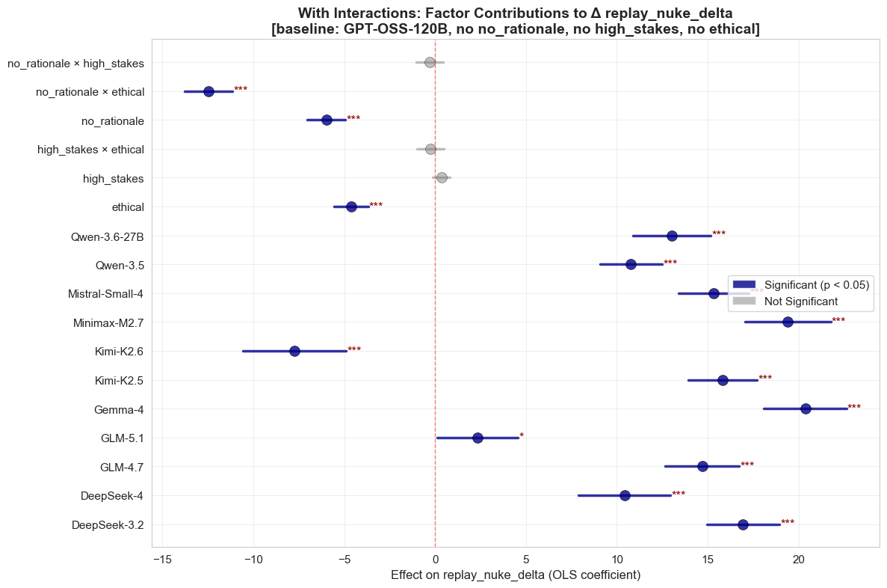
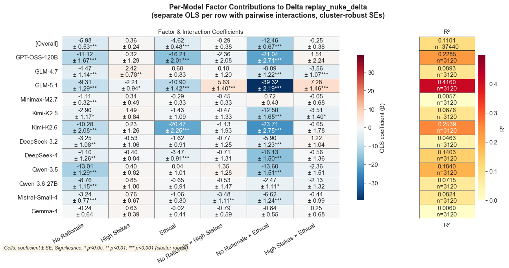
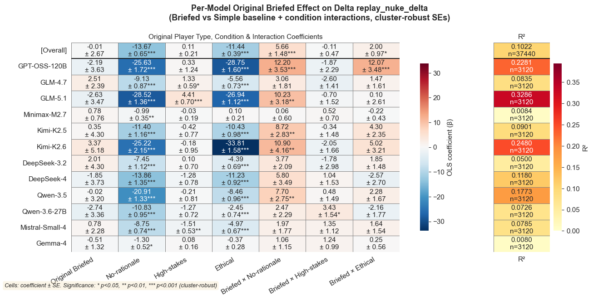
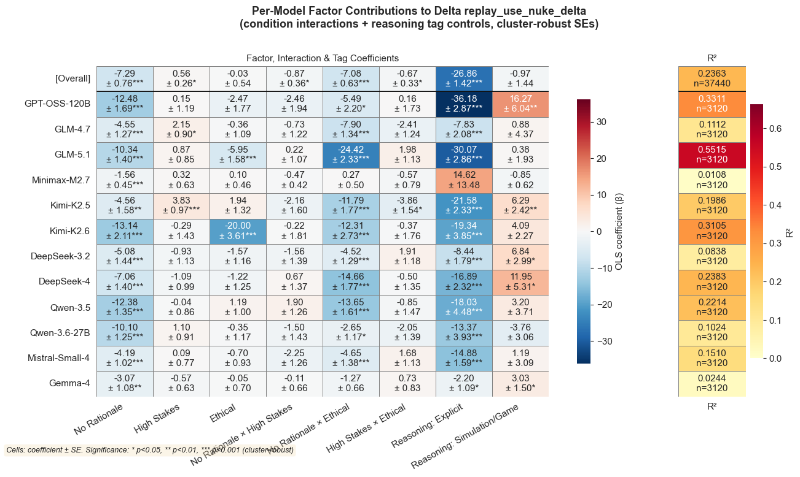
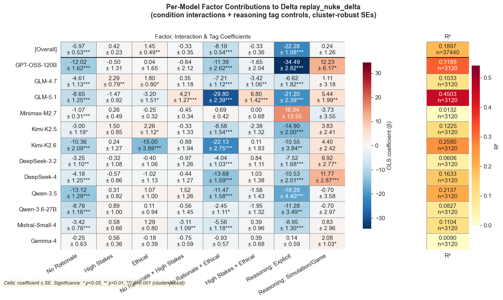

# `replay_regression`

*Extracted from `replay_regression.ipynb`*

---

```python
import sys
sys.path.insert(0, '..')

import pandas as pd
from IPython.display import display, Markdown

from shared.plot_utilities import setup_notebook_display
from shared.regression_utilities import run_regression_suite, plot_regression_coefficient_heatmap
from nuke.utils.load_replay_data import (
    CONDITION_FACTORS,
    REPLAY_TAG_JOIN_KEYS,
    canonical_condition_name,
    add_canonical_replay_model,
    add_condition_factor_columns,
    get_complete_replay_models,
    get_present_strategist_model_order,
    load_replay_data,
    prefixed_tier_columns,
    tier_source_columns,
)

setup_notebook_display()
df = load_replay_data()
df = add_canonical_replay_model(df)
df = add_condition_factor_columns(df)
```

```
✓ Loaded 37,440 rows from 96 files
  Conditions   : original, no-rationale, high-stakes, high-stakes-no-rationale, ethical, ethical-high-stakes, ethical-no-rationale, high-stakes-no-rationale-ethical
  Replay models: DeepSeek-V3.2, DeepSeek-V4, GLM-4.7, GLM-5.1, Gemma-4, Kimi-K2.5, Kimi-K2.6, MiniMax-M2.7, Mistral-Small-4, Qwen-3.5, Qwen-3.6-27B, gpt-oss-120b

  Rows per condition × replay model:
  ───────────────────────────────────────────────────────────────────────────────────────────────────────────────────────────────────────────────────────────────────────────────────────────────────────────────────────────────────────────────────────────────
                                        DeepSeek-V3.2      DeepSeek-V4          GLM-4.7          GLM-5.1          Gemma-4        Kimi-K2.5        Kimi-K2.6     MiniMax-M2.7  Mistral-Small-4         Qwen-3.5     Qwen-3.6-27B     gpt-oss-120b            Total
  ───────────────────────────────────────────────────────────────────────────────────────────────────────────────────────────────────────────────────────────────────────────────────────────────────────────────────────────────────────────────────────────────
                            original              390              390              390              390              390              390              390              390              390              390              390              390             4680
                        no-rationale              390              390              390              390              390              390              390              390              390              390              390              390             4680
                         high-stakes              390              390              390              390              390              390              390              390              390              390              390              390             4680
            high-stakes-no-rationale              390              390              390              390              390              390              390              390              390              390              390              390             4680
                             ethical              390              390              390              390              390              390              390              390              390              390              390              390             4680
                 ethical-high-stakes              390              390              390              390              390              390              390              390              390              390              390              390             4680
                ethical-no-rationale              390              390              390              390              390              390              390              390              390              390              390              390             4680
    high-stakes-no-rationale-ethical              390              390              390              390              390              390              390              390              390              390              390              390             4680
  ───────────────────────────────────────────────────────────────────────────────────────────────────────────────────────────────────────────────────────────────────────────────────────────────────────────────────────────────────────────────────────────────
                               Total             3120             3120             3120             3120             3120             3120             3120             3120             3120             3120             3120             3120            37440
  ───────────────────────────────────────────────────────────────────────────────────────────────────────────────────────────────────────────────────────────────────────────────────────────────────────────────────────────────────────────────────────────────
```

---

## Regressions: `replay_use_nuke_delta`

Three nested models (main effects → condition interactions → model × condition) with game/player fixed effects and cluster-robust SEs.

Baseline: GPT-OSS-120B, has rationale, not high-stakes, not ethical

---

```python
GROUP_COLS = ['game_id', 'player_id']

_ = run_regression_suite(
    data=df,
    outcome='replay_use_nuke_delta',
    condition_factors=CONDITION_FACTORS,
    group_cols=GROUP_COLS,
)
```

```
[main] replay_use_nuke_delta ~ no_rationale + high_stakes + ethical + C(replay_model_canonical, Treatment(reference="GPT-OSS-120B")) + C(_fe_group)
```

```
[interactions] replay_use_nuke_delta ~ no_rationale * high_stakes + no_rationale * ethical + high_stakes * ethical + C(replay_model_canonical, Treatment(reference="GPT-OSS-120B")) + C(_fe_group)
```

```
[model_x_condition] replay_use_nuke_delta ~ (no_rationale + high_stakes + ethical) * C(replay_model_canonical, Treatment(reference="GPT-OSS-120B")) + C(_fe_group)
```

```

============================================================
Main Effects: Factor Contributions to Δ replay_use_nuke_delta
[baseline: GPT-OSS-120B, no no_rationale, no high_stakes, no ethical] SUMMARY
============================================================

Statistically Significant Effects (p < 0.05):
----------------------------------------
  DeepSeek-3.2                   +15.914 [+13.799, +18.028] ***
  DeepSeek-4                     +6.639 [+4.434, +8.843] ***
  GLM-4.7                        +11.110 [+9.039, +13.181] ***
  GLM-5.1                        -4.198 [-6.302, -2.093] ***
  Gemma-4                        +19.249 [+17.000, +21.498] ***
  Kimi-K2.5                      +12.155 [+10.355, +13.956] ***
  Kimi-K2.6                      -10.170 [-12.951, -7.388] ***
  Minimax-M2.7                   +17.656 [+15.090, +20.222] ***
  Mistral-Small-4                +11.676 [+9.581, +13.771] ***
  Qwen-3.5                       +9.085 [+7.402, +10.768] ***
  Qwen-3.6-27B                   +10.515 [+8.401, +12.629] ***
  ethical                        -13.876 [-14.729, -13.023] ***
  no_rationale                   -13.843 [-15.329, -12.356] ***

Non-Significant Effects:
----------------------------------------
  high_stakes                    -0.190 [-0.574, +0.195]

Overall Statistics:
----------------------------------------
  Total effects analyzed: 14
  Significant effects: 13 (92.9%)
```



```
<Figure size 1200x800 with 1 Axes>
```

```
=== Main Effects (replay_use_nuke_delta) ===
                              OLS Regression Results                             
=================================================================================
Dep. Variable:     replay_use_nuke_delta   R-squared:                       0.344
Model:                               OLS   Adj. R-squared:                  0.341
Method:                    Least Squares   F-statistic:                     112.9
Date:                   Sat, 09 May 2026   Prob (F-statistic):           3.46e-65
Time:                           12:59:01   Log-Likelihood:            -1.7044e+05
No. Observations:                  37440   AIC:                         3.412e+05
Df Residuals:                      37296   BIC:                         3.424e+05
Df Model:                            143                                         
Covariance Type:                 cluster                                         
=================================================================================
R² = 0.3439, Adj R² = 0.3414, n = 37440, (cluster-robust SEs; FE: game_id, player_id)

============================================================
With Interactions: Factor Contributions to Δ replay_use_nuke_delta
[baseline: GPT-OSS-120B, no no_rationale, no high_stakes, no ethical] SUMMARY
============================================================

Statistically Significant Effects (p < 0.05):
----------------------------------------
  DeepSeek-3.2                   +15.914 [+13.799, +18.028] ***
  DeepSeek-4                     +6.639 [+4.434, +8.843] ***
  GLM-4.7                        +11.110 [+9.039, +13.182] ***
  GLM-5.1                        -4.198 [-6.302, -2.093] ***
  Gemma-4                        +19.249 [+17.000, +21.498] ***
  Kimi-K2.5                      +12.155 [+10.355, +13.956] ***
  Kimi-K2.6                      -10.170 [-12.952, -7.388] ***
  Minimax-M2.7                   +17.656 [+15.090, +20.222] ***
  Mistral-Small-4                +11.676 [+9.580, +13.771] ***
  Qwen-3.5                       +9.085 [+7.402, +10.768] ***
  Qwen-3.6-27B                   +10.515 [+8.401, +12.629] ***
  ethical                        -7.489 [-8.554, -6.424] ***
  no_rationale                   -7.308 [-8.798, -5.817] ***
  no_rationale × ethical         -12.256 [-13.916, -10.596] ***
  no_rationale × high_stakes     -0.814 [-1.599, -0.029] *

Non-Significant Effects:
----------------------------------------
  high_stakes                    +0.477 [-0.069, +1.022]
  high_stakes × ethical          -0.518 [-1.159, +0.123]

Overall Statistics:
----------------------------------------
  Total effects analyzed: 17
  Significant effects: 15 (88.2%)
```

```
C:\Users\John Chen\AppData\Local\Programs\Python\Python312\Lib\site-packages\statsmodels\base\model.py:1894: ValueWarning: covariance of constraints does not have full rank. The number of constraints is 143, but rank is 14
  warnings.warn('covariance of constraints does not have full '
```



```
<Figure size 1200x800 with 1 Axes>
```

```

=== Condition Interactions (replay_use_nuke_delta) ===
```

```
                              OLS Regression Results                             
=================================================================================
Dep. Variable:     replay_use_nuke_delta   R-squared:                       0.356
Model:                               OLS   Adj. R-squared:                  0.353
Method:                    Least Squares   F-statistic:                     94.24
Date:                   Sat, 09 May 2026   Prob (F-statistic):           4.42e-64
Time:                           12:59:01   Log-Likelihood:            -1.7010e+05
No. Observations:                  37440   AIC:                         3.405e+05
Df Residuals:                      37293   BIC:                         3.418e+05
Df Model:                            146                                         
Covariance Type:                 cluster                                         
=================================================================================
R² = 0.3556, Adj R² = 0.3531, n = 37440, (cluster-robust SEs; FE: game_id, player_id)

=== Model x Condition (replay_use_nuke_delta) ===
                              OLS Regression Results                             
=================================================================================
Dep. Variable:     replay_use_nuke_delta   R-squared:                       0.414
Model:                               OLS   Adj. R-squared:                  0.411
Method:                    Least Squares   F-statistic:                     51.17
Date:                   Sat, 09 May 2026   Prob (F-statistic):           4.70e-64
Time:                           12:59:01   Log-Likelihood:            -1.6833e+05
No. Observations:                  37440   AIC:                         3.370e+05
Df Residuals:                      37263   BIC:                         3.385e+05
Df Model:                            176                                         
Covariance Type:                 cluster                                         
=================================================================================
R² = 0.4138, Adj R² = 0.4110, n = 37440, (cluster-robust SEs; FE: game_id, player_id)

=== F-tests (replay_use_nuke_delta) ===
Main vs Condition Interactions:
   df_resid           ssr  df_diff        ss_diff           F         Pr(>F)
0   37296.0  1.972319e+07      0.0            NaN         NaN            NaN
1   37293.0  1.936952e+07      3.0  353669.285256  226.978377  6.105690e-146
Main vs Model x Condition:
   df_resid           ssr  df_diff       ss_diff           F  Pr(>F)
0   37296.0  1.972319e+07      0.0           NaN         NaN     NaN
1   37263.0  1.762238e+07     33.0  2.100814e+06  134.612973     0.0
Condition Interactions vs Model x Condition:
   df_resid           ssr  df_diff       ss_diff           F  Pr(>F)
0   37293.0  1.936952e+07      0.0           NaN         NaN     NaN
1   37263.0  1.762238e+07     30.0  1.747145e+06  123.146158     0.0
```

```
C:\Users\John Chen\AppData\Local\Programs\Python\Python312\Lib\site-packages\statsmodels\base\model.py:1894: ValueWarning: covariance of constraints does not have full rank. The number of constraints is 146, but rank is 17
  warnings.warn('covariance of constraints does not have full '
C:\Users\John Chen\AppData\Local\Programs\Python\Python312\Lib\site-packages\statsmodels\base\model.py:1894: ValueWarning: covariance of constraints does not have full rank. The number of constraints is 176, but rank is 47
  warnings.warn('covariance of constraints does not have full '
```

---

## Regressions: `replay_nuke_delta`

Same regression suite for the nuke (launch) outcome.

---

```python
_ = run_regression_suite(
    data=df,
    outcome='replay_nuke_delta',
    condition_factors=CONDITION_FACTORS,
    group_cols=GROUP_COLS,
)
```

```
[main] replay_nuke_delta ~ no_rationale + high_stakes + ethical + C(replay_model_canonical, Treatment(reference="GPT-OSS-120B")) + C(_fe_group)
```

```
[interactions] replay_nuke_delta ~ no_rationale * high_stakes + no_rationale * ethical + high_stakes * ethical + C(replay_model_canonical, Treatment(reference="GPT-OSS-120B")) + C(_fe_group)
```

```
[model_x_condition] replay_nuke_delta ~ (no_rationale + high_stakes + ethical) * C(replay_model_canonical, Treatment(reference="GPT-OSS-120B")) + C(_fe_group)
```

```

============================================================
Main Effects: Factor Contributions to Δ replay_nuke_delta
[baseline: GPT-OSS-120B, no no_rationale, no high_stakes, no ethical] SUMMARY
============================================================

Statistically Significant Effects (p < 0.05):
----------------------------------------
  DeepSeek-3.2                   +16.949 [+14.954, +18.943] ***
  DeepSeek-4                     +10.419 [+7.895, +12.943] ***
  GLM-4.7                        +14.700 [+12.655, +16.745] ***
  GLM-5.1                        +2.336 [+0.115, +4.557] *
  Gemma-4                        +20.367 [+18.098, +22.636] ***
  Kimi-K2.5                      +15.836 [+13.939, +17.733] ***
  Kimi-K2.6                      -7.726 [-10.565, -4.886] ***
  Minimax-M2.7                   +19.417 [+17.064, +21.769] ***
  Mistral-Small-4                +15.325 [+13.379, +17.272] ***
  Qwen-3.5                       +10.785 [+9.065, +12.506] ***
  Qwen-3.6-27B                   +13.035 [+10.900, +15.171] ***
  ethical                        -10.977 [-11.710, -10.245] ***
  no_rationale                   -12.359 [-13.580, -11.138] ***

Non-Significant Effects:
----------------------------------------
  high_stakes                    +0.087 [-0.283, +0.457]

Overall Statistics:
----------------------------------------
  Total effects analyzed: 14
  Significant effects: 13 (92.9%)
```



```
<Figure size 1200x800 with 1 Axes>
```

```
=== Main Effects (replay_nuke_delta) ===
                            OLS Regression Results                            
==============================================================================
Dep. Variable:      replay_nuke_delta   R-squared:                       0.298
Model:                            OLS   Adj. R-squared:                  0.295
Method:                 Least Squares   F-statistic:                     97.56
Date:                Sat, 09 May 2026   Prob (F-statistic):           1.89e-61
Time:                        12:59:03   Log-Likelihood:            -1.6936e+05
No. Observations:               37440   AIC:                         3.390e+05
Df Residuals:                   37296   BIC:                         3.402e+05
Df Model:                         143                                         
Covariance Type:              cluster                                         
==============================================================================
R² = 0.2982, Adj R² = 0.2955, n = 37440, (cluster-robust SEs; FE: game_id, player_id)

============================================================
With Interactions: Factor Contributions to Δ replay_nuke_delta
[baseline: GPT-OSS-120B, no no_rationale, no high_stakes, no ethical] SUMMARY
============================================================

Statistically Significant Effects (p < 0.05):
----------------------------------------
  DeepSeek-3.2                   +16.949 [+14.954, +18.943] ***
  DeepSeek-4                     +10.419 [+7.894, +12.943] ***
  GLM-4.7                        +14.700 [+12.655, +16.745] ***
  GLM-5.1                        +2.336 [+0.115, +4.557] *
  Gemma-4                        +20.367 [+18.098, +22.636] ***
  Kimi-K2.5                      +15.836 [+13.939, +17.733] ***
  Kimi-K2.6                      -7.726 [-10.565, -4.886] ***
  Minimax-M2.7                   +19.417 [+17.064, +21.769] ***
  Mistral-Small-4                +15.325 [+13.379, +17.272] ***
  Qwen-3.5                       +10.785 [+9.065, +12.506] ***
  Qwen-3.6-27B                   +13.035 [+10.900, +15.171] ***
  ethical                        -4.623 [-5.561, -3.684] ***
  no_rationale                   -5.982 [-7.031, -4.933] ***
  no_rationale × ethical         -12.460 [-13.772, -11.147] ***

Non-Significant Effects:
----------------------------------------
  high_stakes                    +0.359 [-0.117, +0.835]
  high_stakes × ethical          -0.250 [-0.994, +0.494]
  no_rationale × high_stakes     -0.295 [-1.035, +0.445]

Overall Statistics:
----------------------------------------
  Total effects analyzed: 17
  Significant effects: 14 (82.4%)
```

```
C:\Users\John Chen\AppData\Local\Programs\Python\Python312\Lib\site-packages\statsmodels\base\model.py:1894: ValueWarning: covariance of constraints does not have full rank. The number of constraints is 143, but rank is 14
  warnings.warn('covariance of constraints does not have full '
```



```
<Figure size 1200x800 with 1 Axes>
```

```
C:\Users\John Chen\AppData\Local\Programs\Python\Python312\Lib\site-packages\statsmodels\base\model.py:1894: ValueWarning: covariance of constraints does not have full rank. The number of constraints is 146, but rank is 17
  warnings.warn('covariance of constraints does not have full '
```

```

=== Condition Interactions (replay_nuke_delta) ===
                            OLS Regression Results                            
==============================================================================
Dep. Variable:      replay_nuke_delta   R-squared:                       0.312
Model:                            OLS   Adj. R-squared:                  0.309
Method:                 Least Squares   F-statistic:                     96.39
Date:                Sat, 09 May 2026   Prob (F-statistic):           1.16e-64
Time:                        12:59:03   Log-Likelihood:            -1.6899e+05
No. Observations:               37440   AIC:                         3.383e+05
Df Residuals:                   37293   BIC:                         3.395e+05
Df Model:                         146                                         
Covariance Type:              cluster                                         
==============================================================================
R² = 0.3119, Adj R² = 0.3092, n = 37440, (cluster-robust SEs; FE: game_id, player_id)

=== Model x Condition (replay_nuke_delta) ===
                            OLS Regression Results                            
==============================================================================
Dep. Variable:      replay_nuke_delta   R-squared:                       0.363
Model:                            OLS   Adj. R-squared:                  0.360
Method:                 Least Squares   F-statistic:                     57.17
Date:                Sat, 09 May 2026   Prob (F-statistic):           5.83e-67
Time:                        12:59:03   Log-Likelihood:            -1.6755e+05
No. Observations:               37440   AIC:                         3.355e+05
Df Residuals:                   37263   BIC:                         3.370e+05
Df Model:                         176                                         
Covariance Type:              cluster                                         
==============================================================================
R² = 0.3627, Adj R² = 0.3597, n = 37440, (cluster-robust SEs; FE: game_id, player_id)

=== F-tests (replay_nuke_delta) ===
Main vs Condition Interactions:
   df_resid           ssr  df_diff        ss_diff           F         Pr(>F)
0   37296.0  1.861630e+07      0.0            NaN         NaN            NaN
1   37293.0  1.825268e+07      3.0  363628.192842  247.649293  3.895910e-159
Main vs Model x Condition:
   df_resid           ssr  df_diff       ss_diff           F  Pr(>F)
0   37296.0  1.861630e+07      0.0           NaN         NaN     NaN
1   37263.0  1.690460e+07     33.0  1.711704e+06  114.337263     0.0
Condition Interactions vs Model x Condition:
   df_resid           ssr  df_diff       ss_diff          F  Pr(>F)
0   37293.0  1.825268e+07      0.0           NaN        NaN     NaN
1   37263.0  1.690460e+07     30.0  1.348076e+06  99.052663     0.0
```

```
C:\Users\John Chen\AppData\Local\Programs\Python\Python312\Lib\site-packages\statsmodels\base\model.py:1894: ValueWarning: covariance of constraints does not have full rank. The number of constraints is 176, but rank is 47
  warnings.warn('covariance of constraints does not have full '
```

---

## Per-Model Factor Contributions

Separate OLS regressions per model with pairwise interactions:
`outcome ~ no_rationale * high_stakes + no_rationale * ethical + high_stakes * ethical`
with cluster-robust SEs.

Left panel shows main-effect and interaction coefficients with significance stars.
Right panel shows per-model R².

---

```python
from itertools import combinations

model_order = get_present_strategist_model_order(df)
heatmap_model_order = get_complete_replay_models(df, model_order=model_order)
skipped = [model for model in model_order if model not in heatmap_model_order]
if skipped:
    print(f'Skipping models with incomplete condition sets: {", ".join(skipped)}')

interaction_names = [f'{a}:{b}' for a, b in combinations(CONDITION_FACTORS, 2)]
all_vars = CONDITION_FACTORS + interaction_names
pairs = ' + '.join(f'{a} * {b}' for a, b in combinations(CONDITION_FACTORS, 2))
formula_template = '{outcome} ~ ' + pairs

for outcome in ['replay_use_nuke_delta', 'replay_nuke_delta']:
    display(Markdown(f'### {outcome}'))
    plot_regression_coefficient_heatmap(
        data=df,
        outcome=outcome,
        predictors=all_vars,
        group_cols=GROUP_COLS,
        model_order=heatmap_model_order,
        formula=formula_template.format(outcome=outcome),
        title=(
            f'Per-Model Factor Contributions to Delta {outcome}\n'
            f'(separate OLS per row with pairwise interactions, cluster-robust SEs)'
        ),
        coefficient_title='Factor & Interaction Coefficients',
        figsize=(14, 6),
    )
```

```
<IPython.core.display.Markdown object>
```

```
F:\vox-deorum\nuke-analysis\nuke\..\shared\regression_utilities.py:408: UserWarning: This figure includes Axes that are not compatible with tight_layout, so results might be incorrect.
  plt.tight_layout()
```


```
<Figure size 1400x600 with 4 Axes>
```

```
<IPython.core.display.Markdown object>
```

```
F:\vox-deorum\nuke-analysis\nuke\..\shared\regression_utilities.py:408: UserWarning: This figure includes Axes that are not compatible with tight_layout, so results might be incorrect.
  plt.tight_layout()
```



```
<Figure size 1400x600 with 4 Axes>
```

---

```python
df_player_type = df.copy()
df_player_type['original_briefed'] = (
    df_player_type['player_type']
    .astype(str)
    .str.contains('Briefed', case=False, regex=False)
    .astype(int)
)

briefed_interaction_names = [
    f'original_briefed:{factor}' for factor in CONDITION_FACTORS
]
briefed_vars = ['original_briefed'] + CONDITION_FACTORS + briefed_interaction_names
briefed_formula_template = (
    '{outcome} ~ original_briefed * ('
    + ' + '.join(CONDITION_FACTORS)
    + ')'
)

BRIEFED_LABELS = {
    'original_briefed': 'Original Briefed',
    'no_rationale': 'No-rationale',
    'high_stakes': 'High-stakes',
    'ethical': 'Ethical',
    'original_briefed:no_rationale': 'Briefed × No-rationale',
    'original_briefed:high_stakes': 'Briefed × High-stakes',
    'original_briefed:ethical': 'Briefed × Ethical',
}

display(Markdown('## Original Player Type: Briefed vs Simple'))
display(
    df_player_type['player_type']
    .str.extract(r'-(Briefed|Simple)$')[0]
    .value_counts()
    .rename_axis('original_player_type')
    .to_frame('rows')
)

for outcome in ['replay_use_nuke_delta', 'replay_nuke_delta']:
    display(Markdown(f'### {outcome}'))
    plot_regression_coefficient_heatmap(
        data=df_player_type,
        outcome=outcome,
        predictors=briefed_vars,
        group_cols=GROUP_COLS,
        model_order=heatmap_model_order,
        formula=briefed_formula_template.format(outcome=outcome),
        predictor_labels=BRIEFED_LABELS,
        title=(
            f'Per-Model Original Briefed Effect on Delta {outcome}\n'
            f'(Briefed vs Simple baseline + condition interactions, cluster-robust SEs)'
        ),
        coefficient_title='Original Player Type, Condition & Interaction Coefficients',
        figsize=(14, 6),
    )
```

```
<IPython.core.display.Markdown object>
```

| ('Unnamed: 0_level_0', 'original_player_type')   |   ('rows', 'Unnamed: 1_level_1') |
|--------------------------------------------------|----------------------------------|
| Simple                                           |                            28800 |
| Briefed                                          |                             8640 |

```
<IPython.core.display.Markdown object>
```

```
F:\vox-deorum\nuke-analysis\nuke\..\shared\regression_utilities.py:408: UserWarning: This figure includes Axes that are not compatible with tight_layout, so results might be incorrect.
  plt.tight_layout()
```


```
<Figure size 1400x600 with 4 Axes>
```

```
<IPython.core.display.Markdown object>
```

```
F:\vox-deorum\nuke-analysis\nuke\..\shared\regression_utilities.py:408: UserWarning: This figure includes Axes that are not compatible with tight_layout, so results might be incorrect.
  plt.tight_layout()
```



```
<Figure size 1400x600 with 4 Axes>
```

---

## Per-Model Factor Contributions with Reasoning Tag Controls

Same per-model OLS as above, but with two additional binary predictors from the reasoning trail:
- **rea_tier_Explicit**: whether the model's reasoning contains explicit ethical/moral language
- **rea_tier_SimulationGame**: whether the reasoning references simulation/game framing

`outcome ~ no_rationale * high_stakes + no_rationale * ethical + high_stakes * ethical + rea_tier_Explicit + rea_tier_SimulationGame`

---

```python
from pathlib import Path

# Load reasoning trail tags and join to df
rea = pd.read_csv(Path('trails') / 'reasoning_trails_tagged.csv')
rea['condition'] = rea['condition'].map(canonical_condition_name)
TAG_TIERS = ['Explicit', 'Simulation_Game']
TAG_COLS_ORIG = tier_source_columns(TAG_TIERS)
TAG_COLS = prefixed_tier_columns(TAG_TIERS, 'rea')

rea_tags = rea[REPLAY_TAG_JOIN_KEYS + TAG_COLS_ORIG].rename(columns=dict(zip(TAG_COLS_ORIG, TAG_COLS)))
df_tags = df.merge(rea_tags, on=REPLAY_TAG_JOIN_KEYS, how='left')
df_tags[TAG_COLS] = df_tags[TAG_COLS].fillna(0).astype(int)

print(f'Rows after join: {len(df_tags):,}')
print(f'rea_tier_Explicit prevalence:       {df_tags["rea_tier_Explicit"].mean():.1%}')
print(f'rea_tier_SimulationGame prevalence:  {df_tags["rea_tier_SimulationGame"].mean():.1%}')

# Extended predictors: condition factors + interactions + tag factors
tag_vars = TAG_COLS
extended_vars = all_vars + tag_vars
tag_terms = ' + '.join(tag_vars)
extended_formula_template = formula_template + ' + ' + tag_terms

TAG_LABELS = {
    'rea_tier_Explicit': 'Reasoning: Explicit',
    'rea_tier_SimulationGame': 'Reasoning: Simulation/Game',
}

for outcome in ['replay_use_nuke_delta', 'replay_nuke_delta']:
    display(Markdown(f'### {outcome}'))
    plot_regression_coefficient_heatmap(
        data=df_tags,
        outcome=outcome,
        predictors=extended_vars,
        group_cols=GROUP_COLS,
        model_order=heatmap_model_order,
        formula=extended_formula_template.format(outcome=outcome),
        predictor_labels=TAG_LABELS,
        title=(
            f'Per-Model Factor Contributions to Delta {outcome}\n'
            f'(condition interactions + reasoning tag controls, cluster-robust SEs)'
        ),
        coefficient_title='Factor, Interaction & Tag Coefficients',
        figsize=(14, 7),
    )
```

```
Rows after join: 37,440
rea_tier_Explicit prevalence:       18.8%
rea_tier_SimulationGame prevalence:  7.2%
```

```
<IPython.core.display.Markdown object>
```

```
F:\vox-deorum\nuke-analysis\nuke\..\shared\regression_utilities.py:408: UserWarning: This figure includes Axes that are not compatible with tight_layout, so results might be incorrect.
  plt.tight_layout()
```



```
<Figure size 1400x700 with 4 Axes>
```

```
<IPython.core.display.Markdown object>
```

```
F:\vox-deorum\nuke-analysis\nuke\..\shared\regression_utilities.py:408: UserWarning: This figure includes Axes that are not compatible with tight_layout, so results might be incorrect.
  plt.tight_layout()
```



```
<Figure size 1400x700 with 4 Axes>
```
